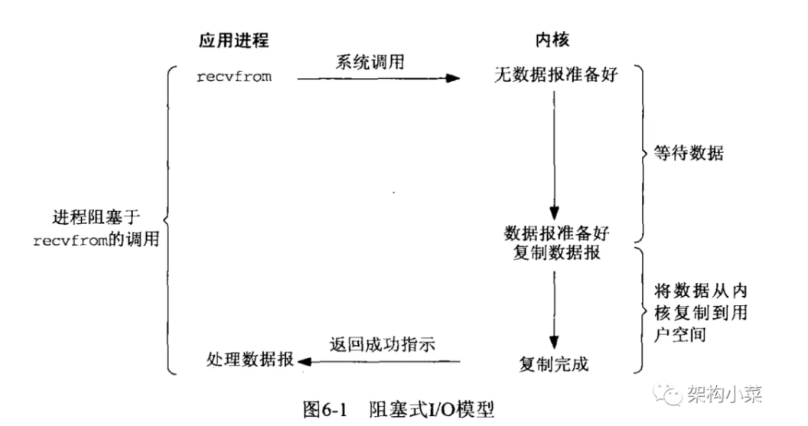
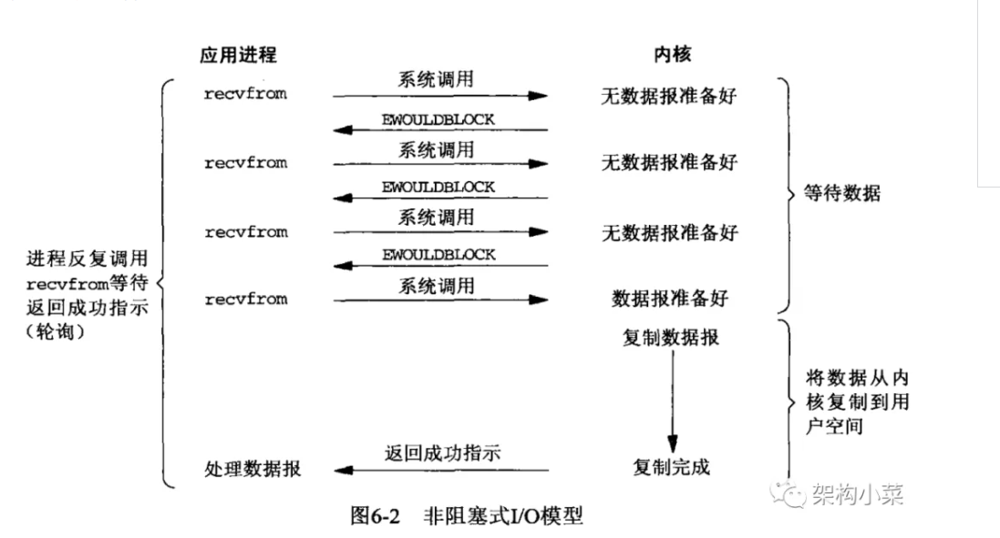
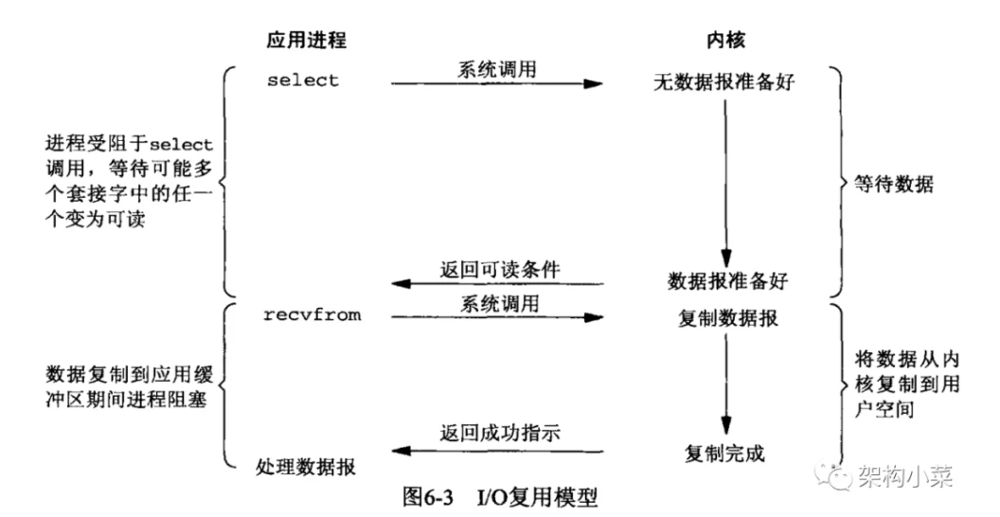
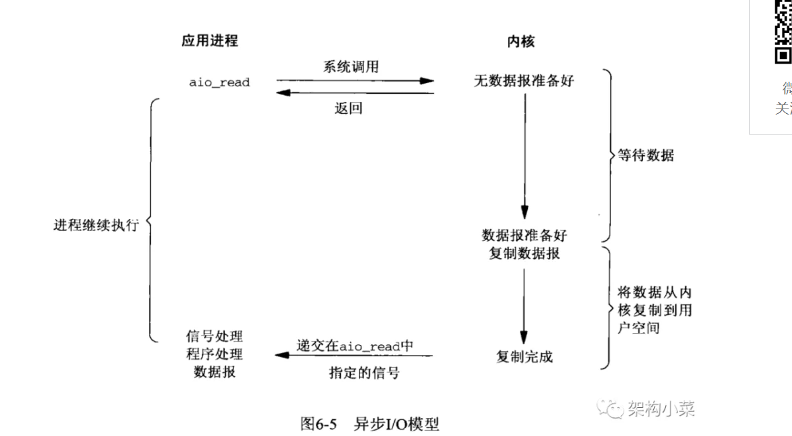
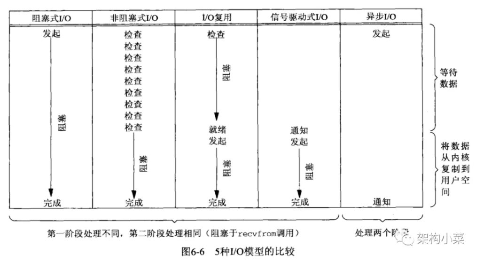
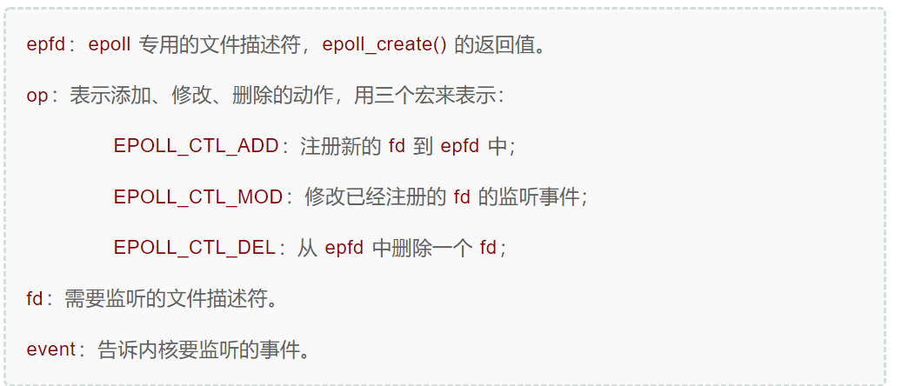

# linux网络模型

> 针对一次网络IO访问（以Read为例），总共分为两部分
>
> - 等待数据准备好：通常涉及等待数据从网络到达，当所有等待分组到达时，他被复制到内核中的缓冲区中
> - 将数据从内核拷贝到进程中：将数据从内核缓冲区拷贝到进程缓冲区

## 1.阻塞式IO

阻塞式IO（Blocking  IO）使我们最常见的IO模型



第一阶段：当用户进程调用了 recvfrom函数以后，进程就被卡住了，此时内核开始等待数据从网络中到达，这也就是第一个阶段，数据等待阶段，当等待的数据分组都到达了以后，数据就会被拷贝到内核缓冲区，此时用户进程一直处于等待状态

第二阶段：当数据进入内核缓冲区以后，内核将数据复制到用户进程缓冲区中，然后 recvfrom函数返回结果，用户才会接触block状态，进行运行

从图中可以看出 **阻塞IO的特点是，两个阶段全被阻塞了**

## 2.非阻塞IO



可以设置socket 使其变成非阻塞，非阻塞的调用如上图↑：

他也分为两个阶段：

- 在数据处理阶段 用户调用 recvfrom函数，系统发现数据还没有准备好，就会返回一个错误，不会阻塞用户进程，用户级进程可以过一会在次调用recvfrom函数看看数据有没有准备好，循环往复，知道数据准备完毕
- 当数据准备完毕后，内核同样会阻塞用户进程，直到内核缓冲区中的数据全部拷贝到用户进程中后，recefrom函数返回结果，用户程序可以进行运行

当一个进程这样频繁的代用 recvfrom函数检查数据是否准备好的情况，我们成为轮询，轮询会频繁造成用户态和内核态之间的切换，浪费大量的CPU

**非阻塞IO的第一阶段是非阻塞的，第二个阶段同样是阻塞的**

## 3.IO多路复用

IO多路复用也称为 事件驱动IO，就是我们用到的 select，poll，epoll，他们的原理就是 又内核监控一组用户感兴趣的网络事件，当某个事件发生的时候，通知用户进程进行处理，他的最大的用处就是可以让我们用单线程来处理多个连接请求。



从图中可以看到，当用户进程调用select函数以后，整个进程都会被阻塞，内核此时会监控所有注册到select上的socket，当任何一个socket准备好以后，select函数就会返回，用户进程就可以处理这个准备好的socket

我们可以发现，这个图其实和阻塞模型没有太大的区别，而且这个图还会调用两个函数（select和recvfrom），效率上可能还会差一些，但是他的优点就是 用一个线程来处理多个IO请求。

如果连接是不是很高的话，他不一定比多线程+阻塞Io的模式要更好，但是如果连接数很高的话，他的优势有显示出来了。**他的优点不是对单个连接处理快，而是可以用一个线程处理多个连接请求**

**IO多路复用，本质上也是阻塞式IO，他两个阶段都被阻塞了。**

## 4.异步IO



异步IO是真正的实现了从数据准备到数据传输两个阶段都没有阻塞的IO模型

当用户进程发送aio_read请求后，内核会立刻返回，不阻塞用户，用户立刻就可以去做别的事情，当数据准备好，并且内核将数据主动复制到用户进程以后，内核会发送一个信号通知用户进程，告诉他上述的aio_read操作完成了。

**异步IO在数据准备和数据复制两个阶段都是非阻塞的。**



上图中我们可以发现，除了异步IO，其他的在数据从内核复制到用户进程中的时候，都是阻塞的。	

# IO多路复用详解

> 在linux系统中，一切皆文件，无论是网络IO还是磁盘，终端。都被抽象成了文件

通过文件这一抽象，任何IO操作都可以分为如下简单几个接口来实现

- read：读取数据
- write：写入数据
- seek：改变读写位置
- close：关闭文件
- open：打开文件

当我们创建或者打开文件的时候，系统就会向用户返回一个文件描述符fd(file descriptor)，用来指向刚刚的文件，用户就可以用这个文件描述符调用系统提供的接口来操作文件，而不必关系文件存储到哪里，文件在内存什么位置等其他信息。

因此当我们打开一个文件的时候，过程是这样的：

```c
int fd = open(file_name); // 返回文件描述符
read(fd, buff);
```

当我们建立一个 网络连接接收客户端发来的数据的时候，是这样的

```c
int conn_fd = accept(...); // 返回网络连接文件描述符
if (read(conn_fd, request_buff) > 0) {
   do_something(request_buff);
}
```

## 1.多线程+阻塞IO

这种方式虽然简单，但是有两个重要的问题：

- 当连接数较多的时候，需要创建大量的线程来保持socket通信，而大多数线程一般来来都处于闲置等待状态
- 线程之间频繁的切换引起CPU上下文的切换，非常消耗CPU

同样 单线程和非阻塞的IO的方式中，一个当负责的某个连接没有返回的时候，将一直处于阻塞状态，一个要频繁的轮序cpu，都是不是好的办法

## 2.Select模式

1. 每个连接都返回一个fd，我们需要一个数组fds记录所有的fd
2. 我们需要一个叫fd_set的数据结构，他是一个默认1024bit的位图来实现，每个bit标识一个fd
3. 用户进程通过调用select函数，将fd_set结构数据传入系统内核，由系统内核监控这些fd，判断那些链接有数据到来，如果有链接准备好数据，select系统调用就会返回。
4. select返回以后，用户并不知道那个或那几个fd准备就绪，需要遍历整个fd_set中的fd，当发现有fd被置位的嘶吼，就代表这个fd链接准备就绪了，就可以处理这个fd
5. 重新置位fd_set，然后跳转到第3步继续执行。

`fd_set` 采用位图 bitmap 结构，是一个大小为32的 long 型数组，每一个 bit 代表一个描述符是否被监视

为什么每次 while 循环开始都要重置 `fd_set`，是因为操作系统会复用用户进程传入的 `fd_set` 变量，来作为出参，所以我们传入的 `fd_set` 返回时已经被内核修改过了

**select的问题有如下几个：**

1. ​	可监控的文件符最大为1024，也就是最大支持1024并发，这是由操作系统决定的
2. 用户进程的文件描述符集合每次都从用户进程拷贝到内核，有一定的性能开销
3. select函数返回的时候，我们只知道有fd准备就绪，但是不知道是哪个，需要遍历整个fd

## 3.poll模式

他基本和select一样，只是解决了select的1024的限制的问题。

## 4.epoll模式

epoll是select和poll的增强模式，他用一个文件描述符来管理多个文件描述符，省去了大量文件描述符在用户态和内核态之间的来回拷贝造成的资源浪费

epoll有三个非常重要的接口：

```c
#include <sys/epoll.h>
int epoll_create(int size);
int epoll_ctl(int epfd, int op, int fd, struct epoll_event *event);
int epoll_wait(int epfd, struct epoll_event * events, int maxevents, int timeout);
```

- epoll_create用来创建一个epoll专用的文件描述符（创建一个epoll的句柄）
- epoll_ctl 方法是epoll的事件注册函数，高速内核要监控的文件描述符和事件类型（accept  read write等）
- epoll_wait方法等待事件的产生，类似select函数

epoll底层采用红黑树来存储epoll_ctl传递过来的socket，用链表来保存准备就绪的事件

当epoll_wait被代用的时候，只需要监控 保存准备好数据的链表就好了，当链表中有数据的时候，就返回。而且即使我们同时监控数百万的连接，大多也只会一次性返回少量的准备就绪的连接，所以epoll_wait每次从内核态拷贝到用户态的数据都不会太多

**epoll比poll和select更高效的原因为：**

1. 减少了用户态和内核态之间拷贝文件的数量，只需要一个文件句柄
2. 减少了文件描述符的遍历，select和poll需要遍历所有的文件描述符，epoll只需要遍历准备好的
3. 没有并发数量的限制，性能不会随文件描述符数量的增加而下降

我们工作中常用的 redis、nginx 都是使用了 `epoll` 这种I/O复用模型，通过单线程就实现了10万以上的并发访问。

另外有很多资料会说 `epoll` 使用了共享内存（mmap）的方式，其实是不正确的，它并没有用到mmap。


