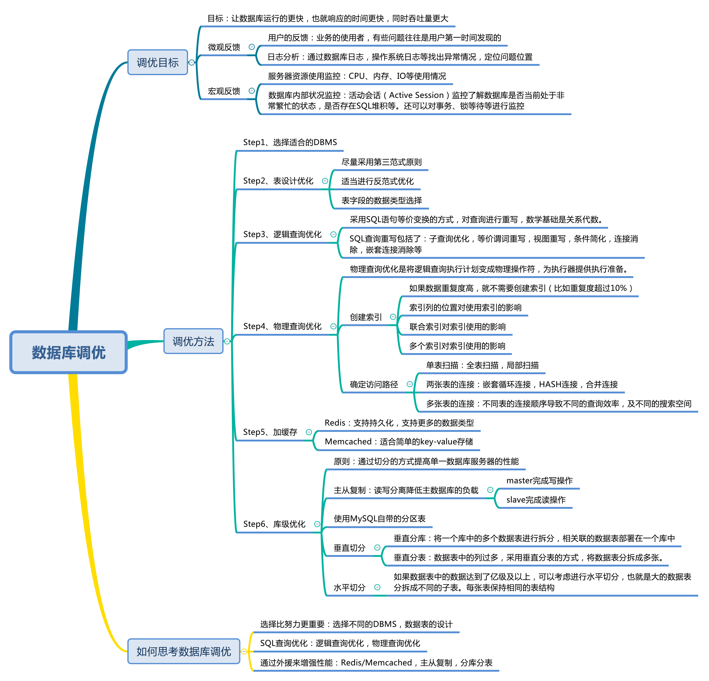
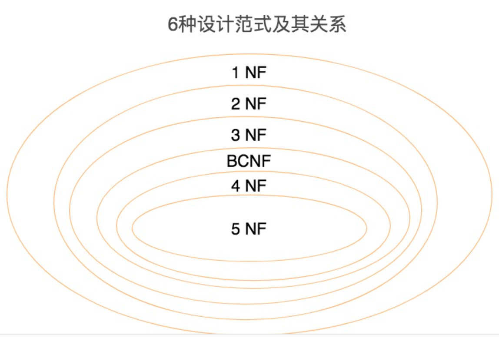

# sql必知必会-优化篇

## 如何确定数据库的调优目的

一般来说，有如下几种方式可以确定**调优的目标**

1.  **用户反馈**：一般来说，用户都会第一时间发现问题，虽然他们不会提供技术建议，但是会反馈遇到的问题，我们要重视这个问题。
2.  **日志分析**：我们可以通过查看数据库日志，或者操作系统日志来定位问题
3. **使用服务器资源监控**：可以通过查看 CPU ，内存，IO的使用状况来了解服务器的性能，
4.  **使用数据库监控**：数据库的会话监控是一个非常重要的指标，通过它可以清楚了解当前数据库是否处于非常繁忙的状态，是否存在sql堆积等问题，同时监控数据库的事务和锁，也能进一步的了解数据库的状况

## 数据库的都有哪些调优的维度

### 1.选择合适的数据库

不同数据库都有不同的适用范围，例如商业的数据库在事务处理和安全性上边，效果很好，sql server 单表处理上亿条数据，查询效率也不会差

对于NoSql数据库来说，也是这个道理，例如列式存储数据库，能降低IO操作，适合分布式文件存储和OLAP，但是如果需要频繁的增删改，那么他就不再适合了

### 2.优化表设计

1. 表结构要尽可能的符合第三范式，这样能让表结构更清晰规范，减少冗余字段，同时也减少在更新，删除和插入数据时异常发生的次数
2. 如果分析应用查询比较多，需要进行多表联查的时候，可以采用反范式进行优化，反范式就是采用空间换时间的手段，通过增加冗余字段来优化查询
3. 合适的字段类型的选择可以提高查询效率和降低空间浪费，一般来说，如果字段可以选择数值类型，字符串长度要尽可能设计的短一些，针对字符类型来说，当确定字符长度固定时，就可以采用 CHAR 类型；当长度不固定时，通常采用 VARCHAR 类型。

### 3.优化查询逻辑

sql查询优化分为两种：一种是逻辑查询优化，一种是物理查询优化

- 逻辑查询优化就是通过改变sql语句的执行内容让sql执行的效率更高，采用的方式是对sql语句进行等价变换，例如exists和in的选择（小表驱动大表），在 **在where条件中，尽可能对字段进行函数运算，他会让索引的字段失效**

如下例子就是一个 逻辑优化查询的示例：

查询评论内容为abc开头的内容都有哪些，

```sql
SELECT comment_id, comment_text, comment_time FROM product_comment WHERE SUBSTRING(comment_text, 1,3)='abc'
```

这里where中就是用了函数，我们可以用如下方式，进行逻辑优化，调整sql语句

```sql
SELECT comment_id, comment_text, comment_time FROM product_comment WHERE comment_text LIKE 'abc%'
```

在数据了大的情况下，第二个sql语句的执行效率是第一个sql语句的十倍。

**物理查询**：就是将逻辑查询的内容变成可以被执行的物理操作符，：**其核心就是高效的建立索引，并通过这些索引来做各种优化**

但是索引不是万能的，需要根据实际情况来创建索引：

1. 如果数据重复率很高，就可以不需要创建索引，通常重复率超过10%的情况下，可以不创建索引这个字段，比如性别这个字段（男或女）
2. 要注意索引列的位置对索引使用的 影响，比如我们在where子句中对索引字段继续了表达式的计算，会造成这个字段的索引失效。
3. 要注意联合索引对索引使用的印象，我们创建联合索引的时候，会对多个字段创建索引，这时候，索引的顺序就很重要了，比如我们对字段x,y,z创建了索引，那么where中  这三个字段的顺序是 x,y,z  还是 y,x,z 再执行的时候就会有差别。
4. 索引不是越多越好，因为每个索引都需要存储空间，而且如果过多的使用索引，优化器在进行评估的时候，增加了筛选出索引的时间，印象评估

### sql查询路径：

sql查询时需要对不同的表进行查询，因此在物理查询阶段也需要确定这些查询所采用的路径，如下所示：

1. **单表扫描**：对于单标扫描，我们可以全表扫描所有数据，也可以局部扫描
2. **两张表的连接**：常用的连接方式包括了嵌套循环连接，HASH连接和合并连接。
3. **多张表的连接**：多张表进行连接的时候，顺序很重要，因为不同的连接路径查询的效率不同，搜索空间也会不同，我们在进行多表联查的时候，搜索空间可能会达到很高的数量级，巨大的搜索空间会占用很大的资源，**因此我们要通过调整连接顺序，将搜索空间调整到一个可接受的范围内**

物理查询优化是在确定了逻辑查询优化之后，采用物理优化技术（比如索引等），通过计算代价模型对各种可能的访问路径进行估算，从而找到执行方式中代价最小的作为执行计划。在这个部分中，我们需要掌握的重点是对索引的创建和使用。

### 4.使用redis或Memcached作为缓存

 数据如果放到内存中，作为缓存使用，就会大大的提升效率。键值存储数据库就是一个非常好的选择，

Redis和Memcached就是常用的键值存储数据库。redis支持持久化，Memcached只支持内存存储，Redis支持的数据结构也比Memcached要多，

对于相应要求好，读多写少的场景，内存数据库非常棒！

### 5.库级优化

站在一个数据库的角度进行优化，例如控制表的数量，以及主从分离等。

例如如果读和写的业务都很大，我们可以采用读写分离的方式，降低主数据库的负载，主数据库负责写入数据，从数据库负责读取数据

除此以外，我们还可以对数据库分库分表。当数据量级达到亿级以上时，有时候我们需要把一个数据库切成多份，放到不同的数据库服务器上，减少对单一数据库服务器的访问压力。如果你使用的是 MySQL，就可以使用 MySQL 自带的分区表功能，当然你也可以考虑自己做垂直切分和水平切分。

什么时候做垂直拆分，什么时候做水平拆分呢

1. 如果如果数据库中数据表过多，可以采用**垂直分库**的方式，将关联的数据表部署到一个数据库上
2. 如果一个表中的字段过多，可以采用 **垂直分表**的方式，将数据表拆成多张，把经常一起使用的列，放到同一个表中。
3. 如果表中的数据达到了亿级以上，可以采用 **水平切分的方式**，将大表拆分中不同的子表。例如可以按照年份进行查分，或者某个关键字段的Hash值。

采用**垂直分表**的形式，就是将一张数据表分拆成多张表，采用**水平拆分**的方式，就是将单张数据量大的表按照某个属性维度分成不同的小表

### 总结：

sql优化大体上分为两类：1：逻辑查询优化，2：物理查询优化，



## 范式设计

我们需要在设计表的时候，就考虑到表的范式的设计，因为一但系统开发完成，开始使用了，在调降代价就大了

### 	数据表的设计范式有哪些

范式：对关系表内部各个属性之间联系的合理化程度进行定义

数据库的范式设计的越高级，冗余度也就越低，同时高阶的范式一定满足低阶范式的要求，例如第二范式就满足第一范式的要求。

一般来说，数据库设计满足到3NF即可，但是也不尽然，有时候为了提高某些查询性能，还要破坏范式，也就是反范式



### 数据表中的那些键

| 键名称 |                             含义                             |
| :----: | :----------------------------------------------------------: |
|  超键  |             能唯一标识元组的 **属性集**叫做超键              |
| 候选键 |      如果超键不包含多余的属性，那么这个超键就叫做候选键      |
|  主键  |              用户可以从候选键中选择一个作为主键              |
|  外键  | 如果数据表R1中的某个属性集不是R1的主键，而是另一个数据表R2的主键，那么这个属性集就是数据表R1的外键 |
| 主属性 |             包含在任一候选键中的属性，称为主属性             |
|        |                                                              |

