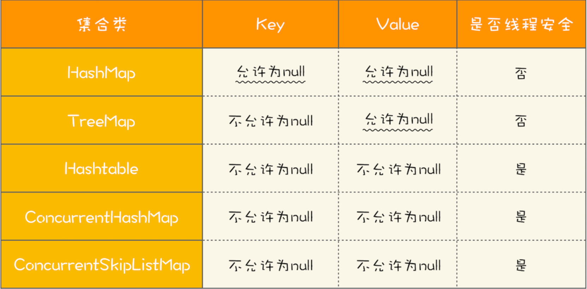

# 多线程

kill -9 给进程发送一个信号，如果进程实现了接受这个信号的机制，就关闭

kill -3 

java里的线程，其实是一个裸线程，只要java里的一个线程被new出来，他都对应这操作系统中的一个真正的线程

守护线程出现的原因：他用来做一些功能性的工作，比如定时查询，垃圾回收，然后守护线程还会随着主线程的毁灭而毁灭（主线程都死了，你作为他的守护现场，或者还有啥意义）

Thread类本身就实现了Runnable接口

CPU是以时间片的方式来运行的，就是一个线程运行一段时间，就切换其他的线程继续运行

Thread.sleep 释放cpu时间片，不释放锁

Object.wait：释放锁


为什么 wait和notify是放到Object基类中的而不是Thread类中的呢

线程Ready和Running状态是不可区分的，超出类我们编码控制的范围，是因CPU给你时间片你就能运行，不给你 你就要处于ready状态

join会释放当前执行的线程的锁（就是从那个线程里调用的join）

synchronized 加载方法上 或者代码块（不指定对象） 相当于加了this ，如果是静态方法，则是相当于加了类对象

关于 join的例子 可以中间加上 sleep  然后 用jstack -l 来查看线程状态

乐观锁好处：他讲 加锁-业务操作-解锁的操作 转化成了  一次操作，在压力不大的时候（就是大多数操作只需要自旋一次就能成功），效果很好，但是压力太大的时候，抢资源的线程过多，他自旋的次数过多，可能还不如 正常的加锁。

乐观锁就是赌一把，堵他没有变，变了的话就在赌一把

### 读锁的作用是什么：

任何锁表面上是互斥，但本质是都是为了避免原子性问题（如果程序没有原子性问题，那只用volatile来避免可见性和有序性问题就可以了，效率更高），读锁自然也是为了避免原子性问题，比如一个long型参数的写操作并不是原子性的，如果允许同时读和写，那读到的数很可能是就是写操作的中间状态，比如刚写完前32位的中间状态。long型数都如此，而实际上一般读的都是复杂的对象，那中间状态的情况就更多了。

所以读锁是防止读到写操作的中间状态的值。

本地缓存比redis缓存更快

锁降级主要是为了保证 **数据的可见性**，如下所示为官方示例，因为共享一份data变量数据，如果两个线程同时要修改这个数据，那么，如果第一个线程修改完以后，立刻释放读锁，可能第二个线程也立刻进来修改值，如果此时两个线程修改的值不一样，那么就会导致 第一个线程虽然写入了变量，却无法用到自己写入的变量的值，从而使用了错误的数据，如果此时用锁降级，将写锁降级为读锁，就可以阻止，当第一个线程释放锁以后，第二个线程立马获取到写锁，进行数据写入，而是用降级后的读锁，继续阻塞第二个线程的写锁获取。

```java
 class CachedData {
   Object data;
   volatile boolean cacheValid;
   final ReentrantReadWriteLock rwl = new ReentrantReadWriteLock();

   void processCachedData() {
     rwl.readLock().lock();
     if (!cacheValid) {
        // Must release read lock before acquiring write lock
        rwl.readLock().unlock();
        rwl.writeLock().lock();
        try {
          // Recheck state because another thread might have
          // acquired write lock and changed state before we did.
          if (!cacheValid) {
            data = ...
            cacheValid = true;
          }
          // Downgrade by acquiring read lock before releasing write lock
          rwl.readLock().lock();
        } finally {
          rwl.writeLock().unlock(); // Unlock write, still hold read
        }
     }

     try {
       use(data);
     } finally {
       rwl.readLock().unlock();
     }
   }
 }

```

## StampedLock:比读写锁还快

### StampedLock和ReadWriteLock的区别：


1. ReadWriteLock支持两种锁模式：**读锁和写锁**，而StampedLock支持三种锁的模式：**写锁，悲观读锁，乐观锁**，写锁和悲观读锁的意思和ReadWriteLock中的 读锁，写锁很像，只不过stampedLock中的写锁和悲观读锁在加锁成功以后，会返回一个 stamp，然后解锁的时候，需要传入这个stamp，如下代码所示：

   ```java
   
   final StampedLock sl = 
     new StampedLock();
     
   // 获取/释放悲观读锁示意代码
   long stamp = sl.readLock();
   try {
     //省略业务相关代码
   } finally {
     sl.unlockRead(stamp);
   }
   
   // 获取/释放写锁示意代码
   long stamp = sl.writeLock();
   try {
     //省略业务相关代码
   } finally {
     sl.unlockWrite(stamp);
   }
   ```

2. 乐观读是两者的最大区别：ReadWriteLock当有一个读的时候，所有的写都会被阻塞。stampLock提供的乐观读，是允许一个线程获取写锁的，也就是不是所有的写操作都被阻塞。

注意，我们这里用的 **乐观读**而不是 **乐观读锁** ，也就是说 乐观读这个操作是**无锁**的，所以相比较ReadWriteLock的读锁，性能要高一点

如下是乐观读的使用例子：

```java

class Point {
  private int x, y;
  final StampedLock sl = 
    new StampedLock();
  //计算到原点的距离  
  int distanceFromOrigin() {
    // 乐观读
    long stamp = 
      sl.tryOptimisticRead(); //这里就是获取乐观读
    // 读入局部变量，
    // 读的过程数据可能被修改
    int curX = x, curY = y;
    //判断执行读操作期间，
    //是否存在写操作，如果存在，
    //则sl.validate返回false
    if (!sl.validate(stamp)){//这里的验证是StampedLock自带的锁
      // 升级为悲观读锁
      stamp = sl.readLock();
      try {
        curX = x;
        curY = y;
      } finally {
        //释放悲观读锁
        sl.unlockRead(stamp);
      }
    }
    return Math.sqrt(
      curX * curX + curY * curY);
  }
}
```


StampedLock的乐观读和数据库的乐观锁有异曲同工之妙，

### 通过数据库的乐观锁理解乐观读

当多个人会对同一个订单进行修改的时候，我们可以在订单表里边增加一个version字段，当系统读取订单数据的时候，会一并将这个version字段读取走，当更新数据的时候，要先比较当前的version字段和数据库中的version字段是否一致，如果一致，可以直接更新字段，如果不一致则提示更新失败，需要从新操作。

这里的version就类似于StampedLock中的stamp。

### StampedLock使用注意事项

对于读多写少的场景，StampedLock现对于ReadWriteLock有一定的优势， **但是StampedLock仅仅是ReadWriteLock的子集**，因此需要注意一下的几种情况

1. StampedLock不支持**可重入锁**
2. StampedLock的悲观读和写锁都不支持条件变量（即Lock中的newCondition）
3. 当线程阻塞在StampedLock的悲观读锁或者写锁上的时候，如果此时 **调用阻塞线程的interrupt(),会导致CPU使用率飙升，**

如下代码所示，线程T1调用写锁，然后将自己阻塞，线程T2代用读锁，因为有写锁，因此自己也会阻塞，此时如果调用线程T2的interrupt()方法，会发现CPU的使用率飙升到100%

```java

final StampedLock lock
  = new StampedLock();
Thread T1 = new Thread(()->{
  // 获取写锁
  lock.writeLock();
  // 永远阻塞在此处，不释放写锁
  LockSupport.park();
});
T1.start();
// 保证T1获取写锁
Thread.sleep(100);
Thread T2 = new Thread(()->
  //阻塞在悲观读锁
  lock.readLock()
);
T2.start();
// 保证T2阻塞在读锁
Thread.sleep(100);
//中断线程T2
//会导致线程T2所在CPU飙升
T2.interrupt();
T2.join();
```

**使用StampedLock 一定不要调用中断操作，如果需要支持中断操作，一定要使用可以中断的 悲观读锁 readLockInterruptibly()和写锁 writeLockInterruptibly()**

如下所示是 对于StampedLock的官方示例的模板，我们在用的时候，尽可能参照如下模板进行使用

```java
//读模板
final StampedLock sl = new StampedLock();
//乐观读
long stamp = sl.tryOptimisticRead();
//读入方法局部变量
....
//校验stamp
    if(!sl.validate(stamp)) {
        //升级为悲观读锁
        stamp = sl.readLock();
        try {
            //读入方法局部变量
            ....
        }finally {
            sl.unlockRead(stamp);
        }
    }
//使用方法局部变量进行业务操作
```

```java
//stamp写模板
long stamp = sl.writeLock();
try {
    //写共享变量
} finally {
    sl.unlockWrite(stamp);
}
```

StampedLock 支持锁的降级（通过 tryConvertToReadLock() 方法实现）和升级（通过 tryConvertToWriteLock() 方法实现），但是建议你要慎重使用

## CountDownLunch和CyclicBarrier

CountDownLatch我会，就不做笔记了。

CyclicBarrier的使用例子如下：

```java
//订单队列
Vector<P> pos;
//派送单队列
Vector<D> dos;

Executor executor = Executors.newFixedThreadPool(1);
final CyclicBarrier barrier = new CyclicBarrier(2,() -> {
    executor.execute(() ->check());
})
    void check() {
    P p = pos.remove(0);
    D d = dos.remove(0);
    //执行对账操作
    diff = check(p,d);
    //差异写入差异库
    save(diff);
}
void checkAll() {
    //循环查询订单库
    Thread t1 = new Thread(() -> {
        while(存在未对账订单) {
            //查询订单库
            pos.add(getPOrders());
            //等待
            barrier.await();        
        }
    });
    t1.start();
    //循环查询运维单裤
    Thread t2 = new Thread(() -> {
        while(存在未对账订单) {
            //查询运维单库
            dos.add(getDOrder());
            //等待
            barrier.await();
        }
    });
    t2.start();
}
```

CyclicBarrier的回调函数执行在一个回合里最后执行await()的线程上，而且同步调用回调函数check()，调用完check之后，才会开始第二回合。所以check如果不另开一线程异步执行，就起不到性能优化的作用了

所有的阻塞操作，都需要设置超时时间，这是个很好的习惯

## 并发容器都有哪些坑

java并发包很大一部分内容都是关于**并发容器**的。

java的容器主要可以分为四大类：List Map Set和Queue4

如何把非线程安全的容器封装成线程安全的容器：**只要把非线程安全的容器封装在对象内部，然后控制好访问路径就可以了**。

如下所示代码，就是将ArrayList变成线程安全的类：用上边的方法。

```java
SafeArrayList<T>{
  //封装ArrayList
  List<T> c = new ArrayList<>();
  //控制访问路径
  synchronized
  T get(int idx){
    return c.get(idx);
  }

  synchronized
  void add(int idx, T t) {
    c.add(idx, t);
  }

  synchronized
  boolean addIfNotExist(T t){
    if(!c.contains(t)) {
      c.add(t);
      return true;
    }
    return false;
  }
}
```

所有的非线程安全的类都可以通过上述的方式来解决。

**组合操作要注意竞态条件问题**：就算每个操作都是原子性的操作，但是合道一起，就不一定是原子性的。

在容器领域一个容易被忽视的坑：**用迭代器遍历容器**，如下代码就存在并发问题：

```java
List list = Collections.
  synchronizedList(new ArrayList());
Iterator i = list.iterator(); 
while (i.hasNext())
  foo(i.next());
```

而正确做法是下面这样，锁住 list 之后再执行遍历操作。如果你查看 Collections 内部的包装类源码，你会发现包装类的公共方法锁的是对象的 this，其实就是我们这里的 list，所以锁住 list 绝对是线程安全的。

```java
List list = Collections.
  synchronizedList(new ArrayList());
synchronized (list) {  
  Iterator i = list.iterator(); 
  while (i.hasNext())
    foo(i.next());
}    
```

**同步容器**：基于synchronized这个关键字实现的线程安全的容器，被称为同步容器

vector，Stack，HashTable，这三个容器不是基于包装类实现的，但同样是基于synchronized关键字是现的。对着三个容器的**遍历**，同样要加锁保证互斥。

jdk1.5之前所说的线程安全的容器：主要就是指**同步容器**，缺点就是串行度太高，性能太差（都用synchronized来保证的）

jdk1.5之后的提供了性能更高的容器，我们一般称为 **并发容器**

并发容器虽然种类很多，但是基础依然是  List Set Map  Queue这四大类。


### List的并发容器：

List并发容器只有一个实现类：CopyOnWriteArrayLIst实现类，他在写的时候会将变量复制出来一份，但读的时候，是无锁的

CopyOnWriteArrayLIst内部维护者一个数组，array变量指向这个数据，当需要读数据的时候，就从这个数组中读取。当需要写入数据的时候，就会复制一份这个数组，在复制后的这个数组上进行新增操作：


新增完毕后，再讲array指向新内部数组就好了

CopyOnWriteArrayLIst需要注意以下两点

1. CopyOnWriteArrayLIst仅适用于写操作非常少的场景，而且能够容忍短暂的读写不一致
2. CopyOnWriteArrayLIst迭代器是只读的，不支持增删改，因为迭代器遍历的仅仅是一个快照，而对快照进行增删改是没有意义的

### Map的并发容器

Map并发容器主要有两个：ConcurrentHashMap和ConcurrentSkipListMap，他俩的区别在于**ConcurrentHashMap的key是无序的，ConcurrentSkipListMap的key是有序的**。

它们俩的key和value都不能为空，否则会抛出NPE异常



ConcurrentSkipListMap 里面的 SkipList 本身就是一种数据结构，中文一般都翻译为“跳表”。跳表插入、删除、查询操作平均的时间复杂度是 O(log n)，理论上和并发线程数没有关系，所以在并发度非常高的情况下，若你对 ConcurrentHashMap 的性能还不满意，可以尝试一下 ConcurrentSkipListMap。

### Set并发容器

set的两个实现是CopyOnWriteArraySet和ConcurrentSkipListSet。使用场景和上边类似。

### Queue并发容器

这是最复杂的并发容器，它可以分为 **阻塞与非阻塞**，阻塞就是当队列为空时，出队阻塞，单队列为满的回收，入队阻塞。**单端与双端**：单端就是只能在队尾入队，首出队，双端就是：可以同时在队首队尾进行入队和出队操作

**java并发包中的阻塞队列都用Block进行标识，单端队列用Queue命名，双端队列用Deque命名**

#### 单端阻塞队列

ArrayBlockingQueue，LinkedBlockingQueue，SynchronousQueue,LinekdTransferQueue,PriorityBlockingQueue和DelayQueue。

队列的内部一般会持有一个数组（例如ArrayBlockingQueue）或者一个链表（LinkedBlockingQueue）。也可以不持有（例如synchronousQueue，此时生产者的入队操作必须等消费者的出队操作)。而LinkedTransferQueue融合了LinkedBlockingQueue和SynchronousQueue的功能，性能比LinkedBlockingQueue要好。

PriorityBlockingQueue支持按照优先级出队，DelayQueue支持延时出队

#### 双端队列

其 实现就是LinkedBlockingDeque

**单端非阻塞队列**：ConcurrentLinkedQueue

**双端非阻塞队列**ConcurrentLinkedDeque

在实际工作中，一般 **不建议使用无界队列**，因为数据量大了以后，很容易导致OOM，上边提到的队列中，只有ArrayBlockingQueue和LinkedBlockingQueue支持有界队列，因此 **在使用无界队列的时候，一定要考虑是否会发生OOM的问题**

1.8版本之前 并发执行HashMap的put方法，可能会导致CPU飙升到100%

ConcurrentSkipListMap和ConcurrentHashMap的区别

如果key冲突比较大，hashmap还是要靠链表或者tree来解决冲突的，所以O(1)是理想值。同时增删改操作很多也影响hashmap性能。这个也是要看冲突情况。也就是说hashmap的稳定性差，如果很不幸正好偶遇它的稳定性问题，同时又接受不了，就可以尝试skiplistmap，它能保证稳定性，无论你的并发量是多大，也没有key冲突的问题。

ConcurrentSkipListMap可以做到无锁并发：原因：跳表就跟字典的索引一样，通过这个索引既能快速定位数据，也能隔离并发（可以并发查看不同页上的字）

CopyOnWriteArrayLIst的写操作是互斥的。

并发容器遍历是线程安全的。

## 原子类：无锁工具的典范

jdk提供了很多原子类的操作工具。它相对于互斥锁的一大好处就是，**性能更好**

无锁方案没有 加锁，解锁，互斥的性能消耗，还能保证互斥性。

**无锁方案的实现原理**

无锁方案的实现的秘密很简单：硬件支持而已。CPu为了解决并发问题，提供了CAS指令（compare and swap ，比较并交换）

CAS指令包含三个参数： **共享变量的内存地址A，用于比较的值B和共享变量的新值C**，并且只有到内存地址A处的值等于B的时候，才会将其值更新为C

**作为一条CPU指令，CAS本身是能够保证原子性的。**

如下是CAS指令的模拟代码，**只有当目前count的值和期望的值expect相等时，才会将count更新为newValue**。

```java
class SimulatedCAS{
  int count；
  synchronized int cas(
    int expect, int newValue){
    // 读目前count的值
    int curValue = count;
    // 比较目前count值是否==期望值
    if(curValue == expect){
      // 如果是，则更新count的值
      count = newValue;
    }
    // 返回写入前的值
    return curValue;
  }
}
```

只有当内存中 count 的值等于期望值 A 时，才能将内存中 count 的值更新为计算结果 A+1，这不就是 CAS 的语义吗

使用CAS一般都伴随着自旋，所谓的自旋就是循环尝试