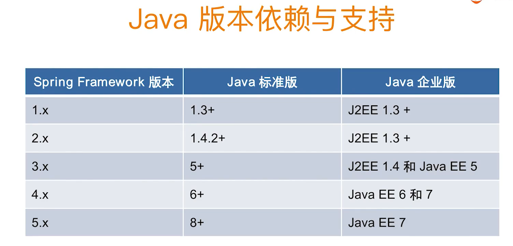

# 小马哥Spring

我们在观察spring源码的时候，观其大意即可，不比拘泥于细节，因为每个人对语言的理解有偏差，也有自己的实现风格，没必要过分的纠结。	

**事物抽象（Transactions）是面试必考的内容**

讨论jpa和讨论hibernate  实际上是讨论一个东西。


web Reactive 技术栈是 spring 5 以后才支持的 

spring mvc 和spring webflux 在注解上边 是一样的，但是他的底层实现时不同的，spring mvc  是需要servlet引擎来支撑的，

spring reactive 默认是 netty的 web server   但是 他也是可以用spring mvc的引擎来实现的。 也就是 他也可用servlet引擎来实现

servlet3.0规范之后，开始对webSocket进行支持。

SockJS可有可无。

对于 webClient来说 ，它是用来代替之前的 RestTemplate（或叫HTTPClient），RestTemplate是一个http请求的客户端，是同步执行的，webClient把他改成了异步调用。

学好了 spring mvc  的话  web Reactive也不会太难学。



## 1.IOC

### IOC定义

ioc就是控制反转，我们以来的数据，又其他方提供，而不需要自己去主动获取。


ioc来源于好莱坞原则

好莱坞原则的定义是：你不要打电话给我（导演）。 我（导演）会打电话给你

### 2.IOC有哪些主要的实现手段

1. service locator pattern ：服务定位模式（这种技术好想挺老了），这种模式是javaEE里边定义的一种模式
2. 依赖注入：现在很常用，分为 构造器注入，setter注入，参数注入。借口注入
3. Using acontextualized lookup ：上下文的依赖查询，例如java beans这个技术，它里边有一个通用的上下文，叫beancontext，这里边既可以传输我的bean，也可以管理我的bean的层次。
4. 用模板方法的设计模式。例如spring的jdbcTemplate 的实现。

**依赖注入**：组件不需要我们去查找，而是容器自动帮我们注入数据，或者我们手动去注入一些事情。

### 3：IOC容器的职责 

第一种解读：

1. 职责一：实现和要执行的任务之间，要产生解耦，这和我们面向对象的思想很像，也就是相当于 ioc也是我们面向对象的一个补充。
2. 职责二：关注设计的最终的目标，而不是具体的实现
3. 职责三：使用契约的方式把模块从猜测其他系统的实现方式与具体做法中解脱出来，换句话说就是尽量使用契约比如API标准的方式而非猜测接口实现的方式去完成一个模块
4. 职责四：好莱坞原则

第二种解读

**通用原则**

```xml
<?xml version="1.0" encoding="UTF-8"?>
<beans
        xmlns="http://www.springframework.org/schema/beans"
        xmlns:context="http://www.springframework.org/schema/context"
        xmlns:xsi="http://www.w3.org/2001/XMLSchema-instance"
        xsi:schemaLocation="http://www.springframework.org/schema/beans
        https://www.springframework.org/schema/beans/spring-beans.xsd
        http://www.springframework.org/schema/context
        https://www.springframework.org/schema/context/spring-context.xsd">


<!--  cmcccccccc -->
	<bean id="myUser" name="myUserr" class="org.geekbang.thinking.in.spring.ioc.overview.domain.MyUser" primary="true">
		<property name="id" value="1"></property>
		<property name="name" value="cmc"></property>
	</bean>
	<!--  id和name都不能重复  -->
		<bean id="myUser1" name="myUserr1" class="org.geekbang.thinking.in.spring.ioc.overview.domain.MyUser">
		<property name="id" value="2"></property>
		<property name="name" value="czmc"></property>
	</bean>
	
	<!--  parent标识继承某个bean 继承它里边的数据-->
	<bean id="mySuperUser" class="org.geekbang.thinking.in.spring.ioc.overview.domain.MySuperUser" parent="myUser">
		<property name="address" value="北京"></property>
	</bean>
		
	<bean id = "objectFacoryBean" class="org.springframework.beans.factory.config.ObjectFactoryCreatingFactoryBean">
		<!-- 这里的这个属性，是我们需要关联一个需要被延迟加载的bean，value是bean的id -->
		<property name="targetBeanName" value="myUser"></property>
	</bean>
</beans>
```


- 依赖处理
  - 依赖查找（就是我们主动去查找资源）
  - 依赖注入（他也有查找的过程，但是通过容器来自动提供给隐藏了）
- 生命周期管理
  - 容器（容器的生命周期，容器有自己的启动，暂停，终止等）
  - 托管的资源（JavaBean 或其他的资源）所托管的资源，不是全指的java bean。 其实spring的事件，也是一种托管的资源。
- 配置
  - 容器：容器的配置，控制容器的一个行为，比如容器什么时候启动。
  - 外部化配置（属性的配置，比如一些xml配置）
  - 托管的资源（JavaBean 或其他的资源）

### 4：Spring的依赖查找

首先要配置我们的xml

