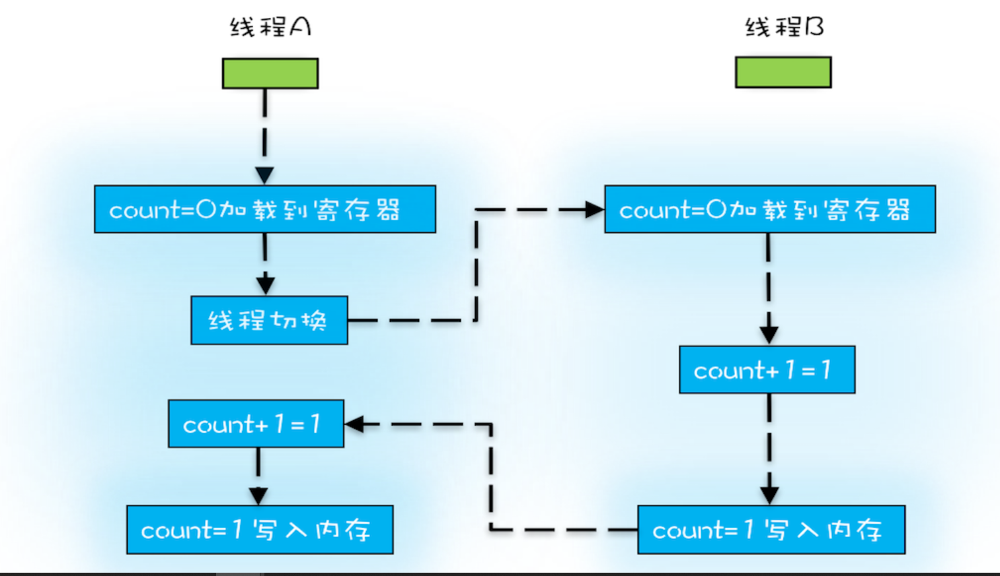
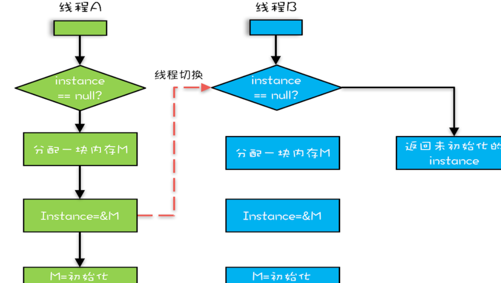
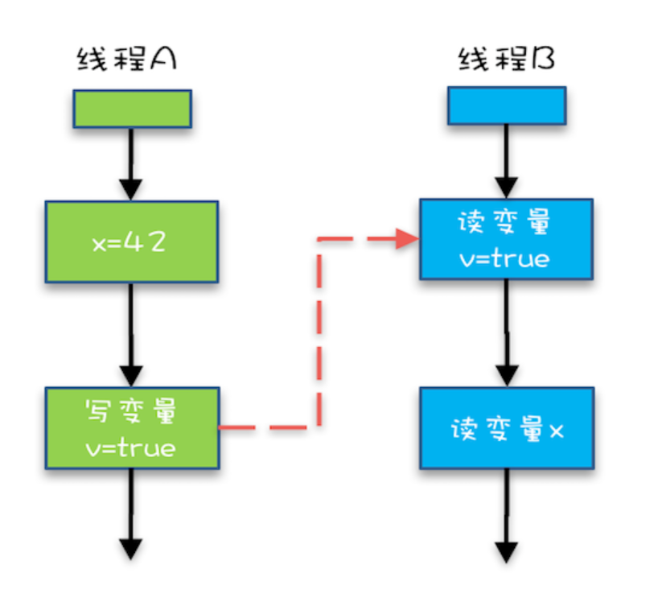

java的容器总共可以分为四大类：List，Map，Set，Queue

# 并发


- 可见性：一个线程对共享变量的修改，另一个线程能够理科看到
- 当两个线程并行执行加法（比如循环10000000)的时候，他的值会更加接近于10000000 ，而不是20000000。（个人理解，因为线程有交替运行的时候，就是一个线程运行，而另一个线程没有运行，此时只有一个线程运行的时候，就会让数值单独增加一会，然后另一个线程起来，读取这个值到缓存（应该是每一段时间，cpu缓存中的数值就会刷新到内存中），两个线程在一起跑，他们都只读自己cpu缓存中的数值，而不读内存中的，此时就导致 要加的数据以期增加。因此 他的结果接近1000000 而不是20000000. 其实也就是下边的cpu时间片的机制
- **至于什么时候把数据从缓存写到内存，没有固定的时间**
- cpu时间片：一个线程执行一段时间，就交给另一个线程在执行一段时间。每一段时间就是一个cpu时间片
- 我们把一个或者多个操作在 CPU 执行的过程中不被中断的特性称为原子性。
- 

count+1  需要的CPU指令数：

1. 把变量从内存加载到CPU的寄存器
2. 在寄存器中进行+1操作
3. 将结果写入内存/缓存

因为上述原因的存在，当cpu进行切换的时候，就很容易产生bug




- 有序性：编译器调整代码执行的先后循序：例如对于new指令来说：

  1. 分配一块内存地址
  2. 在内存地址上初始化对象
  3. 将此内存地址赋值给指向这个对象的指针

  然后编译器优化成了：

  1. 分配一块内存地址
  2. 将此内存地址赋值给指向这个对象的指针
  3. 在内存地址上初始化对象

于是这就出了问题。（对于双重检查的单例来说）此时如果a线程再执行完b步骤之后，就把权限给了c。此时c拿到的就是一个没有初始化的变量，一用就出问题了。




除了编译器有序性优化外：CPU和解释器在运行期也会做一部分优化，所以很多时候都是看不到的，也很难重现

**因此很多的并发问题都是：原子性，可见性，有序性所引发的，他们是并发bug之源，要想写好多线程一定要打破这三个条件，我们要解决的就是这三个问题**

**在采用一项技术的同时，一定要清楚它带来的问题是什么，以及如何规避。**


为什么要使用volatile：	https://www.cnblogs.com/huiAlex/p/9037020.html

有如下代码：

```java
public class RunThread extends Thread{
    private boolean isRunning = true;
    public boolean isRunning(){
        return isRunning;
    }

    public void setRunning(boolean isRunning){
        this.isRunning = isRunning;
    }

    @Override
    public void run() {
        System.out.println("进入run...");
        while(isRunning==true){}
        System.out.println("线程停止了");
    }
}


import java.util.concurrent.TimeUnit;

public class Run {
    public static void main(String[] args){
        try{
            RunThread thread = new RunThread();
            thread.start();
            TimeUnit.MILLISECONDS.sleep(1000);
            thread.setRunning(false);
            System.out.println("赋值为false");
        } catch (InterruptedException e) {
            e.printStackTrace();
        }
    }
}
```

执行结果：

我们创建了一个RunThread对象，并启动了该线程。当 isRunning == True时，将一直进行while循环。可以看到，我们启动了线程之后就调用setRunning方法将isRunning设为false。

按道理来说，当isRunning的状态为false时，就会退出while循环，输出“赋值为false”。然后run方法执行结束，线程执行完毕，整个程序运行结束。

但通过执行结果发现，线程进入了while死循环，线程从未终止。


这是由于在启动RunThread.java线程时，变量 private boolean isRunning = True 存在于公共堆栈和线程的私有堆栈中。JVM以server模式运行时，为了提高运行效率，线程一直从私有堆栈中读取isRunning的值为True。而thread.setRunning(false)执行后，是把公共堆栈中的isRunning改为false。所以即便将isRunning改为false，程序依然进入了while死循环。

 

解决办法：

使用volatile关键字，把 private boolean isRunning = True 改为 volatile private boolean isRunning = True ，再次运行：


**volatile的作用是：强制线程从公共堆栈中取变量的值，而非从线程的私有堆栈中取值**

****


关于为甚如果同时有两个线程 分别执行 100000此 i++操作 中 i如果被标注为 volatile的时候，计算出来的值可能要会小于100000的原因：并不是线程二没有触发MESI，而是因为自增操作本身并不具备原子性，比如i++,分开来就是读取i的值到工作内存，计算i+1这个值（可以将这个值理解为temp，这个值可能保存在工作内存中某个地方，这不重要），将这个值赋值给i，假设线程2触发了MESI，线程1重新读取i，这里不会重新计算i+1（temp）这个步骤，而是将之前计算的i+1（temp）赋值给i，然后将i写回主存，这也是为什么说volatile只能保证可见性不能保证原子性，**其实是这个中间变量temp捣的鬼**

如果 上述的i没有被volatile操作，那他的值会比100000多一点的原因是，有一个线程先启动，然后他会将计算的一部分值刷新到主内存中，然后第二个线程启动的时候，从主内存中获取到值，其实这里也会发生比100000少的可能性，比如99910等值，我个人猜测也是因为临时变量的原因，和上述一样

为了合理利用 CPU 的高性能，平衡这三者的速度差异，计算机体系结构、操作系统、编译程序都做出了贡献，主要体现为：

CPU 增加了缓存，以均衡与内存的速度差异；

操作系统增加了进程、线程，以分时复用 CPU，进而均衡 CPU 与 I/O 设备的速度差异；

编译程序优化指令执行次序，使得缓存能够得到更加合理地利用。->指令优化只是编译器优化能力的一种。 指令一般都是由两部分组成：操作码和操作地址。 在计算机大量的指令当中有着“二·八”定则，指的是有着20%的指令在80%的时间里重复使用着，而80%的指令只有20%的时间在使用着。 那么为了提高计算机的工作效率，在指令的调用上，要想办法把那20%的指令尽可能的放在近的地方，而那剩下的指令可以放在稍微远一些的地方，例如： 比如第1行：a=8
第1000行：a=a*2;

这个时候，把他们放到一起执行，是不是就能更好的利用缓存了（这要求中间的几百行，没有对a使用）？

操作系统允许每个进程（其实就是线程，因为调度的单位就是线程）运行一段时间，就切换其他线程（任务切换），例如是50ms，50ms后，操作系统就会切换其他的线程，这个50ms就是时间片，**所以我们的线程并不是一直运行的，他是会隔一段时间才运行一段时间。**  。任务切换的时机大多数是在时间片结束的时候


没开啥东西，线程就这么多，他切换的能不厉害么。。。 所以i++这种要三条CPU指令的语法，容易出问题就不奇怪了。

spring 默认创建的是单例，多线程共享这个单例，自然就存在并发问题了

## java内存模型

java内存模型：解决**可见性**和**有序性**导致的问题

掌握java内存模型，有助于解决 可见性和有序性引发的问题。

- 导致可见性的 原因是缓存，导致有序性的问题是编译优化。解决这两个最直接的方式：**全部禁用缓存和编译优化**，但这明显不合理
- 所以我们要按需禁用缓存和编译优化->因为何时禁用只有程序员知道，所以**按需就是按照程序员的要求禁用**。
- 为了解决可见性和有序性问题，只需要提供给程序员按需禁用缓存和编译优化的方法即可。
- 站在程序员的角度：java内存模型可以理解为：**java内存模型规范了jvm如何提供按需禁用缓存和编译优化的方法**
- 这些方法包括：volatile，synchronized，final 三个关键字，以及六项Happend-Before原则。

### volatile

> 告诉编译器：不能使用cpu缓存，必须从内存中读取或写入,并强制其他缓存中的数据失效

- Happen-Before：**前面的一个操作的结果对后续操作是可见的**
- Happen-Before：为程序员提供了按需禁用缓存和编译优化的行为
- 比较正式的说法是：Happens-Before 约束了编译器的优化行为，虽允许编译器优化，但是要求编译器优化后一定遵守 Happens-Before 规则。

#### 1.程序的循序执行

> 在一个**线程**中，按照程序顺序，前面的操作Happen-Before于后续的任意操作，一个线程内保证语意的串行性（即如果b依赖于a  那么 a一定先与b 执行，但是 如果 a和b没有依赖关系，则不一定）
> 在一个线程内，按照控制流顺序，书写在前面的操作先行 发生于书写在后面的操作。注意，这里说的是控制流顺序而不是程序代码顺序，因为要考虑分支、循 环等结构。
>
> 个人理解：就是对于单一线程，程序的运行结果，要符合程序程序员书写的逻辑，就是你编译器无论怎么优化，、程序的执行看起来，要和没有优化的时候样子一样。

因此 对于一些没有前后依赖关系的代码，就可以进行指令重排序了

```java
// 以下代码来源于【参考1】
class VolatileExample {
  int x = 0;
  volatile boolean v = false;
  public void writer() {
    x = 42;
    v = true;
  }
  public void reader() {
    if (v == true) {
      // 这里x会是多少呢？
    }
  }
}
```

上述代码中 在同一个线程里 x =42 就要先用v=true执行，

### 2：volatile变量规则

> 对一个volatile的写操作，Happen-Before于对这个变量的读操作

对一个 volatile 变量的写操作相对于后续对这个 volatile 变量的读操作可见，这怎么看都是禁用缓存的意思

### 3.传递性

> 如果 A Happen-Before B  B Happen-Before C  那么 A  Happen-Before C

如下图所示，传递性的效果




“x=42” Happens-Before 写变量 “v=true” ，这是规则 1 的内容；

写变量“v=true” Happens-Before 读变量 “v=true”，这是规则 2 的内容 。

再根据这个传递性规则，我们得到结果：“x=42” Happens-Before 读变量“v=true”。这意味着什么呢？如果线程 B 读到了“v=true”，那么线程 A 设置的“x=42”对线程 B 是可见的。也就是说，线程 B 能看到 “x == 42” ，有没有一种恍然大悟的感觉？这就是 1.5 版本对 volatile 语义的增强，这个增强意义重大，1.5 版本的并发工具包（java.util.concurrent）就是靠 volatile 语义来搞定可见性的，这个在后面的内容中会详细介绍。

个人理解：假设只有一个线程运行，那么     x = 42;v = true; 没有语义的先后循序 ，因此可以进行指令重排序

当有两个线程的时候，同时 v 被标注为 volatile 的时候，就给v以及在v之前进行的赋值操作，强制加了一个语义循序（依赖于 happen-before 第三条），因此 才能肯定读到v=42

指令重排序：在cpu执行指令的过程中，对于同一个线程中没有`数据依赖`的指令可以重新排序优化，有数据依赖的指令按照顺序串行执行，来保证单线程程序运行的正确性，同时也提升了CPU的执行效率，合理的利用了CPU等待时间，

我理解 volatile 就是在cpu指令级别上，加了一个写锁，在对volatile对象进行写入的时候，加上了写锁，所有读都必须等待其写完之后，才能读取


### 4：管程中锁的规则

> 对一个锁的解锁Happens-Before于后续对这个锁的加锁 ->这条一般也要配合 3.传递性一起使用 

管程：管程是一种通用的同步原语，在Java中指的就是synchronized，synchronized就是java对管程的实现

这也就是先进入管程中的程序对管程中数据的操作，对于后续进入管程的程序来说，完全可见

锁操作是具备happens-before关系的，解锁操作happens-before之后对同一把锁的加锁操作。 实际上，在解锁的时候，JVM需要强制刷新缓存，使得当前线程所修改的内存对其他线程可见。

一个线程对一个锁临界区执行完解锁后，变量的值对于另外线程后续对这个临界区做加锁操作时是可见的

### 5：线程start()规则

这是关于线程启动的，它是指主线程A启动子线程B后，子线程B能看到主线程A在启动B之前的操作  ->这条一般也要配合 3.传递性一起使用。

### 6：线程join()规则

这条是关于线程等待的，它是指主线程A等待子线程B完成（主线程A通过调用子线程B的join()方法实现）当子线程B完成后（主线程A中join()方法返回），主线程能够看到子线程中的操作，即对“**共享变量**的操作”  -> 这条 一般也要配合3.传递性一起使用

换句话说就是，如果在线程 A 中，调用线程 B 的 join() 并成功返回，那么线程 B 中的任意操作 Happens-Before 于该 join() 操作的返回。具体可参考下面示例代码。

volatile：禁用缓存和编译优化

final可以安全发布对象

“逸出”有点抽象，我们还是举个例子吧，在下面例子中，在构造函数里面将 this 赋值给了全局变量 global.obj，这就是“逸出”，线程通过 global.obj 读取 x 是有可能读到 0 的。因此我们一定要避免“逸出”。

```java
// 以下代码来源于【参考1】
final int x;
// 错误的构造函数
public FinalFieldExample() { 
  x = 3;
  y = 4;
  // 此处就是讲this逸出，
  global.obj = this;
}
```

Happens-Before 的语义是一种因果关系。在现实世界里，如果 A 事件是导致 B 事件的起因，那么 A 事件一定是先于（Happens-Before）B 事件发生的，这个就是 Happens-Before 语义的现实理解

在java语言里，Happen-Before的语义本质上是一种可见性，A Happens-Before B 意味着 A 事件对 B 事件来说是可见的，无论 A 事件和 B 事件是否发生在同一个线程里。例如 A 事件发生在线程 1 上，B 事件发生在线程 2 上，Happens-Before 规则保证线程 2 上也能看到 A 事件的发生。

### 7:线程中断规则：

> 线程中断规则：对线程interrupt()方法的调用先行发生于被中断线程的代码检测到中断事件的发生，可以通过Thread.interrupted()方法检测到是否有中断发生。

，volatile字段可以看成是一种不保证原子性的同步但保证可见性的特性，其性能往往是优于锁操作的。但是，频繁地访问 volatile字段也会出现因为不断地强制刷新缓存而影响程序的性能的问题

final修饰符，final修饰的实例字段则是涉及到新建对象的发布问题。当一个对象包含final修饰的实例字段时，其他线程能够看到已经初始化的final实例字段，这是安全的

所谓顺序，指的是你可以用顺序的方式推演程序的执行，但是程序的执行不一定是完全顺序的。编译器保证***结果***一定 == 顺序方式推演的结果 ->所以才造成了指令重排序

**这几条规则，都是告诉你，可以按照这个规则推演程序的执行。但是编译怎么优化，那就百花齐放了。**

volatile强制所修饰的变量及它前边	的变量刷新至内存，并且volatile禁止了指令的重排序。

volatile的一种解释：https://blog.csdn.net/weixin_30342639/article/details/91356608

## MESI缓存一致性协议

| 状态                | 描述                                                         |
| ------------------- | ------------------------------------------------------------ |
| M修改（modify）     | 此时缓存中的数据和主内存中的数据不一致，数据只存在于本工作内存中，其他线程从主内存读取共享变量的操作会被延迟，直到该缓存行将数据写回到主内存中 |
| E 独享（Exclusive） | 此时缓存行中的数据与主内存中的一直，数据只存在于本工作内存中，此时会监听其他线程读主内存中共享变量的操作，如果发生，该缓存行需要变成共享状态 |
| S 共享（Shared）    | 此时该缓存行中的数据和主内存中的一样，同时数据存在于很多工作内存中，此时会监听其他线程使该缓存行无效的请求，如果发生，该缓存行需要变成共享状态 |
| I 无效（Invalid）   | 此时该缓存行无效                                             |

假如说当前有一个cpu去主内存拿到一个变量x的值初始为1，放到自己的工作内存中。此时它的状态就是独享状态E，然后此时另外一个cpu也拿到了这个x的值，放到自己的工作内存中。此时之前那个cpu会不断地监听内存总线，发现这个x有多个cpu在获取，那么这个时候这两个cpu所获得的x的值的状态就都是共享状态S。然后第一个cpu将自己工作内存中x的值带入到自己的ALU计算单元去进行计算，返回来x的值变为2，接着会告诉给内存总线，将此时自己的x的状态置为修改状态M。而另一个cpu此时也会去不断的监听内存总线，发现这个x已经有别的cpu将其置为了修改状态，所以自己内部的x的状态会被置为无效状态I，等待第一个cpu将修改后的值刷回到主内存后，重新去获取新的值。这个谁先改变x的值可能是同一时刻进行修改的，此时cpu就会通过底层硬件在同一个指令周期内进行裁决，裁决是谁进行修改的，就置为修改状态，而另一个就置为无效状态，被丢弃或者是被覆盖（有争论）


一个或多个操作，在cpu执行过程中不被中断的特性，称为“原子性”

不要用字面量作为锁：因为，字面量会进入常量池，你不知道什么时候他就被引用，然后再被用作其他的锁的话，就有可能造成了死锁了。。。，就是你不知道这个锁什么时候，会被用作什么用途。

如果资源之间没有关系，很好处理，每个资源一把锁就可以了。如果**资源之间有关联关系，就要选择一个粒度更大的锁，这个锁应该能够覆盖所有相关的资源**

**原子性问题的源头：线程切换**

- 同一时刻只有一个线程执行，这个条件非常总要，我们称之为 **互斥**，如果我们能够保证对共享变量的修改时互斥的，那么无论是单核还是多核cpu，都能保证数据的正确性
- 需要互斥执行的代码称为 **临界区**

锁模型如下：


首先，我们要把临界区要保护的资源标注出来，如图中临界区里增加了一个元素：受保护的资源 R；其次，我们要保护资源 R 就得为它创建一把锁 LR；最后，针对这把锁 LR，我们还需在进出临界区时添上加锁操作和解锁操作。另外，在锁 LR 和受保护资源之间，我特地用一条线做了关联，这个关联关系非常重要。很多并发 Bug 的出现都是因为把它忽略了，然后就出现了类似锁自家门来保护他家资产的事情，这样的 Bug 非常不好诊断，因为潜意识里我们认为已经正确加锁了。

- synchronized可以修饰静态方法，非静态发方法，代码块
- 对应synchronized来说：当修饰静态方法的时候，锁定的是当前类的Class对象，当修饰的是非静态方法的时候，锁定的是当前实例对象this
  - 受保护的资源和锁之间的关系：**一个合理的关系是：受保护的资源和锁之间是多对一的关系**，就是可以用一把锁保护多个资源

**加锁本质就是在锁对象的对象头中写入当前线程id**

sync锁的对象monitor指针指向一个ObjectMonitor对象，所有线程加入他的entrylist里面，去cas抢锁，更改state加1拿锁，执行完代码，释放锁state减1，和aqs机制差不多，只是所有线程不阻塞，cas抢锁，没有队列，属于非公平锁

当线程释放一个锁时会强制性的将工作内存中之前所有的写操作都刷新到主内存中去，而获取一个锁则会强制性的加载可访问到的值到线程工作内存中来。虽然锁操作只对同步方法和同步代码块这一块起到作用，但是影响的却是线程执行操作所使用的所有字段。

volatile告诉编译器：对这个变量的读写，不能使用cpu缓存，必须从内存中都读取或写入

- 用不同的锁对受保护的资源进行精细化管理，能够提升性能，这种锁叫细粒度锁：例如 存款 取款 可以用同一把锁，查看密码，修改密码，也可以用同一把锁，着就是细粒度锁。当然我们也可以存款，取款，查密码，改密码全用一把锁，着就是粗粒度锁。

如何保护多个资源已经很有心得了，关键是要分析多个资源之间的关系。如果资源之间没有关系，很好处理，每个资源一把锁就可以了。如果资源之间有关联关系，就要选择一个粒度更大的锁（例如Xxx.class)，这个锁应该能够覆盖所有相关的资源。除此之外，还要梳理出有哪些访问路径，所有的访问路径都要设置合适的锁

- 关联关系（比如转账：A转给B100）如果用更具体更专业的语言描述的话，其实是一种“原子性”特征，我们提到的原子性，主要是面向 CPU 指令的，转账操作的原子性则是属于是面向高级语言的，不过它们本质上是一样的

  - 原子性的本质是什么：其实不是不可分割，不可分割只是外在的表现，其本质是多个资源之间有一致性的要求， **操作的中间状态对外不可见** 。例如，在 32 位的机器上写 long 型变量有中间状态（只写了 64 位中的 32 位），在银行转账的操作中也有中间状态（账户 A 减少了 100，账户 B 还没来得及发生变化），i++中也有中间状态

  **不可用可变对象做锁！！** 如果一个对象里边的某个字段发生了值的变化，是没有问题的，但是如果是引用变了，那就凉凉了，所以我们做锁的对象，最好用final标识符进行修饰。

死锁的一个比较专业的定义是：一组互相竞争资源的线程因互相等待，导致“永久”阻塞的现象。

### 如何预防死锁：

预防死锁：只需要破坏如下四个条件中的一个即可。

- **互斥：共享的资源x和y只能被一个线程占用**->*这条是不能被破坏的，因为我们多线程就是要互斥的访问共享资源*
- 占有且等待：线程T1已经占有x资源，在他等待y资源的同时，不释放x资源
- 不可抢占：其他资源不能强行抢占线程T1占有的资源
- 循环等待：线程T1等待线程T2占有的资源，线程T2等待线程T1占有的资源就是循环等待

只要破坏上述的一条就能破坏死锁

### 破坏占有且等待

要破坏这个条件，可以一次性申请所有的资源：已转账操作为例


​	

“同时申请”这个操作也是一个临界区，我们也需要一个角色，来管理这个临界区，我们就把这个角色定义为Allocator，他又两个重要的功能，分别是同时申请资源apply()和同时释放资源free()，账户类Account中持有ALlocator的一个单例（必须是单例，只能由一个人来分配），当账户Account再执行转账操作的时候，首先像Allocator同时申请转入账户和转出账户这两个资源，成功后在锁定这两个资源，当转账操作执行完，释放锁后，我们需要通知Allocator同时释放转出账户和转入账户这两个资源

```java
class Allocator {
  private List<Object> als =
    new ArrayList<>();
  // 一次性申请所有资源
  synchronized boolean apply(
    Object from, Object to){
    if(als.contains(from) ||
         als.contains(to)){
      return false;  
    } else {
      als.add(from);
      als.add(to);  
    }
    return true;
  }
  // 归还资源
  synchronized void free(
    Object from, Object to){
    als.remove(from);
    als.remove(to);
  }
}

class Account {
  // actr应该为单例
  private Allocator actr;
  private int balance;
  // 转账
  void transfer(Account target, int amt){
    // 一次性申请转出账户和转入账户，直到成功
    while(!actr.apply(this, target))  //此处其实应该有个timeout
      ；
    try{
      // 锁定转出账户
      synchronized(this){              
        // 锁定转入账户
        synchronized(target){           
          if (this.balance > amt){
            this.balance -= amt;
            target.balance += amt;
          }
        }
      }
    } finally {
      actr.free(this, target)
    }
  } 
}
```

### 破坏不可抢占条件

用java.util.concurrent这个包下提供的Lock是可以轻松加解决的

### 破坏循环等待条件

破坏这个条件，需要对资源进行排序，然后按顺序申请资源，例如对于账号id来说，每个账号都有id，我们就可以利用这个顺序来做文章，申请资源的时候，我们就可以按照id从小到大的顺序来申请

如下代码所示①到⑥是我们要执行的转账逻辑

```java
class Account {
  private int id;
  private int balance;
  // 转账
  void transfer(Account target, int amt){
    Account left = this        ①
    Account right = target;    ②
    if (this.id > target.id) { ③
      left = target;           ④
      right = this;            ⑤
    }                          ⑥
    // 锁定序号小的账户
    synchronized(left){
      // 锁定序号大的账户
      synchronized(right){ 
        if (this.balance > amt){
          this.balance -= amt;
          target.balance += amt;
        }
      }
    }
  } 
}
```

这里肯定不会发生死锁的，比如 有三个账号1,2,3  1和2相互转账，2和3相互转账，如果T1拿到了id1的锁，此时切换线程，T2拿到了线程2的锁，此时在切换线程到T1，T1获取不到id2的锁没错，但是等到T2的时候T2可以获取到id3的锁，此时他可以正常转账，等他这里操作完了，就能进行id1和id2之间的转账了

人能智能的交流，但是两个线程之间是没有这个能力的。因此很多人理所当然的事情，在线程上就发生了死锁了。

用细粒度锁来锁定多个资源的时候，要注意死锁的问题，并把它生成为一个思维定式，一遇到这种场景，就要想到死锁的可能性。不同的破坏死锁条件的方式，花费的成本也不同，例如上述的破坏不可抢占条件的，就成本很高，但是，破坏循环等待的，就成本很低。

循环等待，一定是A->B->C->...->N->A形成环状。
如果按顺序申请，是不允许N->A出现的，只能N->P。没有环状，也就不会死锁了

## 等待-通知 优化循环等待

我们上边的避免死锁的一个方式是 破坏“占有且等待”的这个条件，当时我们用的是：

```java
// 一次性申请转出账户和转入账户，直到成功
while(!actr.apply(this, target))
  ；
```

这种死循环的方式，如果并发量小，他还可以，如果并发量大，需要循环上万次才能拿到锁，那就操蛋了。

这种情况下最好的方式是：如果条件不满足（转入转出的账本没有同时可用），线程就进行 **等待** 状态，当条件满足以后，**通知**等待的线程重新执行。**其中线程等待的方式，就能避免循环等待消耗CPU的问题**

- 线程进入等待状态，要释放持有的互斥锁
- 当处于等待状态的线程条件满足了，还需要去重新去获取互斥锁

**一个完整的等待-通知机制：线程首先获取互斥锁，当线程要求的条件不满足的时候，释放互斥锁，进入等待状态；当要求的条件满足时，通知等待的线程，重新获取互斥锁**

### 用synchronized实现等待通知

synchronized配合 wait() notify() notifyAll() 就能轻松实现。

对于synchronized保护的临界区，同一时刻，只有一个线程可以进入，其他的线程就要在该互斥锁的等待队列上进行等待。**互斥锁和等待队列是一对一的关系，每个互斥锁都有自己的等待队列**

当线程进入synchronized保护的临界区后，由于需要的条件不满足，可以调用 java的wait()方法进入等待状态，**进入等待状态的线程就会释放互斥锁，并进入该互斥锁的另一个等待队列中**，因为临界区中的线程释放了锁，所以其他线程就有机会获取到这个锁


当线程条件满足后：就可以调用 notify()方法 **通过调用wait()方法进入等待队列的线程**（上图右侧的队列）**条件曾经满足过**，因为notify只能保证，**他通知的那个时刻，条件是满足的**，被通知线程的执行时间，和通知的时间点一般都不会一致，所以当被通知的线程执行的时候，条件可能就不满足了（其他线程插队）。

而且被通知的线程，想要再一次进入临界区，任然需要重新获取锁，因为他之前的锁在调用wait()函数的时候已经被释放掉了


我们要注意的是：wait(),notify(),notifyAll()方法操作的等待队列是某个互斥锁的等待队列，因此，如果我们的互斥锁是this，那么对应的就是this.wait,this.notify,this.notifyAll()  同理 如果我们锁的是 target对象，那么就是target.wait(),target.notify,target.notifyA(), this.wait()是不能为 target.notify()唤醒的，因为他们不是一个互斥锁的队列。

而且我们调用这三个方法的条件之一就是：**线程已经获取了锁** 因为我们会发现，他们都是在synchronized {} 临界区内获取到的。如果在 synchronized{}外部调用，或者锁定的 this，而用 target.wait() 调用的话，JVM 会抛出一个运行时异常：java.lang.IllegalMonitorStateException。

notify会唤醒队列最前边的哪一个线程

因为等待-通知 有条件曾经满足过的问题，所以我们在让线程等待的时候，最好用如下的方式,这是一种范式，意思就是这是一种经典做法

```java
while(条件不满足) {
    wait();
  }	
```

例如我们可以吧之前破坏“占有且等待”的代码改成如下：

```java
class Allocator {
    private List<Object> als;
    synchronized void apply(Object from,Object to) {
        while(als.contains(from)||als.contains(to)) {
            wait();
        }
        als.add(from);
        als.add(to);
    }
    synchronized void release(Object from ,Object to) {
        als.remove(from);
        als.remove(to);
        notifyAll();
    }
}
```

### 尽量使用notifyAll()

***notify()会随机的通知等待队列中的一个线程*，而notifyAll()会通知等待队列中的所有线程**，如果我们使用notify()，造成的问题就是 **某些线程可能永远都不会被通知到**，如下例子，解释了如果使用notify 可能会发生的问题

*假设我们有资源 A、B、C、D，线程 1 申请到了 AB，线程 2 申请到了 CD，此时线程 3 申请 AB，会进入等待队列（AB 分配给线程 1，线程 3 要求的条件不满足），线程 4 申请 CD 也会进入等待队列。我们再假设之后线程 1 归还了资源 AB，如果使用 notify() 来通知等待队列中的线程，有可能被通知的是线程 4，但线程 4 申请的是 CD，所以此时线程 4 还是会继续等待，而真正该唤醒的线程 3 就再也没有机会被唤醒了。* 	

所以除非经过深思熟虑，否则尽量使用 notifyAll()；

所以当我们使用循环来等待某个状态的话，就可以改成用等待-通知的方式（线程协作的方式）

wait与sleep区别在于：

1. wait()方法与sleep()方法的不同之处在于，wait()方法会释放对象的“锁标志”。当调用某一对象的wait()方法后，会使当前线程暂停执行，并将当前线程放入对象等待池中，直到调用了notify()方法后，将从对象等待池中移出任意一个线程并放入锁标志等待池中，只有锁标志等待池中的线程可以获取锁标志，它们随时准备争夺锁的拥有权。当调用了某个对象的notifyAll()方法，会将对象等待池中的所有线程都移动到该对象的锁标志等待池。
   sleep()方法需要指定等待的时间，它可以让当前正在执行的线程在指定的时间内暂停执行，进入阻塞状态，该方法既可以让其他同优先级或者高优先级的线程得到执行的机会，也可以让低优先级的线程得到执行机会。但是sleep()方法不会释放“锁标志”，也就是说如果有synchronized同步块，其他线程仍然不能访问共享数据。
2. sleep是Thread的方法，wait()是Object的方法。

notify 只会唤醒，因为调用wait()方法而陷入等待的队列，而不会唤醒，从一开始就没有获取到锁的队列

## 安全性，活跃性和性能问题

### 安全性问题：

> 安全性的含义就是：程序按照我们期望的执行，不会发生意外情况

理论上，避免了原子性，可见性，有序性问题的程序就是线程安全的。

- **只有同时存在共享数据且该数据会发生变化，两个条件共存**，通俗的将就是多个线程会同时读写同一数据的时候，才会发生安全性问题。	
- 如果数据不共享或者共享数据不发生变化，就能解决这个问题了，例如ThreadLocal类就是让线程不共享，不变模式就是让共享数据不可变。

### 安全性问题的主要两个方面：

1. 数据竞争：当多个线程同时访问一个数据，并且至少有一个线程执行写入操作，如果我们不采取措施，就会导致bug。如下代码如果两个线程同时执行，就会发生数据竞争

   ```java
   public class Test {
     private long count = 0;
     void add10K() {
       int idx = 0;
       while(idx++ < 10000) {
         count += 1;
       }
     }
   }
   ```

2. 竞态条件：线程的执行结果依赖线程执行的顺序或者说是程序执行依赖于某个状态变量，如下代码所示就是一种竞态条件：

   ```java
   public class Test {
     private long count = 0;
     synchronized long get(){
       return count；
     }
     synchronized void set(long v){
       count = v;
     } 
     void add10K() {
       int idx = 0;
       while(idx++ < 10000) {
         set(get()+1)      
       }
     }
   }
   ```

   上述代码中 虽然我们给 get()和set()加锁了，但 add10k()中  set(get()+1) 这段并不是一个原子操作，可能两个线程先后调用get()  此时两个线程得到的值都是0，此时 他们就是依据获取到的这个值进行set() 结果就是错误的：**这就是竞态条件中的，程序的执行结果依赖于程序执行的顺序**

   对于另一种，**程序的执行依赖于某个状态变量** 的示例代码如下：

   ```java
   class Account {
     private int balance;
     // 转账
     void transfer(
         Account target, int amt){
       if (this.balance > amt) {
         this.balance -= amt;
         target.balance += amt;
       }
     } 
   }
   ```

   这是转账操作，要求账户余额必须>0  如果balance只有300  ，如果线程T1执行if后，发现满足要求，此时T2抢到了CPU 也执行了if，发现同样满足要求，然后T1和T2同时执行 this.balance -= amt;这条语句，就会导致balance，这就是 **程序的执行依赖于某个状态变量** 也就是如下语句：

   ```
   if (状态变量 满足 执行条件) {
     执行操作
   }
   ```

   当某个线程发现状态满足后，开始执行操作，可是当这个线程执行操作的时候，有其他的线程也执行同样的操作，导致状态变量变的不在满足执行条件了。**很多场景下，这个条件是不显示的，例如前面的add10K()方法中，set(get()+1)的操作，就隐式依赖get()的结果**

3. 解决上述的 **数据竞争** 和 **竞态条件** 的方式就是用 **互斥** 也就是 **锁** 的技术来解决

4. 数据竞争会引发竞态条件的问题。

### 活跃性问题

> 当程序无法执行下去的时候，就发生了活跃性问题，**死锁** 就是一种常见的活跃性问题，除此之外还有 **活锁 和饥饿**

- 发生死锁后，线程会相互等待，并且会一直等待下去，在技术上表现为：线程永久的阻塞了。

活锁：线程没有发生阻塞，但是仍然存在执行不下去的情况，这就是所谓的活锁（活锁没有堵塞，顾名思义，一直在运行，但是没有执行有效代码）：

- 例如两个人相向而行，都想给对方让路，一个往左一个往右，然后发现不行，又同时一个往右一个往左，如此反复，就是活锁。

- 又比如：活锁典型的例子实在一些重试机制中，比如以太网络上，两个基站尝试使用相同的载波发送数据包，包会发生冲突。发生冲突后，稍后都会重发。如果这时他们都是在 **1s 后（时间固定  ）**重发，那么他们又会再次发生冲突，一直循环下去，导致数据包永远不能发送。如下是一个活锁的代码：

  ```java
  /************************
   * 活锁例子
   * 创建一个勺子类，有且只有一个。
   * 丈夫和妻子用餐时，需要使用勺子，这时只能有一人持有，也就是说同一时刻只有一个人能够进餐。
   * 但是丈夫和妻子互相谦让，都想让对方先吃，所以勺子一直传递来传递去，谁都没法用餐。
   * */
  public class LiveLockTest {
  
      //定义一个勺子，ower 表示这个勺子的拥有者
      static class Spoon {
          Diner owner;//勺子的拥有者
  
          //获取拥有者
          public String getOwnerName() {
              return owner.getName();
          }
          //设置拥有者
          public void setOwner(Diner diner) {
              this.owner = diner;
          }
  
          public Spoon(Diner diner) {
              this.owner = diner;
          }
          //表示正在用餐
          public void use() {
              System.out.println(owner.getName() + " use this spoon and finish eat.");
          }
      }
  
      //定义一个晚餐类
      static class Diner {
          public Diner(boolean isHungry, String name) {
              this.isHungry = isHungry;
              this.name = name;
          }
          private boolean isHungry;//是否饿了
          private String name;//定义当前用餐者的名字
  
          public String getName() {//获取当前用餐者
              return name;
          }
          //可以理解为和某人吃饭
          public void eatWith(Diner spouse, Spoon sharedSpoon) {
              try {
                  synchronized (sharedSpoon) {
                      while (isHungry) {
                          //当前用餐者和勺子拥有者不是同一个人，则进行等待
                          while (!sharedSpoon.getOwnerName().equals(name)) {
                              sharedSpoon.wait();
                              //System.out.println("sharedSpoon belongs to" + sharedSpoon.getOwnerName())
                          }
                          //spouse此时是饿了，把勺子分给他，并通知他可以用餐
                          if (spouse.isHungry) {
                              System.out.println("I am " + name + ", and my " + spouse.getName() + " is hungry, I should give it to him(her).\n");
                              sharedSpoon.setOwner(spouse);
                              sharedSpoon.notifyAll();
                          } else {
                              //用餐
                              sharedSpoon.use();
                              sharedSpoon.setOwner(spouse);
                              isHungry = false;
                          }
                          Thread.sleep(500);
                      }
                  }
              } catch (InterruptedException e) {
                  System.out.println(name + " is interrupted.");
              }
          }
      }
  
      public static void main(String[] args) {
          final Diner husband = new Diner(true, "husband");//创建一个丈夫用餐类
          final Diner wife = new Diner(true, "wife");//创建一个妻子用餐类
          final Spoon sharedSpoon = new Spoon(wife);//创建一个勺子，初始状态并由妻子持有
  
          //创建一个 线程，由丈夫进行用餐
          Thread h = new Thread() {
              @Override
              public void run() {
                  //表示和妻子用餐，这个过程判断妻子是否饿了，如果是，则会把勺子分给妻子，并通知她
                  husband.eatWith(wife, sharedSpoon);
              }
          };
          h.start();
  
          //创建一个 线程，由妻子进行用餐
          Thread w = new Thread() {
              @Override
              public void run() {
                  //表示和妻子用餐，这个过程判断丈夫是否饿了，如果是，则会把勺子分给丈夫，并通知他
                  wife.eatWith(husband, sharedSpoon);
              }
          };
          w.start();
  
          try {
              Thread.sleep(10000);
          } catch (InterruptedException e) {
              e.printStackTrace();
          }
          h.interrupt();
          w.interrupt();
  
          try {
              h.join();//join()方法阻塞调用此方法的线程(calling thread)，直到线程t完成，此线程再继续；通常用于在main()主线程内，等待其它线程完成再结束main()主线程。
              w.join();
          } catch (InterruptedException e) {
              e.printStackTrace();
          }
      }
  }
  
  ```

  解决活锁的一个一般性的办法就是，尝试等待一个随机的时间就可以了（但是显然上述的我们妻子丈夫用餐的方式，不能这么解决），例如上述中，让路的例子和发信号的例子都可以通过等待一个随机时间解决

### 饥饿问题

> 饥饿：线程因无法访问所需资源而无法执行下去的情况

如果线程优先级不同，在cpu繁忙的情况下，优先级低的线程就很难被执行到，也就发生了线程的“饥饿”。或者持有锁的线程执行时间过长，也会导致饥饿。

解决饥饿有如下三种方式：

1. 保证资源充足
2. 公平的分配资源
3. 避免持有锁的线程执行时间过长

1和3适应的场景比较有限，因为在很多场景下，资源稀缺是无法避免的，同时线程持有锁的执行时间也很难缩短。

在并发编程中，主要是使用公平锁来保证公平的分配资源，公平锁：是一种先来后得到的方案，线程等待是有顺序的，排在队列前面的线程会优先获取资源。

### 性能问题

当锁的粒度过大，就会造成过大范围的串行化，这也就违背了我们是用并发的初衷->用并发挺高程序的执行性能。

阿姆达尔定律：处理器并行运算后，效率提升能提升多少：
$$
S=1/((1−p)+n/p)
$$
n： cpu的核数，p：并行百分比，  1-p 就是串行百分比，例如串行百分比为 5% n为无穷大，那么加速比S最大就20，也就是如果我们有5%的串行代码，那么我们无论采用什么技术，最高也就提高20倍速度。

所以使用锁的时候，一定要注意锁对性能的影响，**JDK并发包中之所以有这么多东西，有很大一部分原因就是要提高在某个特定领域的性能。**

使用无锁的算法和数据结构可以讲解决上述性能的问题：例如线程本地存储（Thread Local Storage TLS），写时复制，乐观锁等，已经jdk包的原子类

减少锁的持有时间（减少串行化的时间）增加并行化的时间：例如使用细粒度锁，concurrentHashMap中的分段锁，以及读写锁->读的时候无锁，写的时候才会加锁

性能方面的指标主要有以下三种：

1. 吞吐量：单位时间内程序能处理的请求数量，吞吐量越多，说明性能越好。
2. 延迟：从发出请求到收到响应的时间，延迟越短，说明性能越好
3. 并发量：指同一时间能处理的请求的数量，一般来说随着并发量的增加，延迟也会增加，所以延迟这个指标：一般会是基于并发量这个指标来说的，例如并发量是1000的时候，延迟是50ms

## 管程：并发编程的万能钥匙

管程的英  文名：Monitor

操作系统的课程告诉我们：用信号量能解决所有并发编程中遇到的问题

java采用的就是管程技术：synchronized关键字和 wait() notify() notifyAll() 三个方法都是管程的组成部分，

管程和信号量是等价的。即用管程能实现信号量，用信号量也能实现管程

**管程 **：**管理共享变量以及对共享变量的操作过程**，翻译成java领域语言：管理类的成员变量和成员方法，让这个类是线程安全的。

java管程的实现参考的 MESA模型

并发编程领域，有两大核心问题：

1. 互斥：同一时刻只能有一个线程访问资源。
2. 同步：程之间如何协作和通信

同步一般建立在互斥的基础上，只有资源具有排他性才需要同步来解决并发过程中对资源的协作问题。

管程解决互斥的方式：将共享变量和共享变量的操作封装起来，例如：实现一个线程安全的阻塞队列，可见将线程不安全的队列封装起来，对外提供线程安全的操作方法，例如出队和入队操作。

利用管程，可以快速实现这个直观的想法。在下图中，管程 X 将共享变量 queue 这个线程不安全的队列和相关的操作入队操作 enq()、出队操作 deq() 都**封装**起来了；线程 A 和线程 B 如果想访问共享变量 queue，只能通过调用管程提供的 enq()、deq() 方法来实现；enq()、deq() 保证互斥性，只允许一个线程进入管程。


管程模型和面向对象高度契合的。估计这也是 Java 选择管程的原因吧

管程解决线程同步的方式：

MESA的管程模型图如下所示：


在管程模型里，共享变量和对共享变量的操作是被封装起来的，图中最外层的框就代表封装的意思。框的上面只有一个入口，并且在入口旁边还有一个入口等待队列。当多个线程同时试图进入管程内部时，只允许一个线程进入，其他线程则在**入口等待队列**中等待。

管程里还引入了条件变量的概念，而且**每个条件变量都对应有一个等待队列**，如下图，条件变量 A 和条件变量 B 分别都有自己的等待队列。

那条件变量和条件变量等待队列的作用是什么呢？其实就是解决线程同步问题。你可以结合上面提到的阻塞队列的例子加深一下理解（阻塞队列的例子，是用管程来实现线程安全的阻塞队列，这个阻塞队列和管程内部的等待队列没有关系，本文中一定要注意**阻塞队列和等待队列是不同的**）

例如：

假设有个线程 T1 执行阻塞队列的出队操作，执行出队操作，需要注意有个前提条件，就是**阻塞队列不能是空**的（空队列只能出 Null 值，是不允许的），阻塞队列不空这个前提条件对应的就是管程里的条件变量。 如果线程 T1 进入管程后恰好发现阻塞队列是空的，那怎么办呢？等待啊，去哪里等呢？就去**条件变量对应的等待队列里面等。**此时线程 T1 就去“队列不空”这个条件变量的等待队列中等待

再假设之后另外一个线程 T2 执行阻塞队列的入队操作，入队操作执行成功之后，**“阻塞队列不空”这个条件对于线程 T1 来说已经满足了，此时线程 T2 要通知 T1，告诉它需要的条件已经满足了**。**当线程 T1 得到通知后，会从等待队列**里面出来，但是出来之后不是马上执行，而是重新进入到入口等待队列里面

如下代码所示：

```java
public class BlockedQueue<T>{
  final Lock lock =
    new ReentrantLock();
  // 条件变量：队列不满  此处就对应着一个等待队列
  final Condition notFull =
    lock.newCondition();
  // 条件变量：队列不空  此处同样对应着一个等待队列
  final Condition notEmpty =
    lock.newCondition();

  // 入队
  void enq(T x) {
    lock.lock();
    try {
      while (队列已满){
        // 等待队列不满 
        notFull.await();
      }  
      // 省略入队操作...
      //入队后,通知可出队
      notEmpty.signal();
    }finally {
      lock.unlock();
    }
  }
  // 出队
  void deq(){
    lock.lock();
    try {
      while (队列已空){
        // 等待队列不空
        notEmpty.await();
      }
      // 省略出队操作...
      //出队后，通知可入队
      notFull.signal();
    }finally {
      lock.unlock();
    }  
  }
}
```

**在MESA模型中有一个编程范式：就是需要在一个while循环里调用wait()**.这是MESA管程模型特有的

```java
while(条件不满足) {
  wait();
}
```

hasen，Hoare，MESA三种管程模型的一个核心的区别是：

1. hasen模型中，要求notify() 放到最后，这样T2通知T1之后，就执行完了，T1再继续执行，这样能保证同一时刻只有一个线程执行
2. hoare模型中，没有要求notify()放到最后，但是在T2通知T1后，T2会陷入阻塞状态，T1马上执行，等T1执行完，在唤醒T2，它也能保证同一时刻只有一个线程再执行，但是相比于hasen，他多了一次阻塞唤醒操作
3. MESA模型：不要求notify()放到最后，并且T2通知T1以后，T2继续执行，T1从条件等待的队列转移到了入口等待队列中等待执行，这样做的好处是notify不用放到最后，也不需要阻塞T2，但是坏处是当T2执行完了之后，之前满足的条件可能不满足了，所以才需要进行while的循环wait()判断

除非满足以下三个条件，否则尽量使用notifyAll()方法

1. 所有等待线程拥有相同的等待条件
2. 所有等待线程被唤醒后，执行相同的操作
3. 只需要唤醒一个线程。

1.管程是一种概念，任何语言都可以通用。
2.在java中，每个加锁的对象都绑定着一个管程（监视器）
3.线程访问加锁对象，就是去拥有一个监视器的过程。如一个病人去门诊室看医生，医生是共享资源，门锁锁定医生，病人去看医生，就是访问医生这个共享资源，门诊室其实是监视器（管程）。
4.所有线程访问共享资源，都需要先拥有监视器。就像所有病人看病都需要先拥有进入门诊室的资格。
5.监视器至少有两个等待队列。一个是进入监视器的等待队列一个是条件变量对应的等待队列。后者可以有多个。就像一个病人进入门诊室诊断后，需要去验血，那么它需要去抽血室排队等待。另外一个病人心脏不舒服，需要去拍胸片，去拍摄室等待。
6.监视器要求的条件满足后，位于条件变量下等待的线程需要重新在门诊室门外排队，等待进入监视器。就像抽血的那位，抽完后，拿到了化验单，然后，重新回到门诊室等待，然后进入看病，然后退出，医生通知下一位进入。

当线程被唤醒后，是从wait命令后开始执行的(不是从头开始执行该方法，这点上老师的示意图容易让人产生歧义)，而执行时间点往往跟唤醒时间点不一致，所以条件变量此时不一定满足了，所以通过while循环可以再验证，而if条件却做不到，它只能从wait命令后开始执行，所以要用while

wait(time) 当等待了time这么长时间后，发现依然没人唤醒他，就会自动醒来，自己在试试 但是依然会在while这个循环圈里

java用两种方式实现了管程①synchronized+wait、notify、notifyAll②lock+内部的condition，第一种只支持一个条件变量，即wait，调用wait时会将其加到等待队列中，被notify时，会随机通知一个线程加到获取锁的等待队列中，第二种相对第一种condition支持中断和增加了时间的等待，lock需要自己进行加锁解锁，更加灵活，两个都是可重入锁，但是lock支持公平和非公平锁，synchronized支持非公平锁

管程是一种并发编程的模型，java中重量级锁的加锁解锁，都是借助管程Monitor，Monitior底层是用c++实现的，直接和系统内核交户，线程的切换，加锁解锁，都需借助操作系统才能完成，开销很大，所以java在并发包中，也提供了并发包，其实就是解决重量级锁线程阻塞带来的开销问题，并发包中的AQS 就是管程的翻版，只不过把线程的阻塞，换成了自旋，这样避免了线程阻塞的开销，同时在并发包中也提供了公平和非公平锁的接口**，java 原生的管程模型，进行加锁解锁，是非公平的，会导致饥饿问题**。

synchronized 解决互斥问题， wait()、notify()、notifyall()解决同步问题。

在synchronized实现的管程中，**调用wait方法的句柄就是条件变量**

## java线程的生命周期

java语言里的线程本质上就是操作系统的线程，他们是一一对应的

java线程生命周期要点->**要搞懂生命周期中各个节点的状态转换机制**

### 通用的线程声明周期

其他语言的线程的声明周期基本上也来自于此

通用的生命周期一共有五种状态，他们分别是：**初始状态，可运行状态，运行状态，休眠状态和终止状态**，如下图所示：


五种状态的详细情况如下：

1. **初始状态**：指线程已经被创建，但是还不允许分配cpu执行，这个状态属于编程语言特有的，不过这里所谓的被创建仅仅是编程语言层面的被创建，而在操作系统层面，真正的线程还没有被创建
2. **可运行状态**：指的线程可以被分配CPU，在这种状态下，真正的操作系统线程已经被创建出来了，所以可以分配CPU执行了。
3. **运行状态**：当有空闲的cpu时，操作系统会将其分配给一个处于可运行状态的线程，被分配到CPU的线程的状态就转换成了运行状态。
4. **休眠状态**：运行时状态的线程如果调用了一个阻塞的API(例如以阻塞的方式读文件)或者等待某个事件（例如条件变量），那么线程的状态就会转变成休眠状态，同时释放cpu的使用权，休眠状态的线程有永远没有机会获取CPU使用权
5. **终止状态**：线程执行完或者出现异常就会进入终止状态，终止状态的线程，不会切换到其他任何状态，进入终止状态也就意味着线程的生命周期结束了。

**jvm把可运行状态和运行状态合并了，因为jvm不关心这两个状态，因为jvm吧线程的调度交给了操作系统**

jvm细化了休眠状态。

### java中线程的声明周期

java线程共有六种状态

1. NEW（初始化状态）
2. RUNNABLE(可运行/运行状态)
3. BLOCKED（阻塞状态）
4. WAITING(无时限等待状态)
5. TIMED_WAITING(有时限等待)
6. TERMINATED（终止状态）

在操作系统层面 BLOCKED WAITING TIME_WAITING 是一种状态->休眠状态，**只要Java县城处于这三种状态之一，那么这个线程就永远没有CPU的使用权**


BLOCKED WAITING TIME_WAITING是线程进入休眠状态的三种原因。

### RUNNABLE和BLOCKED状态的转换

只有一种场景会触发这种转换->线程等待synchronized的隐式锁，单线程获取到synchronized的隐式锁的时候，就能从BLOCKED切换到RUNNABLE状态

线程调用阻塞的api，并不会转换到BLOCKED，依然是RUNNABLE状态，**JVM不关心操作系统调度相关的状态**，我们平时所谓的 Java 在调用阻塞式 API 时，线程会阻塞，指的是操作系统线程的状态，并不是 Java 线程的状态

因为在 JVM 看来，等待 CPU 使用权（操作系统层面此时处于可执行状态）与等待 I/O（操作系统层面此时处于休眠状态）没有区别，都是在等待某个资源，所以都归入了 RUNNABLE 状态

个人理解：操作系统层面看待阻塞未阻塞是从有没有使用cpu，不使用cpu线程就是阻塞状态；而java站在自己的角度认为只有我主动调用了那一系列wait等的接口，自己主动发起的阻塞操作才被承认是阻塞了，等待分配cpu时间片、等待IO返回结果的时候，线程不能运行的原因并不是Java程序的问题，或者说对于Java程序来说我是想运行的，并且我也是可以运行的，我并没有阻塞。

### RUNNABLE与WAITING的状态转换

1. 获取到synchronized的隐式锁，然后调用Object的wait()方法。
2. 调用无参数的 Thread.join() 方法。其中的 join() 是一种线程同步方法，例如有一个线程对象 thread A，当调用 A.join() 的时候，执行这条语句的线程会等待 thread A 执行完，而等待中的这个线程，其状态会从 RUNNABLE 转换到 WAITING。当线程 thread A 执行完，原来等待它的线程又会从 WAITING 状态转换到 RUNNABLE。 join内部调用的就是wait()方法。
3. 调用 LockSupport.park() 方法。其中的 LockSupport 对象，也许你有点陌生，其实 Java 并发包中的锁，都是基于它实现的。调用 LockSupport.park() 方法，当前线程会阻塞，线程的状态会从 RUNNABLE 转换到 WAITING。调用 LockSupport.unpark(Thread thread) 可唤醒目标线程，目标线程的状态又会从 WAITING 状态转换到 RUNNABLE。

### RUNNABLE与TIMED_WAITING的状态转换

1. 调用 **带超时参数**的Thread.sleep(long mills)方法
2. 获取synchronized隐式锁，调用带 **超时参数**的Object.wait(long timeout)方法
3. 调用 **带超时参数**的Thread.join(long mills)方法
4. 调用 **带超时参数**的LockSupport.parkNanos(Object blocker,long deadline)方法
5. 调用 **带超时参数**的LockSupport.partUntil(long deadline)方法

### 从NEW到RUNNABLE状态

只要调用 Thread对象的start方法就可以了。

### 从RUNNABLE到TERMINATED状态

当线程的run方法执行完了之后，或者自行run方法的时候异常抛出了，都会导致线程终止，或者可以调用interrupt方法来强制终止线程。Thread类中的stop方法已经被标记为了废弃

### stop和interrupt的主要区别

stop方法真的会杀死线程，不给任何喘息的机会，如果一个线程还没有来得及调用ReentrantLock的unLock方法释放锁，那其他线程就再也没有机会获取到锁，这太危险了，所以就不建议使用了，但是如果是synchronized隐式的锁时可以释放的。或者有finally的时候，在finally中释放ReentrantLock中的锁也是可以的。类似的还有suspend()和resume()方法。

interrupt() 就温顺的多interrupt仅仅是通知线程，线程有机会执行一些后续操作，同时也可以无视这个通知，被interrupt的线程可以主动检测中断或者通过异常的方式。

当线程A处于WAITING或者TIMED_WAITING状态的时候，如果其他线程调用线程的Interrupt方法，会使线程A返回RUNNABLE状态，同时线程A的代码会触发InterruptException异常，上面我们提到转换到WAITING或TIMED_WAITING状态的触发条件，都是类似于wait(),sleep(),join()这样的方法，他们都会抛出InterruptException异常，**这个异常的触发条件是：其他线程调用了该线程的interrupt()方法**

当线程 A 处于 RUNNABLE 状态时，并且阻塞在 java.nio.channels.InterruptibleChannel 上时，如果其他线程调用线程 A 的 interrupt() 方法，线程 A 会触发 java.nio.channels.ClosedByInterruptException 这个异常；而阻塞在 java.nio.channels.Selector 上时，如果其他线程调用线程 A 的 interrupt() 方法，线程 A 的 java.nio.channels.Selector 会立即返回。

当线程本来就处于RUNNABLE状态的时候，可以通过调用isInterrupt()方法，检测自己是不是被中断了。

理解 Java 线程的各种状态以及生命周期对于诊断多线程 Bug 非常有帮助，**多线程程序很难调试**，出了 Bug 基本上都是靠日志，靠线程 dump 来跟踪问题，分析线程 dump 的一个基本功就是分析线程状态，大部分的死锁、饥饿、活锁问题都需要跟踪分析线程的状态。同时，本文介绍的线程生命周期具备很强的通用性，对于学习其他语言的多线程编程也有很大的帮助。

可以借助jstack命令或者Java VisualVM可视化工具来分析线程状态，比如分析线程的死锁。

如果线程WAITING期间 被中断，会抛出中断异常，try catch捕获异常后，应该重置一下中断标志，因为抛出异常后，中断标志会自动清除掉。

```java
  try {
    Thread.sleep(100);
  }catch (InterruptedException e)｛
    Thread.currentThread().interrupt(); //这里就是重置中断标志
    e.printStackTrace();
  }
```

## 创建多少线程才是合适的

我们所谓的提高性能，从度量性能的角度，主要就是**降低延迟，提高吞吐量**，这也是我们使用多线的主要目的

延迟和吞吐量两个指标有一定的内在联系：同等情况下，延迟越短，吞吐量越大，但是因为他们隶属于不同的维度（一个空间维度，一个时间维度）并不能相互转换。

想要“降低延迟，提高吞吐量”，有两个方法：

1. 优化算法
2. 将硬件的性能发挥到极致（和并发编程息息相关)

在并发变成领域，提升性能本质上就是提升硬件的利用率,再具体点说，就是提高I/O的利用率和CPU的利用率

操作系统解决硬件利用率问题的对象往往是单一的硬件设备，而我们的并发程序，往往需要 CPU 和 I/O 设备相互配合工作，也就是说，**我们需要解决 CPU 和 I/O 设备综合利用率的问题**。关于这个综合利用率的问题，操作系统虽然没有办法完美解决，但是却给我们提供了方案，那就是：多线程

**假设CPU和IO之间的耗时是1:1的情况下，**


此时如果只有一个线程，那么cpu和io的利用率个只有50%，因为进行CPU运算就不能进行IO运算，反之亦然

如果此时有两个线程：


那么当线程A进行CPU运算的时候，线程B可以进行IO运算，反之亦然，CPU和IO的利用率就达到了100%，此时吞吐量相对于1个线程的时候，直接翻了一倍

因此：**如果CPU和IO的利用率很低，可以尝试通过增加线程数来提高吞吐量**

**假设是纯CPU计算任务**

在单核时代，对于纯粹的CPU计算，如果用多线程，反而会使性能变差， 因为没有IO计算，不需要平衡IO和CPU设备的利用率，因为是单核，如果用多线程，反而增加了变成切换的开销。

但是在多核时代，这种纯计算的程序也能利用多线程来提高性能。因为他可以降低计算的响应时间。

假设：计算 1+2+… … +100 亿的值，如果在 4 核的 CPU 上利用 4 个线程执行，线程 A 计算[1，25 亿)，线程 B 计算[25 亿，50 亿)，线程 C 计算[50，75 亿)，线程 D 计算[75 亿，100 亿]，之后汇总，那么理论上应该比一个线程计算[1，100 亿]快将近 4 倍，响应时间能够降到 25%。一个线程，对于 4 核的 CPU，CPU 的利用率只有 25%，而 4 个线程，则能够将 CPU 的利用率提高到 100%。


### 创建多少线程合适

IO密集型计算：我们的程序一般都睡CPU计算和IO操作交叉进行的，由于IO设备相对于CPU来说，速度都很慢，所以大部分情况下IO操作执行的时间相对于CPU来说都很长，这种场景我们一般称为IO密集型计算

CPU密集型计算：CPU密集型计算大部分场景下都是纯CPU计算，

IO密集型额CPU密集型，两种场景下，计算最佳线程数的方法是不同的。

1. 对于CPU密集型计算来说，多线程的本质就是提高cpu的利用率，因此线程的数量和CPU的核心数保持一致即可，再多了也只是增加线程的切换成本，不过，工程上我们一般会设置为 **CPU的核心数+1**，这样的话，当线程偶尔音内存缺页等其他原因导致阻塞的时候，这个额外的线程可以补上，保证cpu的利用率

2. 对于IO密集型计算：最佳的线程数是和程序中的CPU计算和IO操作的耗时相关的，可以通过如下公式：
   **最佳线程数=1+（I/O耗时/CPU耗时）**
   对于 I/O 密集型的计算场景，比如前面我们的例子中，如果 CPU 计算和 I/O 操作的耗时是 1:1，那么 2 个线程是最合适的。如果 CPU 计算和 I/O 操作的耗时是 1:2，那多少个线程合适呢？是 3 个线程，如下图所示：CPU 在 A、B、C 三个线程之间切换，对于线程 A，当 CPU 从 B、C 切换回来时，线程 A 正好执行完 I/O 操作。这样 CPU 和 I/O 设备的利用率都达到了 100%。

3. 

   我们令 R=I/O 耗时 / CPU 耗时，综合上图，可以这样理解：当线程 A 执行 IO 操作时，另外 R 个线程正好执行完各自的 CPU 计算。这样 CPU 的利用率就达到了 100%。

   多核CPU的计算公式如下：最佳线程数 =CPU 核数 * [ 1 +（I/O 耗时 / CPU 耗时）]

对于IO密集型计算，IO和CPU的时间耗时比是一个未知的参数，还是一个动态变化的数，所以工程上，我们要估算这个参数，然后做各种不同场景下的压测来验证我们的估计，不过工程上，原则还是 **将硬件的性能发挥到极致**，所以压测的时候我们需要重点关注CPU，IO设备的利用率和性能指标（响应时间，吞吐量）之间的关系

一类业务一个线程池比较好，比如smsThreadPool，mailThreadPool, calcThreadPool这样，因为线程池里线程数是有限的，当线程忙不过来的时候，任务就放到阻塞队列里了，用统一一个线程池，各种业务的任务在一起排队，如果前面业务处理的时间太常，就会影响阻塞队列里后面业务处理。

认为对于 I/O 密集型应用，最佳线程数应该为：2 * CPU 的核数 + 1，你觉得这个经验值合理吗？答案：大部分应用环境是合理的，老师也说了是积累了一些调优经验后给出的方案，没有特殊需求，初始值我会选大家都在用伪标准

apm工具可以测量 CPU和IO的耗时比。 apm工具可以精确到方法耗时，io相关的方法一般是知道的

对于网关这种服务，io时长和cpu时长的比例可能是99:1 ,那一个8核的网关服务的线程数是配置成8*（99+1）=800？

作者回复: 不是这样的，要看io模型是啥样的，nio和bio是不同的。实际场景和实验室场景差异太大，公式只能用来指导调优

## 利用面向对象的思想写好并发程序

> 在java语言里，面向对象思想能让并发编程变得更简单。

可以从 **封装共享变量 识别共享变量间的约束条件 制定并发访问策略** 三方面下手

### 封装共享变量

多线程同时访问同一个共享变量使我们要觉得一个并发程序问题。

利用面向对象的思想写并发程序的思路：**将共享变量作为对象属性封装在内部，对所有公共方法制定并发访问策略** 如下代码所示：

```java
public class Counter {
  private long value; //这里就是将共享变量封装在了内部，
  synchronized long get(){ //这里对公开方法指定了并发访问策略，和addOne()都用同一个锁
    return value;
  }
  synchronized long addOne(){//这里对公开方法指定了并发访问策略，和get都用同一个锁
    return ++value;
  }
}
```

当然，实际工作中，很多的场景都不会像计数器这么简单，经常要面临的情况往往是有很多的共享变量，例如，信用卡账户有卡号、姓名、身份证、信用额度、已出账单、未出账单等很多共享变量。这么多的共享变量，如果每一个都考虑它的并发安全问题，那我们就累死了。但其实仔细观察，你会发现，很多共享变量的值是不会变的。对于信用卡好，姓名，身份证号等，**这些不会发生变化的共享变量，最好用final关键字来修饰**，这样技能避免并发问题，也能表明你的设计意图，表明你已经考虑过这些共享变量的并发问题了。

### 识别共享变量间的约束

识别共享变量间的约束条件很重要，因为这些 **约束条件，决定了并发访问策略**

例如对于如下设置库存的代码，假设库存是需要设置 *库存的上限和下限*  这就是共享变量间的约束条件

```java
public class SafeWM {
  // 库存上限
  private final AtomicLong upper =
        new AtomicLong(0);
  // 库存下限
  private final AtomicLong lower =
        new AtomicLong(0);
  // 设置库存上限
  void setUpper(long v){
    // 检查参数合法性
    if (v < lower.get()) {
      throw new IllegalArgumentException();
    } //这里因为我们要判断 “约束条件” 因此这里会发生竞态条件问题
    upper.set(v);
  }
  // 设置库存下限
  void setLower(long v){
    // 检查参数合法性
    if (v > upper.get()) {
      throw new IllegalArgumentException();
    } //这里因为我们要判断 “约束条件” 因此这里会发生竞态条件问题
    lower.set(v);
  }
  // 省略其他业务代码
}
```

**其实当我们看到 if语句的时候，就要考虑是否会发生竞态条件了** ，要识别所有共享变量之间的约束条件，约束条件识别不足，很可能导致并发访问策略南辕北辙 反应在代码里，一般都会有if判断，要留意

### 制定并发访问策略

1. 避免共享：避免共享的技术主要是利用线程本地存储以及每个任务分配独立的线程
2. 不变模式：这个在 Java 领域应用的很少，但在其他领域却有着广泛的应用，例如 Actor 模式、CSP 模式以及函数式编程的基础都是不变模式。
3. 管程与其他通信方式：Java 领域万能的解决方案是管程，但是对于很多特定场景，使用 Java 并发包提供的读写锁、并发容器等同步工具会更好

SDK：一种实现某种功能的软件包，他提供了API接口，可以让其他程序通过调用这个SDK提供的API接口，使用这个SDK提供的功能

如下宏观的原则有助于你写出“健壮”的并发程序：

1. **优先使用成熟的工具类**：java SDK并发包里提供了丰富的工具类，基本满足你日常的需要，我们要熟练的使用它们，而不是自己“发明轮子”，毕竟想发明一个没有bug的并发工具类也不容易
2. **迫不得已的时候才是用低级的同步源语**：低级的同步源语主要是指：synchronized，Lock，Semaphore等，这些虽然感觉简单，但实际上并不简单，要小心使用
3. **避免过早优化**：安全第一，并发程序首先要保证安全，出现性能瓶颈了，在优化，在设计期和开发期，很多人经常会情不自禁的预估性能的瓶颈，并对此进行优化，但是残酷的现实是：性能瓶颈不是你想预估就预估的。

Doug Lea《Java 并发编程：设计原则与模式》一书

个人理解：公平锁是直接先进入AQS同步队列，抢占锁。非公平锁，是先抢占锁，若没有抢到则进入AQS同步队列，等待唤醒。

1、公平锁能保证：老的线程排队使用锁，新线程仍然排队使用锁。
2、非公平锁保证：老的线程排队使用锁；**但是无法保证新线程抢占已经在排队的线程的锁**。

https://mp.weixin.qq.com/s/yxn47A4UcsrORoDJyREEuQ    jdk1.7HashMap put  死循环

## Lock和Condition

- 并发编程的两大核心问题：**互斥**：同一时刻只能有一个线程访问资源，**同步**：线程之间应该如何通信

Lock解决和如何互斥的问题，Condition解决了如何同步的问题

Lock可以破坏 **不可抢占条件**，但是synchronized却不可以，因为synchronized 申请资源的时候，如果无法申请到，那么就会陷入永久阻塞状态，无法释放线程栈有的资源

lock支持做到 当占有一个资源的同时去获取其他资源的时候，如果获取不到，可以主动释放其占有的资源。

Lock实现了；

- **可以被中断**：他能相应中断的信号
- **支持超时**：就是如果他在一段时间内没有获取到锁，不进入阻塞状态，而是返回一个错误，这样这个线程也有机会释放占有的锁。
- **可以非阻塞的获取锁**：如果获取锁失败，则不进入等待，而是直接返回，这样也有机会释放已经占有的锁。

**一定要注意释放锁，可以放到finally中释放锁（标准做法）**

Lock锁使用 volatile关键字来保证可见性，他在获取锁的时候，先读写一次volatile变量修饰的 state值，在释放锁的时候，在读写一次volatile变量修饰的state值

类似如下代码：

```java
class SampleLock {
  volatile int state;
  // 加锁
  lock() {
    // 省略代码无数
      int state = getState();//获取state变量的值,即当前锁被重入的次数
    if (state == 0) { //state为0,说明当前锁未被任何线程持有
        if (compareAndSetState(0, acquires)) { //以cas方式获取锁
            setExclusiveOwnerThread(current); //将当前线程标记为持有锁的线程
            return true;//获取锁成功,非重入
        }
  }
  // 解锁
  unlock() {
    // 省略代码无数
   同理如上述加锁
  }
}
```

### 可重入锁

ReentrantLock的名字翻译过来，就叫可重入锁

可重入锁：线程可以重复的获取同一把锁，如下代码

```java
class X {
  private final Lock rtl =
  new ReentrantLock();
  int value;
  public int get() {
    // 获取锁
    rtl.lock();         ②
    try {
      return value;
    } finally {
      // 保证锁能释放
      rtl.unlock();
    }
  }
  public void addOne() {
    // 获取锁
    rtl.lock();  
    try {
      value = 1 + get(); ①
    } finally {
      // 保证锁能释放
      rtl.unlock();
    }
  }
}
```

如果是可重入锁：那么线程在调用addOne()方法获取到rt1锁的时候，因为里边调用了get()方法，get()方法里边同样，要在获取一遍rt1锁，如果是可重入锁，那么就可以获取到get()中的锁，如果不是，那么就获取不到

### 公平锁和非公平锁

ReentrantLock默认为非公平锁

- 公平锁：谁等待的时间最长，谁就是先获取锁（就是队头先获取锁）
- 非公平锁：并不是谁等待的时间长谁就一定先获取锁，如果在一个线程释放锁的同时，有一个没有在等待队列中的线程来获取锁，那么他能立刻获取到，不需要去排队。如果没有这么一个线程，那么队列中的线程依然会根据先来后到的顺序来获取锁。

### 用锁的最佳实践

1. 永远只在更新对象的成员变量的时候加锁
2. 永远只在访问可变的成员变量时加锁
3. 永远不在调用其他对象的方法的时候加锁（万一其他对象的这个方法很奇葩，sleep了100秒）

- Condition：Condition实现了管程中的条件变量
- lock&Condition实现的管程，支持多个条件变量，但是synchronized实现的管程只支持一个条件变量

例如一个队列，就需要实现两个调价你变量：一：**队列不空**，二：**队列不满**

如下代码所示：

```java
public class BlockedQueue<T>{
  final Lock lock =
    new ReentrantLock();
  // 条件变量：队列不满  
  final Condition notFull =
    lock.newCondition();
  // 条件变量：队列不空  
  final Condition notEmpty =
    lock.newCondition();

  // 入队
  void enq(T x) {
    lock.lock();
    try {
      while (队列已满){
        // 等待队列不满
        notFull.await();
      }  
      // 省略入队操作...
      //入队后,通知可出队
      notEmpty.signal();
    }finally {
      lock.unlock();
    }
  }
  // 出队
  void deq(){
    lock.lock();
    try {
      while (队列已空){
        // 等待队列不空
        notEmpty.await();
      }  
      // 省略出队操作...
      //出队后，通知可入队
      notFull.signal();
    }finally {
      lock.unlock();
    }  
  }
}
```

Lock&Condition不过是管程的一种实现罢了

### 同步和一部的区别

同步：需要等待调用的结果，就是同步，

异步：不需要等待调用的结果，就是异步

例如，如果我们调用一个需要计算2小时的接口，同步就是调用这个接口后一直等待，知道2小时候计算完毕，异步就是，我们提交了请求后不需要等待相应结果，直接返回了，然后当计算完后，他在将结果通过我们提供的另一个接口 传递过来

java默认的方式就是同步，

如下是实现异步的两种方式

- 调用方创建一个子线程，在子线程中执行方法调用，这种调用我们称之为**异步调用**
- 方法实现的时候，创建一个新的线程执行主要逻辑，主线程直接return，这种方式我们一般称为**异步方法。**

tcp本身就是异步的。

在我们工作中常用的RPC调用中，在TCP协议层面，发送完RPC请求后，线程是不会等待RPC的响应的，**因此平时我们的RPC调用都是被异步转同步了**

如何异步转同步呢：可以用等待-通知机制，进行异步转同步，及时调用了rpc后，就进入等待状态，当rpc的结果返回后，就唤醒等待中的线程继续进行（管程就是这样。。。），如下代码所示：

```java
class AsynchronousToSynchronous {
    private final Lock lock = ReentrantLock();
    private final Condition done = lock.newCondition();
    
    Object get(int timeout) {
        long start = System.nanoTime();
        lock.lock();
        try {
            while(!isDone()) {
                done.await(timeout);
                long cur = System.nanoTime();
                if(isDone() || cur-start > timeout) {
                    break;
                }
            }
        } finally {
            lock.unlock();
        }
        if(!isDone()) {
            throw new TimeoutException();
        }
        return returnFromResponse();
    }
    	boolean isDone() {
            return response != null;
        }
    
    //RPC结果返回的时候，调用这个方法
    private void doReceived(Response res) {
        lock.lock();
        try{
            response = res;
            if(done != null) {
                done.signal();
            }
        } finally {
            lock.unlock();
        }
    }
}


```

上述我们用了典型的 Lock Condition 来实现了 等待-通知机制

现在很多东西都是异步的了，以后可能更多的地方需要异步转同步。

signal和signalAll的区别，signal会唤醒等待队列中的第一个线程，signalAll会唤醒所有的等待线程。

## Semaphore：信号量

信号量模型：

信号量模型可以概括为：**一个计数器，一个等待队列，三个方法**，在信号量模型内：计数器和等待队列是对外透明的，所以只能通过信号量模型提供的三个方法来访问他，他们是：init(),down(),up() 如下图所示：


三个方法的解释如下：

- init():设置计数器的初始值
- down()：计数器的值减一，如果此时计数器的值**小于0**，则当前线程将被阻塞，否则**当前线程**可以继续执行
- up():计数器的值加1，如果此时计数器的值**小于或者等于0**则唤醒队列中的一个线程，将其从等待队列中移出。

init() down()  up()都是原子性的信号量也称为**PV原语**

在jdk并发包里：down()和up()对应为acquire()和release();

如下为用累加器的例子(count+1) 来实例信号量：

```java
static int count;
//初始化信号量
static final Semaphore s 
    = new Semaphore(1);
//用信号量保证互斥    
static void addOne() {
  s.acquire(); //这里是可以被中断的。
  try {
    count+=1;
  } finally {
    s.release();
  }
}
```

下面我们再来分析一下，信号量是如何保证互斥的。假设两个线程 T1 和 T2 同时访问 addOne() 方法，当它们同时调用 acquire() 的时候，由于 acquire() 是一个原子操作，所以只能有一个线程（假设 T1）把信号量里的计数器减为 0，另外一个线程（T2）则是将计数器减为 -1。对于线程 T1，信号量里面的计数器的值是 0，大于等于 0，所以线程 T1 会继续执行；对于线程 T2，信号量里面的计数器的值是 -1，小于 0，按照信号量模型里对 down() 操作的描述，线程 T2 将被阻塞。所以此时只有线程 T1 会进入临界区执行count+=1；。当线程 T1 执行 release() 操作，也就是 up() 操作的时候，信号量里计数器的值是 -1，加 1 之后的值是 0，小于等于 0，按照信号量模型里对 up() 操作的描述，此时等待队列中的 T2 将会被唤醒。于是 T2 在 T1 执行完临界区代码之后才获得了进入临界区执行的机会，从而保证了互斥性。

**Semaphore有一个Lock不容易实现的功能，就是同时允许多个线程访问一个临界区**

例如，我们有一个对象池子，里边有N个对象，同时最多允许N个线程去获取这N个对象，这就相当于是一个 **限流器**，不允许大于N的线程进入对象池中，如下代码所示：

```java
class ObjPool<T, R> {
  final List<T> pool;
  // 用信号量实现限流器
  final Semaphore sem;
  // 构造函数
  ObjPool(int size, T t){
    pool = new Vector<T>(){};
    for(int i=0; i<size; i++){
      pool.add(t);
    }
    sem = new Semaphore(size);
  }
  // 利用对象池的对象，调用func
  R exec(Function<T,R> func) {
    T t = null;
    sem.acquire();
    try {
      t = pool.remove(0);
      return func.apply(t);//这里就是执行了业务逻辑
    } finally {
      pool.add(t);//把对象还回来
      sem.release();
    }
  }
}
// 创建对象池
ObjPool<Long, String> pool = 
  new ObjPool<Long, String>(10, 2);
// 通过对象池获取t，之后执行  
pool.exec(t -> {
    System.out.println(t);
    return t.toString();
});
```

我们用一个 List来保存对象实例，用 Semaphore 实现限流器。关键的代码是 ObjPool 里面的 exec() 方法，这个方法里面实现了限流的功能。在这个方法里面，我们首先调用 acquire() 方法（与之匹配的是在 finally 里面调用 release() 方法），假设对象池的大小是 10，信号量的计数器初始化为 10，那么前 10 个线程调用 acquire() 方法，都能继续执行，相当于通过了信号灯，而其他线程则会阻塞在 acquire() 方法上。对于通过信号灯的线程，我们为每个线程分配了一个对象 t（这个分配工作是通过 pool.remove(0) 实现的），**分配完之后会执行一个回调函数 func**，而函数的参数正是前面分配的对象 t ；执行完回调函数之后，它们就会释放对象（这个释放工作是通过 pool.add(t) 实现的），同时调用 release() 方法来更新信号量的计数器。如果此时信号量里计数器的值小于等于 0，那么说明有线程在等待，此时会自动唤醒等待的线程。

管程模型理论上解决了信号量模型的一些不足，主要体现在易用性和工程化方面，例如用信号量解决我们曾经提到过的阻塞队列问题，就比管程模型麻烦很多

我理解的和管程相比，信号量可以实现的独特功能就是同时允许多个线程进入临界区，但是信号量不能做的就是同时唤醒多个线程去争抢锁，只能唤醒一个阻塞中的线程，而且信号量模型是没有Condition的概念的，即阻塞线程被醒了直接就运行了而不会去检查此时临界条件是否已经不满足了，基于此考虑信号量模型才会设计出只能让一个线程被唤醒，否则就会出现因为缺少Condition检查而带来的线程安全问题。正因为缺失了Condition，所以用信号量来实现阻塞队列就很麻烦，因为要自己实现类似Condition的逻辑。

## ReadWriteLock:读写锁

java SDK提供这么多的并发工具类目的是：**分场景优化性能，提升易用性**

如下针对一个特殊的场景：**读多写少的场景**，例如我们用的**缓存**就是一种典型的读多写少的场景，缓存之所以能提高性能，一个重要的条件就是读多写少。

ReadWriteLock就是为了这个目的出生的。它非常容易使用，性能也好

### 什么是读写锁

所有的读写锁都遵守以下三个基本规则

1. 允许多个线程同时读共享变量
2. 只允许一个线程写共享变量
3. 如果一个写线程正在执行写操作，此时禁止读线程读共享变量

读写锁和互斥锁的一个重要区别是，读写锁允许多个线程同时读，但是互斥锁不可以，但是读写锁的写操作互斥的，就是当一个线程执行写操作的时候，是不允许其他的线程执行读或者写操作的。

### 用ReadWriteLock快速实现一个缓存

ReadWriteLock的一个实现类：ReentrantReadWriteLock   他是支持可重入的。  ReadWriteLock 是一个接口

使用Lock的一个编程范式就是 try{} finally{}的编程范式，这个变成范式，同样适用于 ReadWriteLock

```java
class Cache<K,V> {
  final Map<K, V> m =
    new HashMap<>();
  final ReadWriteLock rwl =
    new ReentrantReadWriteLock();
  // 读锁
  final Lock r = rwl.readLock();
  // 写锁
  final Lock w = rwl.writeLock();
  // 读缓存
  V get(K key) {
    r.lock();
    try { return m.get(key); }
    finally { r.unlock(); }
  }
  // 写缓存
  V put(K key, V value) {
    w.lock();
    try { return m.put(key, v); }
    finally { w.unlock(); }
  }
}
```

**缓存的初始化问题**：1.可以采用一次性加载的方式，2.也可以采用按需加载的方式

如果源头的数据量不大，就可以采用一次性加载的方式，只需要在启动的时候，把源头数据查出来，放入缓存即可。如下图所示：


如果源头的数据量大，就需要按需加载了，按需加载其实就是我们的懒加载。指的是只有当前应用查询缓存，并且数据不在缓存里的时候，才触发加载源头数据进缓存操作，如下图所示：


如下代码是对按需加载缓存的实现

```java
class Cache<K,V> {
  final Map<K, V> m =
    new HashMap<>();
  final ReadWriteLock rwl = 
    new ReentrantReadWriteLock();
  final Lock r = rwl.readLock();
  final Lock w = rwl.writeLock();
 
  V get(K key) {
    V v = null;
    //读缓存
    r.lock();         ①
    try {
      v = m.get(key); ②
    } finally{
      r.unlock();     ③
    }
    //缓存中存在，返回
    if(v != null) {   ④
      return v;
    }  
    //缓存中不存在，查询数据库,注意这里，可以此时会等待多个线程，因此才有了下边的再次验证缓存是否存在
    w.lock();         ⑤
    try {
      //再次验证
      //其他线程可能已经查询过数据库，这里能避免高并发下，查询数据的问题
      v = m.get(key); ⑥
      if(v == null){  ⑦
        //查询数据库
        v=省略代码无数
        m.put(key, v);
      }
    } finally{
      w.unlock();
    }
    return v; 
  }
}
```

**锁升级**：先获取读锁，在获取写锁，就是锁升级，如下代码所示

```java
//读缓存
r.lock();     //这里先获取了读锁    ①
try {
  v = m.get(key); ②
  if (v == null) {
    w.lock(); //这里在读锁的里边，获取了写锁，着就是锁升级
    try {
      //再次验证并更新缓存
      //省略详细代码
    } finally{
      w.unlock();
    }
  }
} finally{
  r.unlock();     ③
}
```

但是很可惜，java不支持**锁升级**，上述代码中，读锁还没有被释放，此时获取写锁，会导致写锁永久等待。最终导致相关线程永久等待，都被阻塞。

虽然ReentrantReadWriteLock不支持 **锁升级**但是他支持 **锁降级**，如下代码所示： **获取读锁的时候线程还是持有写锁的**，着就是锁降级

```java
class CachedData {
  Object data;
  volatile boolean cacheValid;
  final ReadWriteLock rwl =
    new ReentrantReadWriteLock();
  // 读锁  
  final Lock r = rwl.readLock();
  //写锁
  final Lock w = rwl.writeLock();
  
  void processCachedData() {
    // 获取读锁
    r.lock();
    if (!cacheValid) {
      // 释放读锁，因为不允许读锁的升级
      r.unlock();
      // 获取写锁
      w.lock();
      try {
        // 再次检查状态  
        if (!cacheValid) {
          data = ...
          cacheValid = true;
        }
        // 释放写锁前，降级为读锁
        // 降级是可以的
        r.lock(); //这里就是对锁进行降级
      } finally {
        // 释放写锁
        w.unlock(); //虽然上班进行了降级，这里还是要对读锁进行解锁
      }
    }
    // 此处仍然持有读锁
    try {use(data);} 
    finally {r.unlock();}
  }
}
```

同理读写锁也支持 **公平模式**和 **非公平模式**，因为他也实现了Lock接口，所以tryLock和lockInterruptibly（）等方法也是支持的。但是只有写锁才支持条件变量，读锁不支持条件变量，读锁调用newCondition()会抛出UnsupportedOperationException异常。

今天我们用 ReadWriteLock 实现了一个简单的缓存，这个缓存虽然解决了缓存的初始化问题，但是没有解决缓存数据与源头数据的同步问题，这里的数据同步指的是保证缓存数据和源头数据的一致性。解决数据同步问题的一个最简单的方案就是**超时机制**。所谓超时机制指的是加载进缓存的数据不是长久有效的，而是有时效的，当缓存的数据超过时效，也就是超时之后，这条数据在缓存中就失效了。而访问缓存中失效的数据，会触发缓存重新从源头把数据加载进缓存。当然也可以在源头数据发生变化时，快速反馈给缓存，但这个就要依赖具体的场景了。例如 MySQL 作为数据源头，可以通过近实时地解析 binlog 来识别数据是否发生了变化，如果发生了变化就将最新的数据推送给缓存。另外，还有一些方案采取的是数据库和缓存的双写方案。

## StampedLock

> stampedLock也是一种读写锁，他的性能比ReadWriteLock的效率更高，因为他支持乐观读

### StampedLock支持的三种锁模式

StampedLock支持悲观读锁和写锁，这两个锁也和和ReadWriteLock中的读写锁一样，读锁之间可以同时获取，但是读写锁之间完全互斥。

但是StampedLock和ReadWriteLock不同的地方在于，悲观锁和写锁在加锁成功后，会返回一个 stamp标识，在解锁的时候需要传入这个标识。代码如下所示：

```java
final StampLock sl = new StampLock();
/** 获取和释放悲观读锁*/
long stamp = sl.readLock();
try {
    //TODO 业务代码
} finally {
    sl.unlockRead(stamp);
}
/**获取和释放写锁*/
long stamp = sl.writeLock();
try {
    //TODO 业务代码
} finally {
    sl.unlockWrite(stamp);
}
```

StampedLock性能比ReadWriteLock要好，是因为StampedLock支持**乐观读**的方式，乐观读就是说，在多个线程进行读操作的时候，允许一个线程获取写操作，也就是不是所有的写操作都被阻塞，写操作也不需要等待所有的读操作结束后才能执行。

**注意 这里说的是乐观读，而不是乐观读锁，乐观读是无锁的**

如下代码，便是乐观读的代码,在 distanceFromOrigin() 这个方法中，首先通过调用 tryOptimisticRead() 获取了一个 stamp，这里的 tryOptimisticRead() 就是我们前面提到的乐观读。之后将共享变量 x 和 y 读入方法的局部变量中，不过需要注意的是，由于 tryOptimisticRead() 是无锁的，所以共享变量 x 和 y 读入方法局部变量时，x 和 y 有可能被其他线程修改了。因此最后读完之后，还需要再次验证一下是否存在写操作，这个验证操作是通过调用 validate(stamp) 来实现的。****

```java
class Point{
    private int x,y;
    final StampedLock sl = new StampedLock();
    //计算到原点的距离
    int distanceFromOrigin() {
        //乐观读
        long stamp = sl.tryOptimisticRead();
        //读入局部变量，但是杜宇的过程中，数据可能被修改
        int curX = x,curY = y;
        //判断执行读期间，是否存在写操作，如果存在，则sl.validate返回false 这里就是数据库乐观读锁的版本号机制
        if(!sl.validate(stamp)) {
            //升级为悲观读锁
            stamp= sl.readLock();
            try {
                curX = x;
                curY = y;
            } finally {
                sl.unlockRead(stamp);
            }
        }
           return Math.sqrt(curX * curX + curY * curY);  }
    }
}
```

上述代码中，当执行乐观读的时候，有写操作，那么就将乐观读升级为悲观读锁，之所以这样，是防止在一个循环中反复的执行乐观读，直到乐观读期间没有写操作，这会大量的浪费cpu的资源

其实这里乐观读的原理和数据库的乐观读挺像的，都是通过版本号的机制去判断数据在读取期间是否被修改过。

### StampedLock注意事项

StampedLock适合读多写少的场景，但是要注意的是 StampedLock仅仅是 ReadWriteLock的子集，因此有以下要注意的点

1. StampedLock不支持可重入锁（名字上可以发现，没有 Reentrant字样）
2. StampedLock的悲观读锁和写锁 都不支持条件变量（condition）
3. 当线程阻塞在 StampedLock的 readLock和WriteLock的时候，调用该阻塞线程的interrupt方法，会使CPU飙升到100%，因此如果要使用中断功能，就要用StampedLock的readLockInterruptibly()和 writeLockInterruptibly（）

### StampedLock读写锁模板

我们在使用 StampedLock的时候，按照如下模板来使用即可

**读模板**

```java
final StampedLock sl = new StampedLock();
//乐观读
long stamp = sl.tryOptimisticRead();
//读入方法局部变量
//校验期间是否有写操作发生
if(!sl.validate(stamp)) {
    //升级为悲观读锁
    stamp =  sl.readLock();
    try {
        //TODO 读入方法局部变量
    } finally {
        //释放悲观读锁
        sl.unlockRead(stamp);
    }
    //根据读入的方法局部变量 进行业务操作
}
```

**写模板**

```java
StampedLock sl = new StampedLock();
long stamp = sl.writeLock();
try {
    //写共享变量
} finally {
    sl.unlockWrite(stamp);
}
```

StampedLock支持锁的降级（tryConvertToReadLock()方法实现)和升级（通过 tryConvertToWriteLock()实现）

如下代码进行了锁升级

```java
private double x,y;
final StampedLock sl = new StampedLock();
void moveIfAtOrigin(double newX,double newY) {
    long stamp = sl.readLock();
    try {
        while(x == 0.0 && y == 0.0) {
            long ws = sl.tryConverToReadLock(); //升级为写锁，tryConvertToWriteLock(stamp)这个方法内部会释放悲观读锁stamp（条件是能够升级成功）
            if(ws != 0) {
                x = newX;
                y = newY;
                stamp = ws; //这里将ws赋值给stamp 用来在finally进行释放锁
                break;
            } else { sl.unlockRead(stamp);  // 这里没有进行锁升级，而是先释放读锁，然后在获取写锁
                    stamp = sl.writeLock();
               }
        }
    } finally {
        sl.unlock(stamp);
    }
}
```

## CountDownLatch和CyclicBarrier 写成步调协调

### CountDownLatch

CountDownLatch 就是用来进行线程同步的，他要求 必须要所有的线程全部执行完后，才能进行下一步的操作，如下代码所示：

```java
// 创建2个线程的线程池
Executor executor = 
  Executors.newFixedThreadPool(2);
while(存在未对账订单){
  // 计数器初始化为2
  CountDownLatch latch = 
    new CountDownLatch(2);
  // 查询未对账订单
  executor.execute(()-> {
    pos = getPOrders();
    latch.countDown(); //将计数器减一 
  });
  // 查询派送单
  executor.execute(()-> {
    dos = getDOrders();
    latch.countDown();
  });
  
  // 等待两个查询操作结束 当计数器为0的时候，就不会在这里阻塞，就可以继续进行
  latch.await();
  
  // 执行对账操作
  diff = check(pos, dos);
  // 差异写入差异库
  save(diff);
}
```

### CyclicBarrier

CyclicBarrier和CountDownLatch的区别再用，CountdownLathch 运行完一次，就完成了，但是CyclicBarrier执行完一次后，还可以继续执行，就是可以反复的执行。例如当CyclicBarrier的计数器为2时候 我们创建 CyclicBarrier 的时候，我们还传入了一个回调函数，当计数器减到 0 的时候，会调用这个回调函数，然后计数器重新归位。

如下代码所示： 代码为 取订单数据和派代数据进行对账，发现是否有漏单的情况

```java
//订单队列
Vector<P> pos;
//派单队列
Vector<P>dos;
//执行回调函数的线程池，这里回调函数一定要开启一个新的线程池，否则回掉函数是同步调用的，也就是本次对账操作执行完才能进行下一轮的检查
Executor executor = Executors.newFixedTreadPool(1);//线程数量固定为1，防止了多线程并发导致的数据不一致，因为订单和派送单是两个队列，只有单线程去两个队列中取消息才不会出现消息不匹配的问题。
final CyclicBarrier barrier = new CyclicBarrier(2,()-> {
    executor.execute(() -> check());
})
    
 void check() {
    P p = pos.remove(0);
    D d = dos.remove(0);
    //执行对账操作
    diff = check(p,d);
    //差异写入数据库
    save(diff);
}

void checkAll() {
    //循环查询订单库
    Thread t1 = new Thread(() -> {
        while(存在未对账订单) {
            //查询订单库
            pos.add(getPOrders());
            //等待
            barrier.await();
        }
    });
    T1.start();
    Thread t2 = new Thread(() -> {
        while(存在未对账派单) {
            //查询派单库
            dos.add(getDOrders());
            //等待
            barrier.await();
        }
    })
}
```

CountDownLatch 和 CyclicBarrier 是 Java 并发包提供的两个非常易用的线程同步工具类，这两个工具类用法的区别在这里还是有必要再强调一下：**CountDownLatch 主要用来解决一个线程等待多个线程的场景**，可以类比旅游团团长要等待所有的游客到齐才能去下一个景点；而 **CyclicBarrier 是一组线程之间互相等待**，更像是几个驴友之间不离不弃。除此之外 CountDownLatch 的计数器是不能循环利用的，也就是说一旦计数器减到 0，再有线程调用 await()，该线程会直接通过。但 **CyclicBarrier 的计数器是可以循环利用**的，而且具备自动重置的功能，一旦计数器减到 0 会自动重置到你设置的初始值。除此之外，CyclicBarrier 还可以设置回调函数，可以说是功能丰富

CyclicBarrier的回调函数执行在一个回合里最后执行await()的线程上，而且同步调用回调函数check()，调用完check之后，才会开始第二回合。所以check如果不另开一线程异步执行，就起不到性能优化的作用了。

## 并发容器

### 同步容器

对于我们非并发安全的 ArrayList等容器，只要把这些容器封装到对象内部，然后控制好访问路径就好了，jdk也提供了类似的容器：

```java
List list = Collections.
  synchronizedList(new ArrayList());
Set set = Collections.
  synchronizedSet(new HashSet());
Map map = Collections.
  synchronizedMap(new HashMap());
```

但是 这样也不能完全保证线程的安全性，例如：**组合操作就需要注意静态条件的问题** 例如先 if判断是否存在，在add  这就可能存在问题

如下这种组合的方式，进行遍历，就不具备原子性

```java
List list = Collections.
  synchronizedList(new ArrayList());
Iterator i = list.iterator(); 
while (i.hasNext())
  foo(i.next());
```

我们要用如下的方式遍历

```java
List list = Collections.synchronizedList(new ArrayList());
synchronized(list) {//因为 synchronizedList返回的对象，内部的锁就是this，因此这里用list 也就是this
Iterator i = list.iterator();
while(i.hasnext()) {
    foo(i.next());
}
}
```

经过synchronize包装的容器，叫做**同步容器**：例如 Vector，Stack，HashTable，这三个容器不是基于包装类实现的，但同样是基于 synchronized 实现的，对这三个容器的遍历，同样要加锁保证互斥。

### 并发容器

同步容期虽然解决线程安全的问题，但是性能太差了，因此有了并发容器，解决性能问题

并发容器也是有四大类：List  Set  Map  Queue，如下图所示：


### List

CopyOnWriteArrayLIst，写时复制，当需要写的时候，复制一份数据用来执行写操作，这样可以保证读的时候无锁。


CopyOnWriteArrayLIst内部维护一个array变量指向一个数据，所有的读操作都是基于Array的，迭代器Iterator遍历的就是Array数组

当有数据需要写入的时候，CopyOnWriteArrayLIst就会将array复制一份出来，在复制出来的数据上进行写入操作，当写入完成后，array指向这个新的数据，在写入的时候时候，Iterator依然在原数组上进行遍历，两者之间互不影响


CopyOnWriteArrayLIst有两个注意点：

1. 他适合读多写少的场景，同时允许短暂的数据不一致
2. CopyOnWriteArrayLIst的迭代器是只读的，不支持更改，因为迭代器遍历的仅仅是一个快照，对快照增删改没有意义

### Map

### Map的并发容器

Map并发容器主要有两个：ConcurrentHashMap和ConcurrentSkipListMap，他俩的区别在于**ConcurrentHashMap的key是无序的，ConcurrentSkipListMap的key是有序的**。

它们俩的key和value都不能为空，否则会抛出NPE异常


ConcurrentSkipListMap 里面的 SkipList 本身就是一种数据结构，中文一般都翻译为“跳表”。跳表插入、删除、查询操作平均的时间复杂度是 O(log n)，理论上和并发线程数没有关系，所以在并发度非常高的情况下，若你对 ConcurrentHashMap 的性能还不满意，可以尝试一下 ConcurrentSkipListMap。

因为hash冲突的问题：hashmap的稳定性差，如果很不幸正好偶遇它的稳定性问题，同时又接受不了，就可以尝试skiplistmap，它能保证稳定性，无论你的并发量是多大，也没有key冲突的问题。

### Set并发容器

set的两个实现是CopyOnWriteArraySet和ConcurrentSkipListSet。使用场景和上边类似。

### Queue并发容器

这是最复杂的并发容器，它可以分为 **阻塞与非阻塞**，阻塞就是当队列为空时，出队阻塞，单队列为满的回收，入队阻塞。**单端与双端**：单端就是只能在队尾入队，首出队，双端就是：可以同时在队首队尾进行入队和出队操作

**java并发包中的阻塞队列都用Block进行标识，单端队列用Queue命名，双端队列用Deque命名**

#### 单端阻塞队列

ArrayBlockingQueue，LinkedBlockingQueue，SynchronousQueue,LinekdTransferQueue,PriorityBlockingQueue和DelayQueue。

队列的内部一般会持有一个数组（例如ArrayBlockingQueue）或者一个链表（LinkedBlockingQueue）。也可以不持有（例如synchronousQueue，此时生产者的入队操作必须等消费者的出队操作)。而LinkedTransferQueue融合了LinkedBlockingQueue和SynchronousQueue的功能，性能比LinkedBlockingQueue要好。

PriorityBlockingQueue支持按照优先级出队，DelayQueue支持延时出队

#### 双端队列

其 实现就是LinkedBlockingDeque

**单端非阻塞队列**：ConcurrentLinkedQueue

**双端非阻塞队列**ConcurrentLinkedDeque

在实际工作中，一般 **不建议使用无界队列**，因为数据量大了以后，很容易导致OOM，上边提到的队列中，只有ArrayBlockingQueue和LinkedBlockingQueue支持有界队列，因此 **在使用无界队列的时候，一定要考虑是否会发生OOM的问题**

1.8版本之前 并发执行HashMap的put方法，可能会导致CPU飙升到100%

ConcurrentSkipListMap和ConcurrentHashMap的区别

如果key冲突比较大，hashmap还是要靠链表或者tree来解决冲突的，所以O(1)是理想值。同时增删改操作很多也影响hashmap性能。这个也是要看冲突情况。也就是说hashmap的稳定性差，如果很不幸正好偶遇它的稳定性问题，同时又接受不了，就可以尝试skiplistmap，它能保证稳定性，无论你的并发量是多大，也没有key冲突的问题。

ConcurrentSkipListMap可以做到无锁并发：原因：跳表就跟字典的索引一样，通过这个索引既能快速定位数据，也能隔离并发（可以并发查看不同页上的字）

CopyOnWriteArrayLIst的写操作是互斥的。

并发容器遍历是线程安全的。

## 原子类：无锁工具的典范

jdk提供了很多原子类的操作工具。它相对于互斥锁的一大好处就是，**性能更好**

无锁方案没有 加锁，解锁，互斥的性能消耗，还能保证互斥性。

**无锁方案的实现原理**

无锁方案的实现的秘密很简单：硬件支持而已。CPu为了解决并发问题，提供了CAS指令（compare and swap ，比较并交换）

CAS指令包含三个参数： **共享变量的内存地址A，用于比较的值B和共享变量的新值C**，并且只有到内存地址A处的值等于B的时候，才会将其值更新为C

**作为一条CPU指令，CAS本身是能够保证原子性的。**

如下是CAS指令的模拟代码，**只有当目前count的值和期望的值expect相等时，才会将count更新为newValue**。

```java
class SimulatedCAS{
  int count；//内存中的值，我们需要改变的值
  synchronized int cas(
    int expect, int newValue){
    // 读目前count的值
    int curValue = count;
    // 比较目前count值是否==期望值
    if(curValue == expect){
      // 如果是，则更新count的值
      count = newValue;
    }
    // 返回写入前的值
    return curValue;
  }
}
```

对用count+1的一个核心问题是，基于 内存中count计算出来的当前值A计算出来的count+=1 为 A+1，在A+1写入内存的时候，此时count可能已经被更改了。这样会错误的覆盖其他线程写的代码，因此只有当内存中当前的count值等于期望值A（就是我们在更新的这个时间点之前获取的值）的时候，才能更新内存

只有当内存中 count 的值等于期望值 A 时，才能将内存中 count 的值更新为计算结果 A+1，这不就是 CAS 的语义吗

使用CAS一般都伴随着自旋，所谓的自旋就是循环尝试，比如当我们进行count+1的操作的时候，调用 cas(count,newValue)函数，如果这个函数返回的count和我们持有的count不相等，就证明被更改过。我们就要用这个新的count从新进行+1操作，然后在调用 cas(count,newValue)操作，代码如下所示：

```java
class SimulatedCAS{
  volatile int count;
  // 实现count+=1
  addOne(){
    do {
      newValue = count+1; //①
    }while(count !=
      cas(count,newValue) //②
  }
  // 模拟实现CAS，仅用来帮助理解
  synchronized int cas(
    int expect, int newValue){
    // 读目前count的值
    int curValue = count;
    // 比较目前count值是否==期望值
    if(curValue == expect){
      // 如果是，则更新count的值
      count= newValue;
    }
    // 返回写入前的值
    return curValue;
  }
}
```

因为CAS中完全没有加锁解锁的过程，因此效率会好很多。

### CAS中的ABA问题

ABA问题就是，对于变量count来说，A线程获取到的值为0 ，然后B线程对其进行了加一后，值为1，C线程又对其进行了减一值变成了0，此时A在判断发现count的值还是0，着就是ABA的问题，就是A先变成了B然后又变回了A

当我们更新对象的时候，可能就要关心ABA的问题，虽然两个A相等，但是第二个A的属性可能已经发生了变化。

### java中的原子类

AtomicLong就根据CAS操作实现了原子性的+1操作：

```java
//AtomicLong的加一方法，调用了 Unsafe中的 getAndAddLong
final long getAndIncrement() {
  return unsafe.getAndAddLong(
    this, valueOffset, 1L);
}
```

getAndLong的方法实现：

```java
public final long getAndAddLong(
  Object o, long offset, long delta){ //o标识调用这个方法的对象，offset标识内存中的我们要进行设置的变量，delta标识我们要将offset加多少
  long v; 
  do {
    // 读取内存中的值，最新的，就是我们要进行设置的时候，获取内存中最新的值
    v = getLongVolatile(o, offset); 
  } while (!compareAndSwapLong(
      o, offset, v, v + delta)); //比较 offset和v是否相等，如果不相等 则将内存中最新的值赋予offset，然后在此循环，如果相等，就更新值，并返回更新后的变量
  return v;
}
//原子性地将变量更新为x
//条件是内存中的值等于expected
//更新成功则返回true
native boolean compareAndSwapLong(
  Object o, long offset, 
  long expected,
  long x);
```

Java 提供的原子类里面 CAS 一般被实现为 compareAndSet()，compareAndSet() 的语义和 CAS 指令的语义的差别仅仅是返回值不同而已，compareAndSet() 里面如果更新成功，则会返回 true，否则返回 false。compareAndSet内部代用的也是 getAndAddLong方法

下边这段抽象代码，在很多无锁实现中，经常出现：

```java
do {
  // 获取当前值
  oldV = xxxx；
  // 根据当前值计算新值
  newV = ...oldV...
}while(!compareAndSet(oldV,newV); 
```

### java 原子类概览：

一共有五类：**原子化的基本类型，原子化的对象引用类型，原子化数组，原子化对象属性更新器和原子化的累加器**


### 1.原子化的基本类型

相关的类有 AtomicBoolean，AtomicInteger，AtomicLong，他们提供的主要方法如下：

```java

getAndIncrement() //原子化i++
getAndDecrement() //原子化的i--
incrementAndGet() //原子化的++i
decrementAndGet() //原子化的--i
//当前值+=delta，返回+=前的值
getAndAdd(delta) 
//当前值+=delta，返回+=后的值
addAndGet(delta)
//CAS操作，返回是否成功
compareAndSet(expect, update)
//以下四个方法
//新值可以通过传入func函数来计算
getAndUpdate(func)
updateAndGet(func)
getAndAccumulate(x,func)
accumulateAndGet(x,func)
```

### 2.原子化的对象引用类型：

AtomicReference AtomicStampReference,AtomicMarkableReference ，他们可以实现引用类型的原子化更新，AtomicReference和基本类型 的操作差不多。AtomicStampReference和AtomicMarkableReference可以解决ABA的问题

解决ABA问题的方式也是通过增加一个版本号的方式。

每次执行 CAS 操作，附加再更新一个版本号，只要保证版本号是递增的，那么即便 A 变成 B 之后再变回 A，版本号也不会变回来（版本号递增的）。AtomicStampedReference 实现的 CAS 方法就增加了版本号参数，方法签名如下：

```java
boolean compareAndSet(
  V expectedReference,
  V newReference,
  int expectedStamp, //期待的版本号
  int newStamp) //新设置的版本号
```

AtomicMarkableReference实现的方式更简单，他讲版本号变成了有一个boolean变量：

```java
boolean compareAndSet(
  V expectedReference,
  V newReference,
  boolean expectedMark,
  boolean newMark)
```

### 3.原子化数组

相关实现有 AtomicIntegerArray、AtomicLongArray 和 AtomicReferenceArray，利用这些原子类，我们可以原子化地更新数组里面的每一个元素。这些类提供的方法和原子化的基本数据类型的区别仅仅是：每个方法多了一个数组的索引参数，所以这里也不再赘述了

### 4.原子化对象属性更新器

他有 AtomicIntegerFiledUpdater，AtomicLongFiledUpdater和AtomicReferenceFiledUpdater，他们可以原子化的更新对象的属性,他是通过反射的方式实现的：

```java
public static <U>
AtomicXXXFieldUpdater<U> 
newUpdater(Class<U> tclass,  // 我们实例化的时候，就通过类型.newUpdater方式来实例化，例如 AtomicLongFiledUpdater.newUpdater
  String fieldName)
    //实例
AtomicLongFieldUpdater<User> aabb = AtomicLongFieldUpdater.newUpdater(User.class, "id");
     	 aabb.set(user1, 2);
```

### 5.原子化累加器

DoubleAccumulator，DoubleAdder，LongAccumulator，LongAdder。这四个类仅仅用来执行累加操作，相比原子化的基本数据类型，速度更快，但是不支持 compareAndSet() 方法。如果你仅仅需要累加操作，使用原子化的累加器性能会更好

## Executor线程池

为什么需要线程池：因为创建一个线程，需要代用操作系统内核api，然后操作系统要为这个线程分配一系列的资源，这个成本很高，因此线程是一个重量级的线程，应该避免频繁的创建和修改

线程池与一般的池化技术不同，一般的池化技术都会提供两个接口，一是acquire()获取资源，一个release()释放资源，如下代码所示：

```java

class XXXPool{
  // 获取池化资源
  XXX acquire() {
  }
  // 释放池化资源
  void release(XXX x){
  }
}  
```

但是java提供的线程池里根本就没有获取线程和释放线程的方法

### 线程是一种生产者-消费者模式

线程池之所以没采用一般的池化方式，我觉得是为了线程复用，为了让一个线程能同时用于处理多个不同的任务，如果它和一般的池化技术一样，可以被acquire，那么他只能处理获取他的线程中的任务，很可能有很长的空闲时间。

目前业界公认的线程池设置方式就是生产者消费者模式。**线程池的使用方式生产者，线程池本身是消费者**，如下代码是一个简单的线程池：

```java

//简化的线程池，仅用来说明工作原理
class MyThreadPool{
  //利用阻塞队列实现生产者-消费者模式
  BlockingQueue<Runnable> workQueue;
  //保存内部工作线程
  List<WorkerThread> threads 
    = new ArrayList<>();
  // 构造方法
  MyThreadPool(int poolSize, 
    BlockingQueue<Runnable> workQueue){
    this.workQueue = workQueue;
    // 创建工作线程
    for(int idx=0; idx<poolSize; idx++){
      WorkerThread work = new WorkerThread();
      work.start();
      threads.add(work);
    }
  }
  // 提交任务
  void execute(Runnable command){
    workQueue.put(command);
  }
  // 工作线程负责消费任务，并执行任务
  class WorkerThread extends Thread{
    public void run() {
      //循环取任务并执行
      while(true){ ①
        Runnable task = workQueue.take();
        task.run();
      } 
    }
  }  
}

/** 下面是使用示例 **/
// 创建有界阻塞队列
BlockingQueue<Runnable> workQueue = 
  new LinkedBlockingQueue<>(2);
// 创建线程池  
MyThreadPool pool = new MyThreadPool(
  10, workQueue);
// 提交任务  
pool.execute(()->{
    System.out.println("hello");
});
```

在 MyThreadPool 的内部，我们维护了一个阻塞队列 workQueue 和一组工作线程，工作线程的个数由构造函数中的 poolSize 来指定。用户通过调用 execute() 方法来提交 Runnable 任务，execute() 方法的内部实现仅仅是将任务加入到 workQueue 中。MyThreadPool 内部维护的工作线程会消费 workQueue 中的任务并执行任务，相关的代码就是代码①处的 while 循环。线程池主要的工作原理就这些

### 如何使用java中的线程池

Java提供的线程池工具类中，最核心的就是 **ThreadPoolExecutor** 他强调的是Executor而不是池化技术

ThreadPoolExceutor的构造函数如下：

```java

ThreadPoolExecutor(
  int corePoolSize, //线程池保有的最小线程数
  int maximumPoolSize, //线程池保有的最大线程数，当线程池很忙的时候，需要加线程，这是允许的最大线程数
  long keepAliveTime, //当一个线程如果在keepAliveTime（单位为下边的unit)内没有被使用，并且线程池的线程数量大于corePoolSize，那么这个线程就会被回收
  TimeUnit unit,
  BlockingQueue<Runnable> workQueue, //存储任务的工作队列
  ThreadFactory threadFactory,//自定义如何创建线程，比如给线程一个有意义的名字
  RejectedExecutionHandler handler)  //定义任务的拒绝策略
```

当线程池中的每个线程都很忙碌，同时工作队列也满了（前提是有界队列）线程池就会拒收最新的任务，handler就是定义这个时候我们的拒收策略

ThreadPoolFacotry的四种拒绝策略：

- CallerRunsPolicy:提交任务的线程自己去执行
- AbortPolicy:默认的拒绝策略：会 throws RejectedExecutionException。
- DiscardPolicy：直接丢弃任务，没有任何异常抛出。
- DiscardOldestPolicy：丢弃最老的任务，其实就是把最早进入工作队列的任务丢弃，然后把新任务加入到工作队列。

Java 在 1.6 版本还增加了 allowCoreThreadTimeOut(boolean value) 方法，它可以让所有线程都支持超时，这意味着如果项目很闲，就会将项目组的成员都撤走。

### 使用线程池的注意事项

考虑到 ThreadPoolExecutor 的构造函数实在是有些复杂，所以 Java 并发包里提供了一个线程池的静态工厂类 Executors，利用 Executors 你可以快速创建线程池。不过目前大厂的编码规范中基本上都不建议使用 Executors 了，所以这里我就不再花篇幅介绍了。

不建议使用 Executors 的最重要的原因是：Executors 提供的很多方法默认使用的都是无界的 LinkedBlockingQueue，高负载情境下，无界队列很容易导致 OOM，而 OOM 会导致所有请求都无法处理，这是致命问题。**所以强烈建议使用有界队列。**

### Executors 返回的线程池对象的弊端：

1）FixedThreadPool 和 SingleThreadPool:

   允许的请求队列长度为 Integer.MAX_VALUE，可能会堆积大量的请求，从而导致 OOM。

2）CachedThreadPool 和 ScheduledThreadPool:

   允许的创建线程数量为 Integer.MAX_VALUE，可能会创建大量的线程，从而导致 OOM。

 在使用you界队列，在任务过多的时候，线程池会触发拒绝策略，而默认的拒绝策略抛出的 RejectedExecutionException是运行时异常，默认不会被编译器捕获，因此使用 **默认拒绝策略的时候要慎重**，一般都是用自定义的拒绝策略，同时一般都会搭配降级策略一起使用,例如将任务信息插入数据库或者消息队列，启用一个专门用作补偿的线程池去进行补偿。所谓降级就是在服务无法正常提供功能的情况下，采取的补救措施。具体采用何种降级手段，这也是要看具体场景

使用线程池，还要注意异常处理的问题，例如通过 ThreadPoolExecutor 对象的 execute() 方法提交任务时，如果任务在执行的过程中出现运行时异常，会导致执行任务的线程终止；不过，最致命的是任务虽然异常了，但是你却获取不到任何通知，这会让你误以为任务都执行得很正常。虽然线程池提供了很多用于异常处理的方法，但是最稳妥和简单的方案还是捕获所有异常并按需处理，你可以参考下面的示例代码。

```java

try {
  //业务逻辑
} catch (RuntimeException x) {
  //按需处理
} catch (Throwable x) {
  //按需处理
} 
```

```java
//给变量设置名字
//1. 给线程池设置名称前缀
ThreadPoolTaskExecutor threadPoolTaskExecutor = new ThreadPoolTaskExecutor();
threadPoolTaskExecutor.setThreadNamePrefix("CUSTOM_NAME_PREFIX");

//2. 在ThreadFactory中自定义名称前缀
class CustomThreadFactory implements ThreadFactory {
    @Override
    public Thread newThread(Runnable r) {
      Thread thread = new Thread("CUSTOM_NAME_PREFIX");
      return thread;
    }
  }

ThreadPoolExecutor threadPoolExecutor = new ThreadPoolExecutor(10,
        100,
        120,
        TimeUnit.SECONDS,
        new LinkedBlockingQueue<>(),
        new CustomThreadFactory(),
        new ThreadPoolExecutor.AbortPolicy()
    );
```

建议不同类别的业务用不同的线程池，至于线程池的数量，各自计算各自的，然后去做压测。虽然你的系统有多个线程池，但是并不是所有的线程池里的线程都是忙碌的，你只需要针对有性能瓶颈的业务优化就可以了。

## Future

ThreadPoolExecutor的execute(command),这个人方法可以提交人任务，却无法获取任务执行的结果。

java通过ThreadPoolExecutor提供的3个submit()方法和一个FutureTask工具来获取任务执行的结果

```java

// 提交Runnable任务

 Future<?>  submit(Runnable task):
// 提交Callable任务

Future<T>   submit(Callable<T> task):
// 提交Runnable任务及结果引用  
<T>  
  Future<T> submit(Runnable task, T result):
```

上述submit的返回值都是 Future

Future一共有五个方法：

```java

// 取消任务
boolean cancel(
  boolean mayInterruptIfRunning);
// 判断任务是否已取消  
boolean isCancelled();
// 判断任务是否已结束
boolean isDone();
// 获得任务执行结果
get();
// 获得任务执行结果，支持超时
get(long timeout, TimeUnit unit);
```

### 三个submit方法之间的区别

- 提交Runnable任务的submit(Runnable task):因为Runnable是没有返回值的，因此这里返回的future只能用来判断任务是否已经结束了，类似于Thread.join()

- 提交Callable任务submit(Callable<T> task):Callable的call方法是有返回值的，因此这个方法返回的Future可以通过get()获取返回值。

- 提交 Runnable 任务及结果引用 submit(Runnable task, T result)：这里 future的get()方法的返回值，就是传递这个这个submit方法中的 result对象，如下代码所示：注意task是一个有参构造参数，将result通过构造参数传进去

  ```java
  
  ExecutorService executor 
    = Executors.newFixedThreadPool(1);
  // 创建Result对象r
  Result r = new Result();
  r.setAAA(a);
  // 提交任务
  Future<Result> future = 
    executor.submit(new Task(r), r);  
  Result fr = future.get();
  // 下面等式成立
  fr === r;
  fr.getAAA() === a;
  fr.getXXX() === x
  
  class Task implements Runnable{
    Result r;
    //通过构造函数传入result
    Task(Result r){
      this.r = r;
    }
    void run() {
      //可以操作result
      a = r.getAAA();
      r.setXXX(x); //这里给r对象复制
    }
  }
  ```

  ### FutureTask

Future是一个接口，FutureTask是一个工具类，他实现了Future接口和Runnable接口，他有两个构造函数：

```java
//用法和 上述的submit类似
FutureTask(Callable<V> callable);
FutureTask(Runnable runnable, V result);
```

因为他实现了Runnable，所以可以吧FutureTask直接提交给Executors，或者用Thread运行，因为他实现了Future接口，所以可以获取返回结果，下边是提交给ThreadPoolExecutor运行：

```java
//创建FutureTask
FutureTask<Integer> futureTask = new FutureTask<>(() -> 1+2);
//创建线程池
ExecutorService es = Executors.newCachedThreadPool();
//提交FutureTask
es.submit(futureTask);
//获取计算结果
Integer result = futureTask.get();
```

FutureTask被Thread执行的代码如下：

```java
// 创建FutureTask
FutureTask<Integer> futureTask
  = new FutureTask<>(()-> 1+2);
// 创建并启动线程
Thread T1 = new Thread(futureTask);
T1.start();
// 获取计算结果
Integer result = futureTask.get();
```


下面的示例代码就是用这一章提到的 Future 特性来实现的。首先，我们创建了两个 FutureTask——ft1 和 ft2，ft1 完成洗水壶、烧开水、泡茶的任务，ft2 完成洗茶壶、洗茶杯、拿茶叶的任务；这里需要注意的是 ft1 这个任务在执行泡茶任务前，需要等待 ft2 把茶叶拿来，所以 ft1 内部需要引用 ft2，并在执行泡茶之前，调用 ft2 的 get() 方法实现等待。

```java

// 创建任务T2的FutureTask
FutureTask<String> ft2
  = new FutureTask<>(new T2Task());
// 创建任务T1的FutureTask
FutureTask<String> ft1
  = new FutureTask<>(new T1Task(ft2));
// 线程T1执行任务ft1
Thread T1 = new Thread(ft1);
T1.start();
// 线程T2执行任务ft2
Thread T2 = new Thread(ft2);
T2.start();
// 等待线程T1执行结果
System.out.println(ft1.get());

// T1Task需要执行的任务：
// 洗水壶、烧开水、泡茶
class T1Task implements Callable<String>{
  FutureTask<String> ft2;
  // T1任务需要T2任务的FutureTask
  T1Task(FutureTask<String> ft2){
    this.ft2 = ft2;
  }
  @Override
  String call() throws Exception {
    System.out.println("T1:洗水壶...");
    TimeUnit.SECONDS.sleep(1);
    
    System.out.println("T1:烧开水...");
    TimeUnit.SECONDS.sleep(15);
    // 获取T2线程的茶叶  
    String tf = ft2.get();
    System.out.println("T1:拿到茶叶:"+tf);

    System.out.println("T1:泡茶...");
    return "上茶:" + tf;
  }
}
// T2Task需要执行的任务:
// 洗茶壶、洗茶杯、拿茶叶
class T2Task implements Callable<String> {
  @Override
  String call() throws Exception {
    System.out.println("T2:洗茶壶...");
    TimeUnit.SECONDS.sleep(1);

    System.out.println("T2:洗茶杯...");
    TimeUnit.SECONDS.sleep(2);

    System.out.println("T2:拿茶叶...");
    TimeUnit.SECONDS.sleep(1);
    return "龙井";
  }
}
// 一次执行结果：
T1:洗水壶...
T2:洗茶壶...
T1:烧开水...
T2:洗茶杯...
T2:拿茶叶...
T1:拿到茶叶:龙井
T1:泡茶...
上茶:龙井
```

利用多线程可以快速将一些串行的任务并行化，从而提高性能；如果任务之间有依赖关系，比如当前任务依赖前一个任务的执行结果，这种问题基本上都可以用 Future 来解决。在分析这种问题的过程中，建议你用有向图描述一下任务之间的依赖关系，同时将线程的分工也做好，类似于烧水泡茶最优分工方案那幅图。对照图来写代码，好处是更形象，且不易出错。

Callable可以抛出异常，但是Runnable不可以

## CompletableFuture：异步编程

**异步化**，是并行方案得以实施的基础，就是利用多**线程优化性能这个核心方案得以实施的基础**，例如下边的两个串行的方法，就可以用创建线程的方式进行 **异步化**

```java
//以下两个方法都是耗时操作
doBizA();
doBizB();
//改为异步执行
new Thread(()->doBizA())
  .start();
new Thread(()->doBizB())
  .start();  
```

异步编程之所以大火，因为性能是互联网大厂的核心

jdk1.8提供了CompletableFuture来支持异步编程，CompletableFuture非常复杂

### CompletableFuture的核心优势

依然用喝水泡茶的任务来演示CompletableFuture的强大，如下图所示，每个任务要做的事情


CompletableFuture的优势有：

1. 无需手工维护线程，没有繁琐的手工维护线程的工作，给任务分配线程的工作也不需要我们关注

2. 语义更清晰，例如 f3 = f1.thenCombine(f2, ()->{}) 能够清晰地表述“任务 3 要等待任务 1 和任务 2 都完成后才能开始”

3. 代码简练更专注于业务逻辑，几乎所有的代码都和业务逻辑相关，我觉得这点是最重要的

   ```java
   public static void main(String[] args) throws InterruptedException {
   		//任务一：洗茶壶->烧开水
   		CompletableFuture<Void> f1 = CompletableFuture.runAsync(() -> {
   			System.out.println("T1:洗水壶。。。");
   			sleep(1,TimeUnit.SECONDS);
   			System.out.println("T1:烧开水。。。");
   			sleep(15,TimeUnit.SECONDS);
   		});
   		//任务二：洗茶壶，茶杯，拿茶叶
   		CompletableFuture<String> f2 = CompletableFuture.supplyAsync(() -> {
   			System.out.println("T2:洗茶壶。。。");
   			sleep(1,TimeUnit.SECONDS);
   			System.out.println("T2:烧茶杯。。。");
   			sleep(2,TimeUnit.SECONDS);
   			System.out.println("T2:拿茶叶。。。");
   			sleep(2,TimeUnit.SECONDS);
   			return "龙井";
   		});
   		//任务三要等任务1和任务2结束 tf是拿到 返回值龙井
   		CompletableFuture<String> f3 = f1.thenCombine(f2, (__,tf)-> {
   			   System.out.println("T3:拿到茶叶:" + tf); 
   			   System.out.println("T3:泡茶...");
   			   return "上茶:" + tf;
   		});
   		//等待任务3执行结果 f3.join()用来等待
   		System.out.println(f3.join());
   	}	
   	static void sleep(int t, TimeUnit u) {
   		try {
   			u.sleep(t);
   		} catch (InterruptedException e) {
   		}
   	}
   
   ```

   

### 创建CompletableFuture对象

创建CompletableFuture主要靠下边的四个静态方法

1. runAsync(Runnable runnable); Runnable接口的run()方法是没有返回值的
2. supplyAsync(Supplier<U> supplier); Supplier的get()方法是有返回值的。

但是上边的这两个方法不能指定线程池参数

默认情况下，CompletableFuture会使用ForkJoinPool线程池，这个线程池默认创建的线程数是CPU的核数，如果所有 CompletableFuture 共享一个线程池，那么一旦有任务执行一些很慢的 I/O 操作，就会导致线程池中所有线程都阻塞在 I/O 操作上，从而造成线程饥饿，进而影响整个系统的性能。所以，强烈建议你要**根据不同的业务类型创建不同的线程池**，以避免互相干扰。

```java
//可以指定线程池 
static CompletableFuture<Void>  runAsync(Runnable runnable, Executor executor)
static <U> CompletableFuture<U>   supplyAsync(Supplier<U> supplier, Executor executor)  
```

### CompletionStage接口

任务是有时序关系的，比如有串行关系，并行关系，聚合关系

![](data:image/png;base64,iVBORw0KGgoAAAANSUhEUgAAAgMAAAMICAYAAABVa+YgAAAAAXNSR0IArs4c6QAAAARnQU1BAACxjwv8YQUAAAAJcEhZcwAAEnQAABJ0Ad5mH3gAAKM9SURBVHhe7b33dxVXtu/7/or3wx13jHtCh9N9znm3+3SfPh3cdrcjQTLYBgzYBowDYLABk4zB2AaTweSMRBAgEUSOQjnnDAooB4REUiLbPd+cq3ZJtbdKce+SEev7GWOO2rVqrarS3ktrflf+fwgAAAAAWgMxAAAAAGgOxAAAAACgORADAAAAgOZADAAAAACaAzEAAAAAaA7EAAAAAKA5EAMAAACA5kAMAAAAAJoDMQAAAABoDsQAAAAAoDkQAwAAAIDmQAwAAAAAmgMxAAAAAGgOxAAAAACgORADAAAAgOZADAAAAACaAzEAAAAAaA7EAAAAAKA5EAMAAACA5kAMAAAAAJoDMQAAAABoDsQAAAAAoDkQAwAAAIDmQAwAAAAAmgMxAAAAAGgOxAAAAACgORADAAAAgOZADAAAAACaAzEAAAAAaA7EAAAAAKA5EAMAAACA5kAMAAAAAJoDMQAAAABoDsQAAAAAoDkQAwAAAIDmQAwAAAAAmgMxAAAAAGgOxAAAAACgORADAAAAgOZADAAAAACaAzEAAAAAaA7EAAAAAKA5EAMAAACA5kAMAAAAAJoDMQAAAABoDsQAAAAAoDkQAwAAAIDmQAwAAAAAmgMxAAAAAGgOxAAAAACgORADAAAAgOZADIB+4R//+AfMQdMZu+8D5jsDegAxABzlhx9+oNu3b1NDQwPVN9RTfX3nJnFMszs3w3r7uSsz49nF7yzcatbr1vie4Z7x+xLmGW61pqYmevLkietb14PHjx/T3bt3bb8P07r6zqzfqxnP89wzvmcc0+zieX72NM/01nNPs7tuhpn364lZ01rDrOfWcLHGxkb1fwyebSAGgGP8+OOP1NLSQpu2bKD1W1fS5t2rDQtwmet8C38W6+m5Z3r57Bnf+rmr8568S7fXXZ87v9eqtvOu7iXXrOd219vSW66tXr+MTp46rhyjTty6dYv2H9xL329aYf8dsXX5HbZdX9NpXOu553W7+NZ726X3vO72uZu4nvfq9t6e1y2fuzpvS8u2duNyOnAoiO7du+f61sGzCsQAcAypTdy8eZP+8uLv6L0Ff6bpm17ysb1sE6aXzdj8Eg2f8nuaNf8zqqys1KZZV/7Okmsl9M7Et2j0rD/YfjeG9SSPIB91Zm9N+28aM/4tunP3DroMnnEgBoBjmGLgb0N/R3MC/k7fR/jDfG2Rr9OHy/5M876erpUYEEQMvD91BH228Xn77wbmnXHemrTqzzRu0giIAQ2AGACOYRUDcwP/TuuiXlcFDMx3Jt+pzmJggoiBTc8jbzlg8p1OXs1i4GOIAR2AGACOATHgvOkqBuTvvHbtmiEGNkIMOGEQA3oBMQAcA2LAeYMYgBhwyiAG9AJiADgGxIDzpqsYENq6CSAGHDGIAb2AGACOATHgvOksBtAy4KxBDOgFxABwDB3FwDqbMCdNVzEgfyfEgLMGMaAXEAPAMX5qMbAucpjbsWfmT2sjhqqj/fXOTYRA757lvekqBoT+FANrI4fQmohBbb+xYfZxPeN0Fq9r63s+9JVBDOgFxABwjP4UA2sjhvBRCk/jXArijdFv83E4bYgaQeuj3my71pVJ/JDML2h7/Ht87tfhursNpVXhf1O2NvLvdCr/Gzp/dQU7jb+xvaxMnIiTBbrOYqC/xgzI77gnZSKdvbqS85H8lv6cp95SeUrymWf89VFvKDNEwFDOm6/xPV6h1REv8vE1Dus+P8h9QzLnu/LhTyMIIAb0AmIAOEb/iAE/VdDuS5lKQamf0da4MSwC3uLzSRRRHEAbY4bQ5aIttD91EjvmVzl+5wWrFMAbooZTdu0FOpTxKRfig23jiUlBL886c2UpXShYRWFF39O1m/FUcSeTLhevp/DizRRxbQsFZ86hTTEjbO/hC4MY8L0YkN92Azv6zTGj+LcbSQczplNSRTDVNRdTYsVBSihnKztEodnfqrxmTbuW82JwxlyKLzvIaUIovjyIYkp3U+S1rZwnNnC++ow2RHfdeiT5cH3UMM6HF+lg+kxXC4F5rWN8pwxiQC8gBoBj9JcYWB3xAl24uoHSKk/RidwlXJsawYVxIJXfzqaw4lV8TKekyr10MPMTduCjOY0pCKSQbW+KNQvhwvo4Op67kMPMWr0/O4VRfH24iicm8XYmTKDMmtOUe/0y2yWqayqiO/dquBA/o8LTq0P5fb6lLbFvu+5jfW/fmM5iwJlugqH8275Oe1Om0Jn8NbQl7k124lv59w2jkltJ1ProLpXezKCCOs4jOUtoU/RIt/TSiiAOP6J4C4uBg5RadZTzwXHKqj1LV29E0/mra1hAeOYFz3wo5s/5MJ5Ccxa5wg3bHCOtXf3TFQUxoBcQA8Ax+rObQJz1sayvuCCeQUHpH3ANPVc56JKbKdT04Kaq1YmD3p8qNX5p/vfnGtrrtDn2LU5rNPmKsFjHlnc9nM5eWaFaCdaz7Ux8h07lrnTV8M2CXI5DWYi8TAFJE2lf6seq4C9uiKf9aeNpT8r7tDbyJeUcjIK+4zv7wnQVA/J3+loMrGOBtzl2OO1KHEOXCr+nxPJgFnLSxSRdTq/TgYxPqLaxkJ16DAuCNDqS9aXKHx3vM4jtb7Qm8gVaFf6C6h7YED1UiYedCdLsb80P9vlQ4ojIPMP5cGP0m0Y+TBjL+XCNKx+6P9MJgxjQC4gB4Bj9JQaM5n3pvx2uCtSLBesovy6CVoT/gTbFDuGa+jkuuKergnmta831tRGDWDx8owr22JIDtDvxI1oZ/id24IMoq+Y8XS7azAX0SApKnUHXG69RZvUFdgyjOK0xjkDGKKwKf55WXv47JZUfperbhXSjsYrq7lbS9btlVNqQRVvj3+B3+B0Lghfb3tXXpqsYEHzdTbCFf++YkkCqbymjslsZdPbqV7Q/ZQbtTphMZ/PXU/XdfNUy8PBJK+ePjbQ3eRqnce/Tl/x1KONzSq+WVqpvVT6RfBmY9C4LiFQKzZ3DeUzGDZjxh9BhFhXSahBXepACOB+u4ny4JuJVFq/nVD6UfHcgbQbV3C2g3NrLtCVO8mH7M52yNjGAvQm0AGIAOEZ/iAERAoGJUygkfREFJExRzba7Et7n2vo4WhXxe3bIgyin9jydyJvNQsGPTQpSSeuv+nulpSCmZC+V386iovoY2hDzCqVXHeewANoa9zZtjx9HwZmzlaOQmqOklZaFnQnjKKniEIVkzaSzV1ZRQX0c1TReVY7kVmst3b53nWqbrlLl3WwKzflKpbG+t69MVzHgVMuAiMmjWXPoZkslpVWe5LwTprqgzl35XjnkHVyzD0qbSqW3UlggnqO9KVM5rSkw/ZQ4DM1eqBx5SNantCzsv2j55d/S5vhhVHwzgULzPuF8KQLxJddzXfmQ7yP5sOwW58MGyYevUprKh3s4D46lbXHvqXwoAtXMh05bmxhAy4AWQAwAx3BeDPizGHidC+9FlF55jgvtjey0R3PBOVbVqLJqT1Be3UWu0V1hRx/PTv6EKtSttSppAg7J+pxrbelc8O7iWtvzXNM/TPFlQVwIy/gCceKvuKWR2lxA0gQWAFF0hAv83YkT6XT+KjqVt5SO536lnnGUa3vHcuawQMhXYsE6CMyXBjHg+zEDOxNHUn1zOYVkzuXa/xQ6mD6Lf9MVdLFgLZ25spxO8+8cV3KIzuStpJ3x7ysRIM34QanTVb6TWn5DawU7/3hXHjxNhQ1x1PzwJlU3ZlJ27UnOE8s5nTmzwJ/Tv875cBbn02SKLd3L+fAFSiwLpoSyg7Qj/l31XpIP+3O6IcSAXkAMAMfon5aB19n5v8s1/E+4tj5e1bKk9h+SOY8uFW5Qhffx3G+4dr6Awz6nwKRJlvT+qtYVdW035V2/zLW+d2h1xF+5oD9AieWH+HyMuueFgjV8/2l8b7Ov1k+1FMhUwu0JQ9W4gMtF21gYzOf471B0SQDHlQL7RTp7dSnt43czuxd8bRADvhUDcp+gtE/oVms1neB8I+JSBopeKtxEcWUHKK40iMXiEXbShymscBs76vGcjkUpi0pp7pfafE1jATW0lLvEwFk1VkUGld6+V6VmnESXbOe481SXlOnYjXy4S40T2JX4HufD5yjm2n5KqjjM5+NUS9SFgtV0IP1Tlcc939sJgxjQC4gB4Bj9NWZATApWKSSNglIK5yF07upqVYiKI96b8jEX8tPU57Y0XMs6mrWAC/BTRuEcMZhWhT9HkcUBlFwRzIXwaLYJqjtAxgUYswLMZw7lZwzidB/T7qT3WEyEKdGwL/UjNV5hb8qHapzC/rRJ3U4l88YgBnwrBiT/iAhoaKmg1MqjLB4/4d+Pa/1pn9HR7C9pW/woFn5b+Hf/gvPGRNdsAqOFSoTDjoSxnO44XeE8sD/tYw4bRRtj3uB0I6moIZ7OFSxXY0hkASPzmdKyIIMR06pOqBYlIx8+T5cLd3A+PEa7OQ9KPkwsD+Lz42pKq/WdnTKIAb2AGACO0X9iYChtjvVXhbgs1LIuimv8CW9SfXOZWl9AhEFE8VbKqD5Jm2KGq4LbSOdHe5I/Uc27pkhYy7X5iOLtlFIZTDsTR3HBLCvP/Y0Ops9RXQpWMSHTFHOvX6TY0kA1Dezs1eUsDMZRVs0FOp2/jGuFZ9pql2YN0NcGMeBbMSBjBqS7J6EsmDbFDVK/uYjA8OJtSgSsjx5ERfWJLAbmKuHQnpcMWxPxd3baByit8hjnD8lrYsZYhIL6GAor3Ky6FKzpRAzsTZ5K+1M+43Ajn8jaGWGFW5Sw2J0oXRGDOG/+jQ6lz3WJS2fyk9UgBvQCYgA4Rv+IAT+uRf2dHfhOyqq+yDWrr7jgHaFqbpW381kkiDN/mcKKNvB5Ll28uqVDAW6aFNrb4sdSXt1l1TJgTAOzjyuFsawmt+zy7+nbS7+hyGtb1BiBzXH+dKlwo+p3Xh7+e1oV8VcVD2Kg98jf8uOPP6p8JCafJcz8G51adEj678V5y2eZHRCY9DELvgNce1+opggW1ifQ8bxZtC3hdT73/F1fo5SKI5RUfohFhLkKofxO/pR/I8IQFHz/zvKgmORDqf3n1YWxKD1Ku1gMtF/rGN8pgxjQC4gB4Bj91zLgx7W0N7gAH8WFs8zVHq7GERxM/5yfKTX5obQjYRwdzJihmlu7dsz+tCFmkCrkOx+17a8Ka1llsORWApXeTlQzB2qbrlBNYx7VNRepz1WN2VRxJ4OiS3ar97G/l3cm3+lHy58tMWCKgCdPntDt27fp8OHDlJGRQa2trW6iwJkBhIa1O11/Ne30ZO5y2hE/TuWzOBYGRfVxlFVzjg5lzFI1+/a0Q5XDP391LcdtXwJburESy0PozJVVqrWhO6cuf4+ZD40WKft4ThrEgF5ADADH6D8xICYFcruTF0e+wVIYS4FqrBnfcZEYd5MNYgazdb2ngNTudiaMpn1pY9neof1p7xmWLjaegtj2p49TYbsSx/bguX0z+U6NloHPqLKisq0WPdDt8ePH9ODBA6qtraXRo0fTiy++SLNnz6aYmBi6c+eOul5c3C4G7L4b35hM/RuhHLusZSH5SAYN7kmeRAFJH9l0Afkr4Sdi0d2Jy3TU8Sq8Z7V7Ix8aswi6Eq/OGcSAXkAMAMeQQr3/xEB/m8wieI3MjYq6Mun/tY418Jm5FlASMfDxZ+MoPDyccnNzKScnZ0BbdnY2ZWVlUVpaGkVERNALL7xA//RP/0T/8R//Qa+99hrNnz+fIiMjKTExid6dNJw+3eCkGLA3Y/Gqzpy0/TWjBcGBfOCQQQzoBcQAcIxnWww8BcYOSZzSxyv+TH977Y/kN9Sf3n77bRo1apQ6dmUSpyfx+tPMdxo5cqSyESNGkL+/P/3mN7+hX/ziF/TLX/6Sfvazn9H//t//mwYPHkyrVq2i4e+8zGLgOfvvB+aVQQzoBcQAcIz+EAP9OaDKG3PkPV1iYMrq5+m5v/+eBr06RDnPoUOH2pqfn1/b0fzsaZ7XOvtsDTPDO7tuHq1xPa9b48jnIUOGqFYA6R741a9+pcSA2K9//Wv63e9+p+KtXLmS/N7+G01bz2JAaupidt9TD2yg5KPemLd/E8SAXkAMAMdwWgxIn6yM2La79vSYbEQjU8vaR5b7zNj5rQn3p4lL/kizFkylgoIC1Z8u33l9ff2AtBs3blBdXR1VV1dTSUkJpaSk0EsvvaRaBH7+858rcRAcHKwGD6anp9O7Hw+jaev+ajTb91EMyO8iGxT115S9/jBf5DmIAb2AGACO4ZwYkJUD31UrtuXUXuLz9pXcjKP0y8qiQD3pn5XadW/6ceX+sshMZ07D815D6VDGTLVW/dkrq9W5+3UvjJ3fWpcYmPHFZDVeQJypDLqrqalRDnUgmsyKKCsrU+ImPj6ennvuOTWIcNeuXWoMgYwpKC8vV2MK3hExsL6vYsD4LWVNCFkk6EDGFNeqgMZ1I1/I7yV5yTOtYYazlTh+HH+oStP1eAIxudabPCcmO2p2dk/PcH+1QJKsgCgLbclURffrPTOIAb2AGACO4ZQYkFrP+auyOVAMF3aTOcwsDGXE9gS1Z3xG9SlKrz5JsjCQZ3rTpHA9mD6TDmfNV4W6abK3gUwhMwps94J2Q/RwOp77NV0sXK8cR/ta8bKA0WS6cHWda5EYM50/1zrfpDNXllJhfRztT53S58K5g4kYYPvguz/R519OoStXrqipeA0NDW21bNPMc2sN3PNaZ5+tR+t1zzDPa52F2YVb73P9+nUlCkQQiMA5cuQInT9/XrUS5OXlqVYBETyZmZn0nhpA+Ne276PDd9SFyeySwOTxajfB0/nf8e8ky00bTlquHc/5hpIqQlRekqWmPUWj7C2wL+VjSq44SmGFm9QeFKfzl9OJ3CVqWuvWWFkp0PpO/mr9AslzwRmy4qUhYmXxIlnYSPKW8QxrGj+1VPGZ/BV0LHuhGrRq3ediH+enyGu7Oa17K4CkkbUvZNVDYwZD72ezQAzoBcQAcAwnxIAUoOJQpYC+XLSJ72mtactKbpMooSyEcq+HU21jEW2LF6dujWPYBi7sZXc5mSt+qYDvw2GmXShYR7Gl+9SmQ9vj27eolUI4MPl9tdywOPYzV5ZRaM6itullwZlz1GZIsk9Cu0iQ5w1lkfIuO5Zg9d4yLdG9wO+jucTAh0v/RLMXTqWioiJqbm6mpqYmunv37oA1s6tDuguklUC6C4qLi5UIEIEgQkBEjwiDcZPf6ONsAlm1cphaXCq9KpR/Z2NZYfO6CM7I4t38e52h8tuZ7OSX8nctU/2s9xiiRET57Wy1XLWsWhhfepBiS4JYkK537VvQHl/yiYjYzJozavvstZFyPxaLMW+rtQlkPQpZLEsWzTLTSH48kjWHn5GhxK28R3DmXE4ju28O5fiz1eqXIl6tYkC60HYlvkvFDYlqzQNjEaXetUZADOgFxABwDEfEANfGZS/5zJqzXNi943HdjwtJ2cL4HTrHtbSqO1fUlsRGoWuNx447Yw5dvRHFBfc+td2xtSANSvtUbTYkq78dSJvJTsAoRKUlIZwLbaltZVSfVo4iueKwahGQAvxk3mJ1TUSCzEPfGtu+voA4F+kuuN5UpISB+xz0PpqrJvzhsj/RnK8+pdLSMnr48KGan3///v0Ba/fu3aOWlhZqbGykW7duqdYCEQZylPwkgkEWICosKKTxn7zVp3UG1nFe2Z00RgnG4MwZqnbudp1/n+1cow7OnKrE3/GcBZwPXrWkl3UrhnLte4fa5Gpr3Ch2/mPabEusrE3Qfk/5vc9dWc33uqxaEaS2bl7bGD2SnfocSiw/yHnumOoCM65Jq9JwtYthya1UJSQzqs9S9LU9ag8E2WL79JUlVH03n/PWDJUPRSSYeVk+XyhYr7bX3h4v+2pADIDOgRgAjuFrMSAFsLQEpFefoPiyfVzA2sfZGvs2F7irqbg+jdZFv+RRoxMH6k8XCzbQmfxVtE0VymYt3nCuazj+uqjBfJ9RbCI4jI1oNsUMU7Wzy0UbWIi8x059nCr4T+R+p/Y3iCsLUrvdVd7JVevXy5bKRi1P7juUtie8RWW3Mik0Z6Fb7c8bk+/UuuiQrM43kE3yjKw8KIsKibAxhYG0eMhRziVc4lyzLDrU27wlNeljWV9STWMhO1wJs3eUsoGQtDKFZM52EwPfcz7bFDOUHfh+FoRHOH/404YoWf1SFraSWrp7s7wIA9kdU357owtKws08J0tbv8zpBnN+eoevG3lDWpf2p0xTolS6mUQAyAqa0uJwIncpC4h5fO0INT+8rZZIvnYzhQ5nftH2fyHvEZD0gRKge1Nk58z29+mJQQzoBcQAcAzfiwEZ8f0K5dZeoIjiza7FfDrG284FamxpAGVWn+f44ug7dhOsDn+Z00ufrQwOM22Iy4wBY559+7ICXXDm55TNzy+/naU2JDqVt0LVHGVzm6PZc9W1M/nLKLn8hGo2ltqbOBrp3tgUO5jyr0ezEFnFNUdp5nV/p76YvOezthyxIH+HiANTGJgm55Kv5HpflyM2hN1b/DstpdKbWfR91N89BKNhsgrlmSsrVQtQUOpnHGbJRxGvK+csXT/xLAJ3J43n89G0McZ+cKl050iek1YqGdjqnt9ktUs+53huIoLTbI4ZrfJWcUMKldxMo2zOc8dzvqOCG3F0Mn8BHcr6RAnMnQkfU+XtPDqZ+w3neRlsaORdWYVTtlM+mD5L3b/t3j0wiAG9gBgAjuGEGNgU8xrl1J6nsKL1ajBVx3j+qvYkrQfS1G+sD29XOPvR7sQPVLOsNLPWNV2j+uZSqm8p5driVUoqD+H7tG8QIyaFqQgCGRyWXXNe7TUfmDSZ0qtO0tkry7kWOVu1HBzL+YJrjMcopmSPGhgmzxfHIk2+IlDCizf6VAw8yxsV2Zl5zZu9CTazGDh/dYWqUa9jgSn9/55xpIVIavMyiFBq2G4DFPmz5I80/u2lq6HyTo4yqYXHlOxVtXfPfCd5ICRzrupWqLl7lW5Ifmsu4+M1zoN5/KwAdt7uU2XFqUtLgYwlqLqTT5cKN9G+5M9YEF+m01fm08HMD+nazWRaHz1YbcQlu2QaLQOmGHiD36mYgjPmQgyALoEYAI7hTMvAy0oMRF7baisGpMANSJqgdog7nf+1ap71jGOaDNw6lDGH0ipPqEJcRoEfz1miNqKR2uD+1KnuDoBNBm9JF0Xl3VzKqwunk3nfUVzZfrrCz5P+4Oq7Vyi79izX1rJU37Ax0EvEgLQMDKGrdXHKCcnYBut9+2rPshjoCm/FwKaYN7nGvZgqbuUaXUl2YiB8EIvFUNXKZPS5u1+XWvf2+NG0O+kdznPv0J6UCRSSNYtyr4fRxYJ1lu4A0/xpe9w4rr0vZUEQybX9VM5z31Jo9jeUxeIylZ+12WPdDOlOktkuyZUhdPtejRKvsn2yCIqr9RGUff003WytpOjSnUpYHMlawGLA2AhJhISkb2iWloGZEAOgSyAGgGP4WgwYtZ1BagR4UsVB2hjTcbqUTPcKTH6XSm6m0MGMSV2KATHpo40vO6icv9EM7K+mkaVWhapdDtunCIr5c81uvmoJqOKa3JW6SDqbv0bFk4Fkudcvce2NRQIX1PFlB2h/yqeqJcFIO5RrkqPVeIKQzFndvldPDWKgb2JAHGZw5kyu1RezQx9h6yhXh7/Kv2WY6pLaGGM3psBo8RFRatq6qNdUP750H2yKEYfcMc2+lMmqa+liwXp+D8lfQyi8aLNy9Fvj3EWi1OxliqPMerl9r5rz5XE6mvWlGqcSU7pH5blbrVWUWH5IzYCR1grzmZL39qdOUy1fgckfcZi7sO3OIAb0AmIAOIbvxYBR85c++ZzaC7Qv9UMOcy+kZRxBYMoYqridTbsT37E4444mXQWHMmarmtyJ3MUc5qecxIm8hWr6l4z+dxcDMhDsTVX7k1aB8wUrVQ1famAblHOR8QQX6XjuIhWvPZ0xvzw052tVMMs4gs63R+6dQQz0TQzIb7I94Q0qv5WlmtaNlhr331qce1F9gpqat17161vTW022GR6uRvOfyPuKCuqjVMvAhuiOYlUcdWjOfDVVUFoT1nP+lGdHlWxX01I9xYDRTfAWHc2ep7oSDmRMVa1NMjhQtjc+kj2d75XD9xqvWgHaZ6n4q6mMsSwYZBzL1jgRn5hNADoHYgA4hhNiQGrYAUnvU2rlca4NBXNB6e5UpQDfnfQ2Zddc5AJQCs2OBbJpIizOX11NaVwIy8wAKXilL1mahiVsb8oUjudZm5Ka3VQWC6e5AN+mBiuqmhiLBgmXkeWy3oBVRIjj35PyoRIwMtjMZ+sMsEEM9FUM+CmBJi060sIjTf3tjtQwGVSYXnWKa+ILjN+4U5OFg4ar9QWu3oikiOLtatyK24BDl4lIlO4jmRorgwglLDBJ1s04SwllB8lY+Mg9jZisJCjrHRzPna+cvORVaQXbnzaOihoSXWHtXQyS7/elfqJaomQtDGOGQu/yHMSAXkAMAMdwQgwYhbI/18C+oZJbyXSSa2IdCzmj+bb7wk9WIPxcNf1b40rTrLFOvWd8MX8WDuMppiSQChvi+PlLVcErrQyy+uHp/BUUmDxJnZtpZE55TMluNdBLpjJKQe5+z76brmJA8E4MSF4apmriZbfTKeraThZ2YzncPc8Y+ahnNWqZCihi1Bh/YJ/3pJZ/IO1zOpQ+R7ViSTzJ05LnPMVIu/mzAP6AMqvPGatYpnzKcd/k5w1i0TGGBc1u5ezb85XE/5AFxkm1XLddC0VPDGJALyAGgGM40zJgmAwAC83+SvXfr1P9ru7Xu67JtZs4cs/WAylUu3LYUmhLAStjFqxpJdy09vjG3gSyBoEsHdvT9+qp6SoGvG8ZMEx+v70p76sxIgfSp3GYe22+N7+XxO0uvlw38ojkm/Z8a+S5jvFNM/LcGyrPtXcxsZBQ4Z75V9ZHMMa2bIszWhGs13tqEAN6ATEAHMNJMSAFnjTzSi3d7rrzJgW5aZ7h7uebYkaqFgFfDRq0GsSAd2JATJypdPcYS/Z6/n5Pk8m7SStFd3lO/jdG8t/0XpcCozuDGNALiAHgGE6KAcPMwtHu2tNk8p4dC2xfmK5iQPCVGDDMud/opzHv/x6IAb2AGACO4bwYgEEM+EoMwDwNYkAvIAaAY0AMOG+6igH5OyEGnDWIAb2AGACOATHgvEEMQAw4ZRADegExABwDYsB501UMCBADzhrEgF5ADADHMMXA3/1+T/P2vEjro2ULYqOQgfnG1kcbuxZ+8Y2OLQMl9P60ETR90wvqe7D7fmB9N/l/nbz6LzRuEsSADkAMAMcwxcD/vPB/6e1Z/0WTVv2ZJq30gfnqPs+C8Xcx9IP/j2bMnaphy0AJjR4/nN6c9lv776an9izmJx/8TZNX/YX8PvpPGvXucLpzB2LgWQdiADiG7Eff2NhIn07/hD6a9h59Mmu8sqmzJ7QdrZ89r9vZ1Nnvt6XzTGOXzjOu9Wh+tpoZbo1nPXpaZ9c7Sy/vb8YxTa6Z1lWY5zXzfMLH79C27VuU8NKpwL5x4wZ9t/xb+uCTd92+j86/t455x/PcM74Zx+7oaZ1dl3PTPMPMzz2Jaw2zXrML6yqNGcfzszW++Xni5Hdo6bIl1NLSAjHwjAMxABxFWgeampro7t27MIdMam2tra3qu9aJJ0+eUHNzs/r77b4XmA/szl0lBETYg2cbiAHgOFKjgDlrumL3XcB8b+DZB2IAAAAA0ByIAQAAAEBzIAYAAAAAzYEYAAAAADQHYgAAAADQHIgBAAAAQHMgBgAAAADNgRgAAAAANAdiAAAAANAciAEAAABAcyAGAAAAAM2BGAAAAAA0B2IAAAAA0ByIAQAAAEBzIAYAAAAAzYEYAAAAADQHYgAAAADQHIgBAAAAQHMgBgAAAADNgRgAAAAANAdiAAAAANAciAEAAABAcyAGAAAAAM2BGAAAAAA0B2IAAAAA0ByIAQAAAEBzIAYAAAAAzYEYAAAAADQHYgAAAADQHIgBAAAAQHMgBgAAAADNgRgAAAAANAdiAAAAANAciAEAAABAcyAGAAAAAM2BGAAAAAA0B2IAAAAA0ByIAQAAAEBzIAYAAAAAzYEYAAAAADQHYgAAAADQHIgBAAAAQHMgBgAAAADNgRgAAAAANAdiAAAAANAciAEAAABAcyAGAAAAAM2BGAAAAAA0B2IAAAAA0ByIAQAAAEBzIAYAAAAAzYEYAAAAADQHYgAA7cmjwBWHqPIfrlMAgHZADAAwgGnKCaEVK1bQ+ay+e/KEwyu9voc7PRUX9XRyuy+ea9xH/gZ7g9ABoDsgBgAYwHgrBq6Fb++Q3hQH3Zu9kzXfSayr9zKfs3bbJWp0hXny4EY4bWx7Xud2IKzOlQIA0BcgBgB4yrE6175YZw7ZdLTOONI8ClxpPN/u/ubftDk42xXSW9pbA7oSEwCAngExAMBTjuE4t1Lq9Y5OvauWga6uOSsEDOQZm/i9j1/OdnPW5rN9IQQ6f3+MgwCgN0AMAPCU42sxYCcEpMm+sxaEnmJ2OXhj3YsTs8Whc0dv/t09ux8AQIAYAOApx7dioOOgPe9r6j3BeK43Tfrm39OVgzfHITj7twDw7AExAMBTjrWm2xfrusbvvZPuGd49x9tBjQCAroEYAOApx7ctA+4YTfvmvdsH/fXc7N+rI30XA+5CwPN57e/ctegBAHQFxAAAA5ieOPzO6G33gOGUe+r8PfF9C4Q5RsH9/Y3nQBgA0DsgBgAYwPRdDBhOs6Mz7ZynRwwYrQH2793+dznf9QHAswPEAABPMaaz9848HbjpmLf5rGWg53363VtXTtxoDeh+XIB1ZgNaCQDoHogBAJ5iuqv59+y6uwM3HPchqqD8LmrYHfGmZaDdOfdtgJ+3oqinfyMAugIxAMBTjK/FgLEQkOmQu2pu70jfxYDZEhFM+7f11jEbaTtP093fYKQ/HlaHLgMAugBiAICnGF+LAXf6RwyYrQLyjuagxc7et2vEsW/zeL7n32Cc9+3+AOgLxAAATzGms/fOfjoxYAoB60JB3QkYe4x39byX59/QlJNNYZd3qHg9/bsAABADADzVDOSWATshYGK+d0+WCzbj2g8stP8bzBYILEIEQM+AGABgANOdGOiavoiB7p1ruyPuWjj0xGEbz+xKNHT1NxjjBXrbmgGAjkAMADCA6T8xYMTtynG3O/ee1fhNTIfveW+jZaGjI2+Pb1rXAqWnIgYAnYEYAGAA45QYsDp2q9k/x6yB9/U9DDoTBQAA54EYAAAAADQHYgAAAADQHIgBAAAAQHMgBgAAAADNgRgAAAAANAdiAAAAANAciAEAAABAcyAGAAAAAM2BGAAAAAA0B2IAAAAA0ByIAQAAAEBzIAYAAAAAzYEYAAAAADQHYgAAAADQHIgBAAAAQHMgBgAAAADNgRgAAAAANAdiAAAAANAciAEAAABAcyAGAAAAAM2BGAAAAAA0B2IAAAAA0ByIAQAAAEBzIAYAAAAAzYEYAAAAADQHYgAAAADQHIgBAAAAQHMgBgAAAADNgRgAAAAANAdiAAAAANAciAEAAABAcyAGAAAAAM2BGAAAAAA0B2IAAAAA0ByIAQAAAEBzIAYAAAAAzYEYAAAAADQHYgAAAADQHIgBAAAAQHMgBgAAAADNgRgAAAAANAdiAAAAANAciAEAAABAcyAGAAAAAM2BGAAAAAA0B2IAAAAA0ByIAQAAAEBzIAYAAAAAzYEYAAAAADQHYgAAAADQHIgBAAAAQHMgBgAAAADNgRgAAAAANAdiAAAAANAciAEAAABAcyAGAAAAAM2BGAAAAAA0B2IAAAAA0ByIAQAAAEBzIAYAAAAAzYEYAAAAADQHYgAAAADQHIgBAAAAQHMgBgAAAADNgRgAAAAANAdiAAAAANAciAEAAABAcyAGAAAAAM2BGAAAAAA0B2IAAAAA0ByIAQAAAEBzIAYAAAAAzYEYAAAAADQHYgAAAADQHIgBAAAAQHMgBgAAAADNgRgAAAAANAdiAAAAANAciAHQL/zjH/+A9ZPpht13AHPGwLMLxABwnIaGBtq9ezd99dVXtGjRIvpq0VfKzM+eR/OzXbjddc9w69G0hV8ttL3mGW5+7izcvGZet16TMDOONVyOnvezhptpzLDOwq3nnibX161bRykpKdoU2vJ35ufn05atW2y/HzOss+/OM9z6G5km556/nTWOXDOvW69Zfz/PNHbhcrSmsV63C+/JuTW8u89dpZHjmjVr6Pr16/TDDz+4vn3wrAExABynvLyc3n1/JI2a+hf6ePGLMAfs/QV/p7GTh1BwcLBWYuDSpUs0ZqI///323wvMe3tn1l/pVf+/0tWrV+nx48eubx88a0AMAMcpLS2lsR++Tp9tfIFWh/nT6kswX9uS40Poo69eo8A9gVqJgdOnT9N7nw2mxaFDaJXN9wLz0vj/9Ys9L9Erb/2B8vLy6NGjR65vHzxrQAwAxxEx8M7H/jRjywu0Lup1+j4S5lOL8Kdlp4fQx1/rKQbGzRhES08NpbX8Pdh+PzCv7Mugl+i1kRADzzoQA8BxIAYcNogBJQbke7D9fmB9Nvl/hRjQA4gB4DgQAw4bxADEgIMGMaAHEAPAcSAGHDaIAYgBBw1iQA8gBoDjQAw4bBADEAMOGboJ9AFiADgOxIDDBjEAMeCgQQzoAcQAcBz9xEA/OyWIgX4UA/oJDogBPYAYAI7zU4qBdZHDXEfDPK93Zuujhiuzu9bRxEEYtiH6DdocM5I/s3OK9LNcs0vnI4MY6Acx4M/5YRhtjH6rLay3eao9L/T8PXuXD50xiAE9gBgAjtNfYmBthJ8ya9iGqDeUIJAC1RQG3ZkU8AfTZtG+lGl83n3BvSbiFVod8TKtjXyJjucupLy6y7Qi/I8c9pIKXxPxGsdz0FFBDDguBuQ33JEwiuJKD3BekjUNBnG4CD77+PJ7r+XraziepDXzSG/yg4iP4Iy5FJj0MZ+75+v+NIgBPYAYAI7TP2LAj/YkT6GjWQtod+KHXJC+SQFJEymt6iTtSnqbLhZ+T5eLNtCq8L9x3K4KcbGhFFMSwPG38Of2QttTTMi5iI2I4p2UUhlK6VWnqOxWOjXev0FZtWcpu/YC5V6/zPfZRNviRrul9alBDDgiBtbzb7sldjRtjnmL89WXlF59ghof1FPxzUS6djOFLYl/++20KUaEpjWtHx3O+oLy6yKo7HYGx0umgvpoyuO8kFlzli4UfM9p2lsYOrP1/L+SVBFMZ6+u5PP2PNtTUesrgxjQA4gB4Dj9Iwb8KShtBjvlY1x728fO902KvLabahoLVE29ujGPqu7mcNh2Fg2TVa3LSGe2JrQ7kjVce4sv20MJZQc5nr8q6NdGDFWO39pkK+FyfjJviSrgLxSsZfFxjG40X2PxsZJO5X9NJ/IW8ntN5cL/zbZ0PjeIAR+KAbmH5Ac/2pc6kcKLt9KuxLF0hMVA1LWdlFgeRLfvXaeUipOcPw7T8dzFbl0H5j22svjbnzqZQjKn07HsearF6HT+UrpYsJ5CsxdxvnnDI03HfCgCIK3qBOfZHeq6hKl8GP2mWz502iAG9ABiADhOf3UTSC1uf+o0OpTxORfg71DprQwuSHdSWOFmVZMruZXETnq1anY1xIC/ShPA57sSJ6gCVpp2V4e/QLGlOymVhcWG6MEsAt6kgxkzVAtAYNJklc54pj8XzkM4znBVE4y8to1yr1+kW62VlFAeyI5kAwUmT+C/eTDH7a41wguDGPCZGJA8sCvxff495/HvuYXzwW4+f482x4zi47vs2OfTzZYqqr57hbJrz6h4HR2zH+erUZyv3qft8TJ+5DUWjkNUN4O0Eh3Jms9h1vzgz+J1LOetSbQz4T1XzV+6GF5jMXCchel+lX5j9Aj1vIjiHRxvgkrn/lxnDGJADyAGgOP0hxiQmtYGdvBSMIvtS/mErtyIoM2x4uBf5kJ9v3LwayNfVDV6I52/KlTDi7ZRXGkQ19xWcC3+E1of/SpFl2yjjOqTXKMfRFtjx1JKpRTKB2h30gdtaddFSfrxquA/lbeMcmovU/mtHHYURVR5+wqV3syii1fXs0CZxE5hrEpjfWefGcSAz8SADAANzphFWTXnqeJONueZPRSas4jD5tFJ/o2lO+hKXQSV385k4XeO88xi2p0offrtzl3GE0j+S6s6xc77SzVeYG3EYNqZ+DYLiLMUVrSBBedLljT+SghEXQugmJI9/JyltC9VWq/8+HlHKLkimN/rNc5r76v3iuZ4Ozjfmc9z2iAG9ABiADhOf4iBbXHvUnD6fNqfPIOd81hV0wrOnEnbEvxoe+JbqlBNqjjEtbtxtCthoksQ+KsmXmkZCC/aTjV3C6jidg47/He5Vr+RMmtOshP3Z0EwSjUTb4g20hjPHMKi4RVKLj9J56+uZGcxRw0uy6kNY2cRTdduplEJW+nNdKq6k6f6ls2mXp8bxIBPxwxInghKm043mktVzVzGgkQU72JhEETHshYpYbcvZQrl14Xzbx1Fh/i3lxYiSStiYkO0Px3LmUfFDUl0Kv9b2hj7Cm2KHUIBKWOUQI0rC+CwQSxUpetI3lny4QjamzyVxcBeqmu6plqydiSMoYTyIEqtOsx5Wlq+xlJI5hcsEuQ9HRKWNgYxoAcQA8BxnBYDslvdwfSZlH89krKqz9PelKlcYPqzg9/NtfSrXKiX0Z17dcquN5ZS4Y1kLrDFMRs1M+mH3Rr3Jjv/05RUHszO/w128Gsoo/oEi4fR6v4rw5/juH6WVoUhtDFmEF29EUuXCr/neBNof8oMfo+5XFN8n4JSZ3LYeK4Njqa06mMUz4U6xIBvcUoMSDP9tvgxSsQdzJjOjno4C4B31diQiwWrVN44lfsdnc5dTSHpC2lzzBhOJ8/24zwwXdXuZXBh04MGut5USJV3cvl4TXUv3H/cTK2P7vJ5Eee1w5xGupDM8QBGV8KVukjVvbUhepg6plYd4fcZwXGGcj78Cx/7TwiIQQzoAcQAcJz+6ibYFDOCbSQXom8ppy2tA3u5BheY/JFyzNvjR9OWuOFcI5N+XElnFKoST8YVyEwAcd5S6J7OX6ZGj+9JmajiyyhwcQbSZWCmlW6CfSmf8j2lVviKchIxJbtofczLlFMbrmqP66JeooCkcWwfqTTm+/rUIAZ8KgYkL+1Jfp/u3K+lsKLVqitoW9w7dCJ3CV0u2kwR7KDjyvZRUsVhdta71TgSEZRiB1I/V91JpbfS6GZrBWXVnKOokt0UXryNLhevo4o7WSwgw+lw1kw1kNUQAvLeRpeTtAwU1McqcSr5MKxoE6VUHuX8+y7tiB9POdcv0bGsBSxAHJyd4mEQA3oAMQAcp78GEK6JeFXV+Nuneg1RTj40+ysOe4uFwSdquqDZpGvYUFXwp1edpiNZ0gQ7TF0PzV7INbJQNRNAwkJzFqrZBXvV2gNGWnmGNCmHFW5kR/GNmgaWUL6P1kW/QPnXo+hk7jKKYCcg17fHv2d5po8NYsDn3QQhWdOoujGfEssPqVkqIgjNwXsbYl5UM1ZO5X2nugykid906CJGt8aNoWgWhSW3UlTLggxS3RI7hrbGD2OReJGSKw7y/8EgJTranzuUDqZ/pvLhAT5K3pJxBmeurFRdXIHJE9V7ncpfqsa37Eqc6Hqm+7s7YRADegAxABynf8SAv2qql+l94UVbaUPUcNXMKnO8jalcw7gw/4KKG5K5AB+pmoKNwlS6CEazIJikClu514bo4VwIL6fs2vOq+0GmfEn6gKQPVMHu/lw/OpY9l+MvYcdxkGuFAfR91F+5wA9lZ7GCzhesoP2pHysxIt0N7ml9ZM+4GJC/54cfflAmn82/zykxIFP3DmZMU9MKA5I+VDMJtsaNpIsFslbFJlpx+Q+UXXOef98lnJ9FWBrdTe02VKW9eiOSdiS8o8Ikv61nASBdTzJ2ZW2kLDxkTeOnWqgkH5oiQd5DWgak+0rCjbA32t7JPb1zBjGgBxADwHH6Rwz4qbECMlDvWNaXyrGLk5dFf4yC1I+d8lR1LiP816kC3HQecmx3JFLgihgwnMHHSgx0jCfdBMNYWLxD+1I/4NrcJIotDeCC/gAdyPyQErhGeaFgPQVnfkIHMj7m+0xoExtO2LMoBuTv+PHHH5UIyM3NpdTUVLpx44ZySBIu5siYAf5dRbxtZeesppvyfUVoyjTDkKyptCr8OcqtvaTE35Gs2bQzYRynMwSBUaMfqloQcq9f4vsY60sYYsBPtR4llh/gMGvrlGny/u3jSqSV4WLhOhYEG12zB9rzXvtn5w1iQA8gBoDj9Fc3gdE1IIWyMdBPCtP9qZ+poxTom2PeVk2+QWmfqgK/qwJVxMK6KDaba4bJWvWv0/GcbymjJpTy6s7R1fowKqgPV1bYEMFHtoZIDr9McWWBtC3euX5eTzHwLJg4+ydPntDDhw9pw4YNNGzYMNq8eTOlp6dTQ0MD3b9/n06ePOkSA+xcfSQGOpofO/wJqltgW9xwNVVQ1pzIvx5B2TUX6GjWQrUmQHt8fzU9UMYJmPld8pHkufNX17JIXKfu2R7f3ow0kg+tA1f73yAG9ABiADhOf4kBe7NzEL5yGtI6MJjWRT/H9meL/aWjRf2NC3SHnBU7QXGGH331Ku3evZsePHgw4E0c/b1796ilpYXu3r1LK1asoH/7t3+jn/3sZ/Tzn/+c1q5dS1evXqXDhw/Te9Nfo+9OOikGxGSFQKnNm88QZ25aZ8/tGK4cvEfY024QA3oAMQAc56cVA/1hUuj3xOzSemnsAKXV47uTg2j4R7+n3/zH7+jll192s5deesntaGeecTzjdnfdap3F7e7oaRL+4osv0t///nf6r//6L/rFL36h7Je//CX9+te/pt/+9rf01+f+Rq+N+j0tOTGI1obzd+yoINDP5P8VYkAPIAaA4zz7YuAnNBED7ATFGY6c9kd67s/P0/vvv0/jx4+ncePG0XvvvaeOVjPDPI89sa7SdnXNtJ7GEXv33Xdp7Nix9Pbbb9Pzzz9Pv/rVr9rEwP/6X/+L/vKXv7BgeJmGvvNHWhwKMeCUQQzoAcQAcBxnxYC/mlLYcUT302bGWvM+byFg57fGJQbGzX2BvvvuO8rKyqKUlBRKSkqixMTEAWvx8fEUFRVFYWFhNH369DYh8Mc//pEmTZpEQUFBtHr1anrrw+fp22ODaM1lPy/EgGw5zIJCbU1sd32gmbQYSZ6T/w3v8hzEgB5ADADHcUoMyHQ/WdL1aPYcNfrbLo4UiD53wMqksLUbBGY027s/05/fc4SariaLHxl9xj56J1fLwOLjg2jily/Tps2b6NatW1RbW0vV1dVUVVU1IK2yspLKy8upuLhYOSEROdJlIK0FMphQRIJc27t3L42e8pKXYkA2rBpJsi+FLFdtP7hPwjoTnIbjtb/mS5O/rbM85x4ueUymKh7Nmk2y9oY34xQgBvQAYgA4jlNiQDYIuli4igobYmlHwrtt4SISZAbBjoT3lPPtekqfrCEwnOPLwjHWcNOh2zsXuacsUeseLjMM3qCtsaP5+huWAtiP3+N9Sq4MUcsdi4Dx2SAyixj4YMHLtGXLFjXgTkbb19XV0fXr1wekmWKmrKyMCgsLKSQkhPbs2aNEQGZmJl25ckUJhv1B+2nMJy/Tt6GDVQtJX8SAzAqR7YUza2QXQvcdBWVBIXGq5oZUHQWBv5qKKusJyBoUMmNF1gDYGG2shCl50T2+4agl3FisyHpN3t1eVEge3RL7tnqGZ96RXTVleqMRbvz9arOu1KlUeiuVBcE8lV+taXpjEAN6ADEAHMcJMSCFaUjmbKptKlC7Am6wrOa2mQtNWTpWVgGsvJtHQanTO3ESMhtgCAUkjaGz+d/T+mhzK1pZSe4N2hgjQsF4ljWd8ewvKL8uQhWyYjJtTGqHO1mUyEqFBzI+5Hjt7yQFdUDyeKppvEIn877m+/to0RiXGFhyYjB9sPAV2r59uxqF39jYSHfu3KHbt28PSJPWjZs3byphIE6/pKSECgoKlBUVFalWg/r6egoOCaax016hJcf7JgZk/r9sNVx+J53OXV3l9lvLbxaSOZ/Sq85QcUOKWr1Strc2Ha5hfmq566s3oimscAvnozV0Km85Hcv6hg6kzeS86D6dVJ4nK2QeTP9U3duY4srhfNwYM4yPr7GIMNYmaDd/taqhLH0cXrSTBcFIfk9ZZZPjs8lyyAU34jid+wJIIjZkV0XZY0GWxHZ/754bxIAeQAwAx/G9GPDnwu1DSq08Tolc0/4+Uvp5zYLOn3bET6Do4v0UUxKkdp47kDbDtklf+oePZn1BRQ0JahnY9tqTH10q3KTWl0+uCOFnfaQcg3lNViLMqb1EN1urKIWvy46HsjiRFMQBSe9SXl0YHcn6tEOhLq0Pp/O/UXsg7EqUlensmnz7YOwAvzs5mD5a9Crt2rWLHj9+3DY1T6y1tXVAWnNzs2rlEFEgrRw1NTXKRCBImFw/FnqM3v3sVfX3qwGEdt9Ppybxh/Jvf1ItBiQLC1mvS407rGAni7vDakMqWdBqdcSLrnRmPD+1O2Z9czmlVVwwrNw4xl4LpsDET9zynojMsKJ1LAqvsmhY2ZavZFljeYey2+l0qWCTyivteU424pqhNjoqvZlGiSw2Zcts2atAxMv+1E+poaWSxezf+Vmy8ZGZzo82xAyhQhYK8u7b1Dba5rWeG8SAHkAMAMfxtRiQgV6yBHBxQzztTTGbR9tNNdXHvU2Hs+ZQ+e0s2pc6hcPdHa8M5gvNXsCOO5xFQ6AqjK2F75a4kXQoc7qqDZ7IWa6Eg3lNVieUXelkz4GLBRtZDOyiPclTWEwMYxEwi+qailXBfiJ3sdqn3hQZss7Aljh/qrl7VTXdynLJ5vt4ZSwGZJ0BWXQoICBArdgni/U8rWYuLWx3zWrieGTNARE04viltUOsqalJiQW5LosOvTd9UJ/WGZBateQTccyHs+a6teQY11+nzTFvsbOfThnVZ+jslVW0Jtx9gKGMVTlzZQUV1Mfzb/sm30+WLjZsc+xbbYJQ7iW/d0TxFo4bScdzFymHb95Hni0baYXmzKP40mB29O+1vY90R0WVBKjtks9dXcH5biudzV/L4e+p3RUvF26j5gd31JLYhzO/UCLByMvSbTWMTuR9wc+M4v8DWU3Tcxnk7g1iQA8gBoDj+FoMyG6BFwrWcOEYrhywFOrucfxVt4FsHlTIhXRg8gcc5i4GZAGZvSkfK8GwnQtUo3lV4shRdqAbogrSzbHDaVucuUWt0UVwuWgrO/sQ5dAPZnxKu5PeYUexmp/3NZ3M+4adSwEV1Ser2mRs6V7V32yk9+N3H6yWRBYhYfRBW9+7j8ZOsG0FwsCnfwVCE7trVjOXIjaFgaxEKCafJUyunTp1qs/LEUufvmwOVH47Q7X2eOYRMckHR7O+ZDFwmvPKPD53jyN5Q7YZTqk4rrYXFpFpLE4k8eR92t9JttWWVoSDGVOViDAGHbqbCIbt8aP4aI458WdB+TGlVB6jsKK1FJL1OR1In8J5bpxazVDynAiMe48aKb3qLOe7BDqVt1TlU+OZw0l2PBTxeix7nus57e/fE4MY0AOIAeA4vhYDG7m2FXltuyqgO1vjXQbwidMWx2uMELcrBAdxoeunBhpKU6t0JxzMMCwo7TPVPWBsTNTuANZHvam6BKT/VpajlV3oTnONLL70IEWX7KADGR9xLSxarSkfV7ZXFeKGozEcg4xBkO1v48r2u0SC5zv1waxi4BnbqMgqDKxmhnmzN4G02JzM+1aN/djJecBODMjUvDNXlqmtiPekdNx5UtKl8m8sTvj0FUMMimiQ31YcsXt8eb9XWQgMVw4+KG0657npKr/JcX/qNNqVMNElAtrTSB48lDGLEssPq423kiuO0LGsr1QXWeS1LXyfyXS7tZaPU1iARqm8Z4oB1boRO0KJYtmW2/3ePTOIAT2AGACO42sxILWqqGu7KK3qBJ/bzQv3U4OxEsuPUlrlKa5pSV9px4JebHPMCK5hraMrdTFUdecKF+opVHgjUZmMIziY/rmrpteeRgb/yW6GkuZaQzKF5iygmGtBqmvgWO5syr8RQWeufk2xpYH8DrLdrOn0jWZbqUnK1rjtLQbt9+6TPcNioCvk7/RWDIiDFMFozEbpmEdkjEBY4XrKrjlL2+KNrgXrdclbIkyLZA+KG2EsLC4qh2xsdy3dU+73k2cEJE1kh36ciuuTqeJ2jspzV+viqeBGPCWVh6j3sj5H8szWuHfUVtyNDxqU8BRxIDtjJlUcpODMGXSrtZoCksfy8y+rrgTZ08BMv5HFR0F9HJ29srJNJPTGIAb0AGIAOI6vxcCG6OFqa9ec2gtcuNnFGapqX1k1lyimZC8XpO3N/J4mg8QCEifTxYJNdKO5jE7kLKXg9IVqdkFO7WU1UGt1uPsmNIHJk0h2pZMBhsUNiWqP+UsFm9kJRKtapvRB514P42sJFFO6g53IyLa0sulMamWociCGSGl/lz4bxEDfugn4t5exAjKA1Bg8aNcy8CJFlWyjjOqTXMOWjas8nelQWhX+F1oR/ltlqyP+h0XeWDXGIJMFxDq+p3sa2TBrNOexBZRZfU7lmaNZi+lA6jyKvrafSm6lqLEG6yLbWxVkmmJwxlzOywGqOyCu9ACFZMxnwRFM5bcz+TnnqPnBbYovC+LzbDqRN5fWRr6i0sqzZVyB5NMTeYs4zF4Ud2UQA3oAMQAcx/cDCF9hB7xA9YNujZMxA57NsX5coL7JBW0M15JWq7nf7tfbTQrLLVz4hhV+TyU3M/j9ZEOhoezwJ1Ba1TE6d2U1O4SX3dLsTZ5GcSUHqeZuIZXezKTwot20J3kqHeNCXUaeV9+9oloNoq7to33Jn7FgMd9vCH0f9QJV3clnkfGtEizW+/bZIAb6JAZkgJ4089e3lNoOMjVsiOrukTEiG2OkH7+zmrU8Wxb/kRUxX6ZLRd+rLYy3xHquJSA2iLYlDKWyW9l0On8h50/ZVfMVOs5OXNYF2BIr0wbb84asmXE4a6FqTXj4pFWNDQjNWkJBKbPoXP4GFpenqOnBLZX3zl/ZpGbTmN1i8jcGpb/PeTuFDmVOUd0e7e/RM4MY0AOIAeA4vhYDUtDtT52qat8X2YmvjZSau7Ugl3nZo9RMAhn81T5lsKPJVKw9yRP5XheVIJCanDjv4MzPKac2jMXAWi5AX+K47Y5GmloDkiao65HXttGWOEkzTLVY7E35iGuFp1iELFaDy4z54EY6GetwMH0Ki4WrHO8D9Szznl4ZxECfxIDYhujXVX96ePEWVwuS+3X5XZMrDqsuHxm46nnd3fzZaX+p4pfeSifZ5thOYEhrljTt1zYWqcF98gyZWSB5ufx2GosBd4EreUjy8J7kyaoFIDB5nHpvCZMuMxl7cKO5hO81ms/fVPGN/CqC4BU1piGlMsQ1dgYtA8AeiAHgOL4XA2Zf/xqu8aTSjoS3VYFqvS6FpBTGOxPedxWO7unbbQgdzPhENe8HJBmDvuRe0j0QdW0PBaXKmAHPcQlDVRN/ZvV5NS/8eK4sIjSC48m+9+NVP+5JruW5rzPgz2lGUx4LmNjSAFeNsffOy9YgBvosBuQ3kN+vqCGejmTNbRNupsn5Sc4LIZlzVVzrtY7mTydyl7Kw2EahOYtc4xA6plHTEfNXUHbNJf5/kHUB/NR0QJkyGHUtgJ18xxky8h6Stxrv17NjP8zCYJKKI+EyQFVaozbHylRE83nGyogH06dS5Z1cFimz+LyzVo2uDWJADyAGgOM4IQbEZGCeLCGbXHGIa3Vvq4LRvCYFpXQPeIqEjiazCcapAVlSc5d7GF0Ho2lr7FgOs3PaskLhSArN/oYSyoPoWNZCJQYkXFY/DM6czbU3qwjxU60E4UVbqaA+VrUqeM5p98ogBrwQA4ZzlgGdaVWhtDdlMoe5156lBi7jCzrmg44mg0slvpHv7OPL9d2JH6iVMY08K7Nf3uI8N0aZNR9bTZY5lsGnMnbAXAhLTPKqCOMNagVN45nyfBkHIbNd4kr38/+HjFsxug56Y/L/CjGgBxADwHGcEgNS8w5M/ljNKpBak2ch2lmh2tH6utGMDAiUdGLWgl8+t5/LbAQpmKO51idr3xtL0No7ij4ZxIBXYkD6+XcnTlQ1evl91vbBaVqtZ/nOT7Uk2V/r3IyuJZnd4vm3ur+zCNH9KdMopfJoW3eV9XpvDGJADyAGgOM4JQYMk0LR0xk/jWa+p901Lw1iwCsx0G7y+/TeQT+9Jn+LmHffC8SAHkAMAMdxVgzAIAZ8JQZgdgYxoAcQA8BxIAYcNogBiAEHDWJADyAGgONADDhsEAMQAw4axIAeQAwAx4EYcNggBiAGHDSIAT2AGACOYxUDdoUNzEtTYmCw5mJgCMSAQyZi4NUREAPPOhADwHFEDIz98HX6dMMLtPqSP626aDHz3DPc7lpXcezM81pX9+surp11FcfzWmdHz892512ZiutHi0MH00df6SkG3vtsMP/9Q/i78Ov4/ZjWm+/YvNbZ0c66itOT9KZ5xulJGtP6+uyu4nDYF3teolfehBh41oEYAI4jYmD0+GH03vznaM6OQTR7+2swH9v09a/Su+wU9+zZo5UYOHPmDL394RD6bN2rtt8LzDuT/9ePvnuB/j4UYuBZB2IAOM7t27fpWOhR2hW4lQKDdvTK9hzY2eXRl9bdPXv6zJ7exzNeW7jLrNc6s7Z4+3fQweD9dOXKFa3EgAjNkMOHKGDf9g7fTVdm9xuo753PzaMZbmedXfe8r2e87s67C7ez7uKa1+XY03xltd17t9PefYF048YN+uGHH1zfPnjWgBgAjvP48WNqampiUXBLCQOxW/zZNDPMardu8TU29dkVx/Nomt09VHpLuHmvtnObe8lnz3Pzs915T62zdNZ36u7ednE9j3fv3qX79++7vnU9ePjwoStvGd+D9Xu0fj+dXfP87GnmNc84duk986vnZ0+Ta3bXPcM65F2PcxXWyb16Y+Y9zPvIc8xzyVvyf6yL0NQRiAHQL0ghYhYk5merdRZuWmfXzXDz2NVn81ywhvXGrNidm2HmZ6uZ4ebR08xw89jVZ7sw3bH7TjzN85p53hnWuNZ45mdruPnZzqzXrZ/Nc6EnYdZzuzArnudWrGnNY3cGnm0gBgAAAADNgRgAAAAANAdiAAAAANAciAEAAABAcyAGAAAAAM2BGAAAAAA0B2IAAAAA0ByIAQAAAEBzIAYAAAAAzYEYAAAAADQHYgAAAADQHIgBAAAAQHMgBgAAAADNgRgAAAAANAdiAAAAANAciAEAAABAcyAGAAAAAM2BGAAAAAA0B2IAAAAA0ByIAQAAAEBzIAYAAAAAzYEYAAAAADQHYgAAAADQHIgBAAAAQHMgBgAAAADNgRgAAAAANAdiAAAAANAciAEAAABAcyAGAAAAAM2BGAAAAAA0B2IAAAAA0ByIAQAAAEBzIAYAAAAAzYEYAAAAADQHYgAAAADQHIgBAAAAQHMgBgAAAADNgRgAAAAANAdiAAAAANAciAEAAABAcyAGAAAAAM2BGAAAAAA0B2IA9Av/+Mc/YA6brth9FzDfG3i2gRgAjvPw4UOqqamhkpISKiktNY5WkzCXlXpcl3PTzHN1LGlP0xZuNVd6axoJ97yXp9mFW9Oa97eG210zr1vDrdfk/ZW5zq3PtcZXzzDNGmY5mveprKyiu3fvur51PWhubqbqas5b5vfB1vYdus6tZr3W9n3LNddnT2uL5/qOrfHUfayfrc+wfDavm5/bwizXOwtvu695tJrruplGzO4e6tzjs1tcS1hnVllZSQ8ePIAoeIaBGACOc+PGDVq++nuaOncRTf96FdtKdfxskRxXehzluhmn/Zp7uPHZjN8xvTW+9bz96J7GOJqfu0rnlt6Sxj2t+dl63n60Pqvz9J0f3dO47rdwGX357XKKj4/XpsCWvzM7O5u+WrKcPluwlL8Hm7xgHjt8b9bvvGO48dn9u5f7W8/bw9vTWY/t8drvZxfXLkyOns+xO7rfxzyX6/ZxrOEdr3nGMT5/Ov9bmvPlV0oQ/PDDD65vHzxrQAwAxyktLaHh4ybT0C/20bjtmS7LsHz2NPNaT49dWU/j9uZenVlPnyXmGaezND25VyaNWRdDr3+6nAID92glBk6fPkNDJ87lvz/a9ntxN+++Y3cz03R3T2/u7Xnel3uZ1tk97cz92htLTtGfhoyhvLw8evTokevbB88aEAPAcZQYmDid3lxxiaaE3qLJx27CfGwT95fSsLlbKHCPhmJgyjf895fYfi8w70z+X8dsSaM/D5sIMfCMAzEAHEeJgQ9m0Jsrw+iTE3doynGYb+02fRBUTsPmbdNSDPh98i1NDCqjyaG3bb4bmHd2l97ZlkF/Hg4x8KwDMQAcx10M3LUpcGDeGcQAxIAzJv+vEAN6ADEAHAdiwGmDGIAYcMYgBvQBYgA4DsSA0wYxADHgjEEM6APEAHAciAGnDWIAYsAZgxjQB4gB4DgQA04bxADEgDMGMaAPEAPAcQa8GAi1CevKehvfa4MYGAhi4BObsP7PK70ziAF9gBgAjtOfYsCzwJVzFSaFblcFL1+TePMjmmnW+UaaKlMgOWzayTs092IjTeNz28KczXyGSh/eRBtTW2jyMXZMrmd2ls53BjHQH2LA+juav7c6d/3O5rUO5rq2ILKZZnLeMvOE5K15nLckrzmfR/pmEAP6ADEAHKe/xMC0U3fp09N3VSErheunfL4qsYU+P9dIiyKbaFFUk22hLWkWRjXTco57sewhHb5yj5YntNC3MS20go+Xyh7Qsuhm+uJSk3qGNa08Z+6FRlpwme8f0UT7cu5RVt1j+oqf9zXf89uYZpprk863BjHgtBiQ32/6mbuGSOTzWfybf8W/7+yL/Lvzb72ARWBneevbuGZakdRCUVWPaE/ufVoc10JLOGxdMue30gf0DaeXPDqV861neslfplCQNTpU/uZ3UcbxnRYSEAP6ADEAHKe/xMB8dsbbs1rpOy5oP+NCc2lsM6Vef0zfc0F87toDOsU260KTKlCt6WZyQbw/7x5FVDyia3d/oPybTyiWC+5LLAySah9TbcsPdJ7THsi9Z9TsXOmU4OACeW92Kx0vuE+nih5QMsev4fhn5HlFHFb8gLakt6r3sT7TtwYx4LQY+JId/x4Wet+yKJTzrZmtdJJ/4/X8214oeUDB+fdojrQgWRy65A/JW6GF9yms/BFVNht5S/KZWBrnzVLOb5dYEEgemX62PW+JiTiYzyLzc85zci+5vpHjbUgz7PuUVlrDAnax652cMIgBfYAYAI7TL2KAa2VSuz/CBW8oO2Fp2hcHnnHjCSXVPKayu0/Y0T+hE+ywF0Y2q1qWmVY+T2dnLU22AezwT3Hhvj5VCtwWCmEnH135iJYltNDXXOh+xrVD63OlZraIn7uSBcf3nCaEn1/CBfw6/rw0vkXVGGdyIW7WKJ0xiAEnxYDkj0X8259mYXeU84PUyhOqH1N63WPl0OX3zmt4Qmc5v80xu5gsaWdynpl9oZFOcr48UviAVnNe2Z7RSic4nx3ne65ObqH5ke4iddrJu6pF6XL5Q9oqYvLUHb5HE53k/CWtCVGcJ0VQhLMd5ncy0/naIAb0AWIAOE6/jRmQZlpXf+xsduzX7jxRTfvTuSA9wQXmyeL7qkC1q6VLGinEpSYnokJqgWm1j+jglXtGjc2mCdhMJyY1tkQRHY0/UOODH6mAa4Ap7ChWSCsF1/Akjl163xjEgONjBsy8xXlkcUwzxVU9ooURTUpAnmAnv4dFpOoOsrQMmKbyCKedK10KLCqC8u+pFoLvuXYvXQ8qb1jylzxjfXIrXbx2n8o5P0m30/5szoccd/LR26p1Yhfnz1l8v8nH7iizPs+XBjGgDxADwHH6QwyoApcLRSl0pUCWWvyRq/dVjf8zLlxDr9ynvXlcg2KHYeeYJUzGGMjgv2yu5UnN6xSLh5z6J3SQC29zHII1jYiHldFNtPByk2rOXRvfQnu4gA/J4lofF9an2Y5mttK+tBb6mmt+1rS+NYgBR1sGxMRZc/6SpvsNLPzWpbSqGr84eGktWJvSovKWnWhUeYvzYQDni4wbjymC85Z0HUiLgjT3izi15i0RA19wftrEz8nk+NLFYHZ9zb/cqFok1rJYkPw6VeLbPNNXBjGgDxADwHEcFwNcGEozq/TTh7AAkIJUCs51iS0UwM74INfasrkAlYL4IF+XWpx1sJbqmw3n9CUPVI1vZ9Y91Yy7nAtgGUgYw4W3NM3OCWtyS/cZF8ZhxQ9UM64MAgvkZx3Ou6eed4CFQCDfJ4AtuuKheqYU8mZa3xrEgGNigPOW9MuH8e9/iAXlDBYAM8420qbkFv6971EoC4Hc+scUXf1IdRFtSHUfHyIi8hsWphfZoUuT/27OF+tZcMpgVhGe0poUzHlyHuctM3/IUcSD5EEZwxJe9pAWRTbTrIuNFM/POcDidC2/03cxzbSaBegSvv9Uzott7+xDgxjQB4gB4Dj90TIw80Kj6ntdldSimvqlQF3ChaU0p25j28HOeCcfpba1huOYBa/U7r/heOe4sD9V+pDWc01NuglOs7DYxoXxnEtN6r4y+PAwF/Zybj5TamYh7PxXsmCQQV5rOd5uFgQiRkQQLGCBMOdCEwXwczfzvSAGfEt/iYEvWCjKGBAZFyK/uYTJTICd2Ua+UsafN3PeWhLb3DZzRBz6MnbWMhA1lPPPUk6/jC2k6D4t4Twz+1KjamWQAYR7+R7ShSX3lnwi3QkiTkUMZLCQ3cz5UvKhzHaRgYrHOS/uymqljRx+iMWBDGx1In9BDOgDxABwnP4aM6D6TqUw5c9iUigvYMc+i2td07hg/pRrdTKbQK0B4EojYkD6gLezE9+R3UoB7NwPcG1PugoSrz+mgPz7SkQsiGhSTbrST2tNO4dFyEIZJMgCZAfHO8JpxWEkVj5U0wq/4GdLl4UU4GY63xvEgKNjBjhPmSa/uYTJQFKZWmi2Fsm5TA+0NveLGFjBNXiZKbCbnb3kpeMlDylZugqqH9NuzmtbWCRKK4G0QH1uEQMiQBZwuAwSlEGxIjBFiM6V5/H1oxwWyOlFhEoek2dBDABvgBgAjtNfYkCaZGdz4fglF5xSYErBfLLoAa3hGpUUlqq2VfyA38HdaYiIkCZ/aTXYc4VrXFzTyqh/TFlse7kAl6bdeSwCTEdgmtxfwvbzdSnUpeXgmEsMXJZWBn7u0at8PxYaM9hRKIdiSe87gxhwegCh/KYyI2DBZcPhi/MXJ/19itFasDSumU5eudeh/19+c5l+KnkoIO8+BXF+yHR1WW3nsMBsrtV7iAgznfw90jol4wPkuhlHjntz76uZLpKvOqT1oUEM6APEAHCcfhEDXHh+FdlMl8tkPQFj4KDMIpBR29/GNqsCUxZ/Sa19zDUpj6l+nFZGasvMgeXxzeraQRYBJwsf0Kyzd2lLWqvqv5W+Ys+CV86ltUDGF4gQOMxiQgp/me61gwtx6es1m5at6Xxrz7YYkL/nxx9/VGb92/pTDCzm3ze+8qH6jWXAnswkCC9/SCs5v4iQXJbQTClc2//SVXM300ltXYTDec6TX0Y00wzOlwdZAMiaFJInQll4yrRViWN9nmmTjt52a8kSk5YIaRmQrizVUuVg3oIY0AeIAeA4/dUyIFMAZ8v0Li6cpUCWZtsgds7S/CpOW5pYZV631OisBba0KEhXQVLNI/pM1gTgsD1cYJ/hAvtzLqSl4I/ggl9qf8qxu9JJQS/rCIhYkIGK0kVwnNPs5bQykFEWogni2t+erHtqJcTOCnzv7dkUA6YI+OGHH+j69et048YN5Yzk3BQG/SUGRAh+yb+15BvJS7IIkawr8fkFQ1jOu8zioOqR6sd3G0DI+UXiyRoFkh9FoEp+CGfRKk5exrWE8WfpSvIUmp2ZxFsY2aTyunVAqxMGMaAPEAPAcfpLDIhztvabSkEpAsEsMOUozaozz7f3+4tJ4SoFuDmiW8SBNPFLrU8KetX9wIJChID1/pLuW67572MHEJzTSkfz7tExtqO5xjHUZfJ5W2qLan2wPteXJmLg9blbKSBwT5ujHOgmf8eTJ0/o4cOHFBgYSBMnTlTH4uJiun//vrp26tRpGjrlG8fFgPzuSkC6auHi5KXryZq3RBiI4HPLI/xZ8qCMVZF8NIvz30ZX3pJ7SZ6SvTCsIrMnJs+zPscpgxjQB4gB4Dj9JQZ8ZVLoiziw1vDsmmJFDKjCnAt4WXmuK1OrELoch69NnODE/eXkP2czbd+xg1paWga8NTc3U1NTE929e5du3rxJy5Yto9/85jf05z//mcaNG0e7du1SzungoUM0eNIi/vtLHRUDPbLOmust4SIIpAvLzfl3lu4pMIgBfYAYAI4z0MRAb01EQXdml85XNjn0Fr3PzvDFScvp3TFj6Pvvv6e1a9fSmjVr1NHzs9U845jnncW3ml3crtL1Jf6qVato+fLlNGLECPrVr35Fv/jFL+hf//Vf6fe//71qKZj88ST665gZ9P6+Epp87NZPLwieMYMY0AeIAeA4z7oY+ClNnJ84QXGGf373S/rf/+//qxzmz3/+c2U/+9nPenQ0P5vW2bldGmtcu/CeHLsK+5d/+Rd1lL/L/Nv+4z/+Qx3/89f/Qb/3+4Am7C3m7+EmxICPDWJAHyAGgOM4KQak1u1U87uvTfp4fd3Pa4iBm8oZDpr+PS3jWnRBQQHl5ORQVlYWZWZmUkZGhjL5bDUz3M7s4vQ0zGqe181zz3A7S0tLo6SkJIqJiaGZM2cqAfBv//ZvShg899xztGHDBlq5ahW9/P48mrCnkCYdbfCpGFCDBfuhX94XpsYQ2IR7axAD+gAxABzHKTEgBbUMzLpc8sBta+E2k75YJ/tje9BHbJ7LokMyXVEtHWu95qVJF8HkYw1KDAyduZ4d5Eaqr6+nqqoqKi8vH5BWVlbGeaaUrl27RlevXlWiZt68efTv//7vasyAdCFEREQo0RMYuIde+WA+jQ8scImBW7bfU29NhID8VkF599WmV26/qXz2NEtan1hn9/QIFwEgCw9dLn3Ax/YljX1lEAP6ADEAHMcpMTD7YhNFVjxSU/isg/2kQJRR3V+4Vg2UwtKaztNkUFdn0/7saltmASyrxslnaxy1uFFUs7puLZjl/rJcbfr1x2oBI3mmec0bM1sG3t/HYuDzDbR58xaSQXciCOrq6tSUvNra2gFnNTU1StCIMBCnHxQURBs3bqQTJ05QfHw85ebmUkVFBe3fH0SvfriAJuwpUqLIFy0D8tvIqn6yDLAs9yu/qemEpQYuqw7KMsL78u6p5atlrn9n+UTie84waDMbh6/uz+JDNibyzCMyg0GWRJa8bn2enMv6FrLugYhjaxpvDWJAHyAGgOM4IQaUc81opcTqRzSXC0817ct1TVoJ9nNBfZELx7ybT2hBZOdzuCWuOGlZzU0KWzPed/EtqsBXy796FMoyRVCWmJWdDWU6mUxXVHG4cJfliWW3w6Ux7oW52YpxpvSh2k1R5q1b79lXM8SADCAsIf/ZG2nb9u3U2tqqBMHt27fp1q1bA9JkBoEIGhEG0log3R7SdSAOScSBtByI2Dl0KJhe+2ihT8cMyG8jiwudKmmvbUvekD0rjhXdp/NlD9V6ErK6pOw7cELWEBDxZ7mHpJnDIkG2wpa9Kcw8JLMIlnLeki2vJT945i15dsiVe3SC7y9bIks+lzhyb8lnsovhPFnbwJJG8r7snphU81jl2c6EbV8MYkAfIAaA4/hcDLDTXcgOXmpC4pQ9Hb3M617HNShZBrj4DosBLsTtamEiBGSDGdlSVmqAVue9hGtmss3sYS7wZSMj8xlylDXpY6oeUVLtY9qff48CubAX0SDXZBEiWbxoS0pLm0gwa4Vyf1lcJr+B3ynCfaU6b0wcoMyzl6mFO3fuUgX2vXv3lCiwm7Y3UEymFt65c4caGhqUKJCWgsrKStVqIAsQNTY20tGjx1xTC0v4e/B+NoH8JgsijN9IWnjMPCEOVparFjEgG1J9yb+fCL+tLEglH3wZ6d46IPsIiCCNrnpMKxNb3MTAchYDssOm7FY491K7kJWjLCaU1/CYwqXFi6/LnhkiCuSa3PNG6w+0mOPI7olWISHPllUyZWdE2SDLDPfWIAb0AWIAOI6vxYAUfGtTWimZC2HZi8BaCCtjxy81J3HiKdcf0xfhNmKAz1ckcKHMtT/ZDU4VyJY4ck9Zi15EhWwTq/aq5zCJt40L6FgWA5JuTWorbUlrUZsSyeIxEv/qzSeqD1fWo/82ztgXwbyvFODZXLvbxGLhs1Ptz/POjHUGZNGh3QEBaoU+WZDn8ePHA9bE6chiQ7K4kAgDcfwiDMTks6xD8ODBAzpx4iQNmfK1zxYdkt9kM/820kVgdbbyWQSBWh9AniN5jPOCbFksLUSSV8x8KEcRlxc4Dyzm398z74nAkNasHZyPZJMrq+AIYHEazfdbzvlIdkrcwHlMtkAWIfB9cis1PvyRjrFIkG22Za8N8x1VfuX8J/8TshdHh/+JPhrEgD5ADADH8bUYkAJwMxeGsp2rtcD2jLM2tUXV4KXW3iEOF9CyEJCqYXGhLiaFstXaBIKlMBfHvp4L6aD8e2q75MWxLALYERxgx7+XTZYdvnrrCSXwc9PZoZwsfUizuCA37yH3DC1+QHtyjQ1q2t7HK7MsRxxoLEf8LJi5FLGIAxEG4vzFxCFJWNsKhJ/4bgVC+U32cI0+pPCB8ftbromDtTp8yVenWUweyL/v5nzls+Srzzl/yWfPfNWetwxRYaaTlqotLBCktUqEpghM6WoQ0SBLXX8T00K3H/yohGZewxO1MZYICPPZkufDyh/SJv7f6Oz/orcGMaAPEAPAcXwtBsQhizNVOxDaXFdxuAZ3gAt12bjIWmuzmoRJPFlz/nt24pu4AN7MtpVrhlLDl/0KpMvBM50UwDJeoej2E6pq/oEOcE3tFBfWh/h5i7m2dplFynq+30YuxA9xuKwhbxb6smPiVn73IA6X8Qae9+6bPbsbFZmiwNPMcF/vTTCLa+wH2MluZIdsO+jPZTKG4CTnPzG7nQPlXFYa/Dqqida58pZ0HUn+krwmtX25hzWNmIxHkXEGta0/qPy1i99jLwtP2VNDnlPJ+W0hixAZdyIDGOV/wXy2HM9ee6DGKKgWDFe4NwYxoA8QA8BxfC0GpBDdxQXeWa6VeRbCpskI6/NcgEq/f1c1cIkn4w7iqh8pxy4DEmMrHqrmVmlVkF0MzS4C06QAlsFkF7gWJt0MMvI8KKuVzhXfV83Gkm5XBhfi7PCl31f2NTDTioORbZL3sUlN0Hrfvhu2MPaVGBCBtp9/s91S2+9EDEieEyctY1ZEMHq2IJhxJN8dZEeeUPOYSu/+QMk1jyiq4pHaOTP5+mPVVWB9hnyWvCXjSYpuPaED/AwZGCh5PYrzlHQLVLX8qHbIPF/6gPayGJBWBvN/QNKf4/AdHN9OaPTFIAb0AWIAOI7PxwxwobeRa+bStyo1IDtBIDWsKC6spdCWmrznddOkOVUGggWwM7/GNbFFXJObf7mJViQY2yFv5NqcpxiQgWUiRAo4/pWbT9Qgww0c7xyHiYgo4YI/o+6JGq8QmHlPNRm3PY/fXQaH7c5sdQv3ziAGfCUGZDS/9NuHlT+ydfKSX2SmiQg+6RKS2r9d/jPjilCU1oMwzqsyhuWLS02cp1op98YT+pLzmfUZ6t6xRt6S7gARDYH8Lts4r8sYlcjKx9T48B/qcxrnLZk2K882TYStXNvA8TsTMr01iAF9gBgAjuNrMSAme8AnVD+mRZ1MG5TmfZlqtSbZNU/cJo5pMi0smGuCF7kQNvpy7yhBIHvQb+UCd4rHfvIyRmBjaitl1T1WfbQr+V1kzQOp0UkrQxIX1CeK7tOapBYlNMwCXwpoqS1eaXhCK2zmkffdIAZ8JQbkN1nJzl5mE4gwsDpV+SzTARPZSZ8qeqC2H17A+WSeTBG0xGuLzyb3kNamTeygVf8+562lXMPP5jwigwc9xYC0IslshfrWHyn0yj3V8iC7acosFHH+1c0/qO21Jc9JPrQ+S7okEjnPy9RFM9xbgxjQB4gB4Dg+FwNcoEo/vMzvllq5nVMVMRDLYkEK0Wknu3gm30umc0VWPVY1PSmcxVYnNtOl0gdqK2NPMSBpZObAJRYPh/j5MhBRCRIJ5wI6pPA+reN06r04zEwnrRWypoHU+KTQtxMxfTOIAV+JAflNRNhJzVtmBEht27wmv+cSrrkX3PlBzSA4z7+/CMiDufdoGucZz99T8pFMNZW+f7VeBZ/L/TantqguA8+WAWWcX+Q5ZXee0HbOQ9J6ZOYtydMiUhZyOs/nSZqjnO9k/QM1RsVyzRuDGNAHiAHgOE60DEgtStYCyG14rOb9ewoC6TNdIc24Uph6FrhW40JWmv1PFD5oc+pmWqmJyRxvq0MXkzifcw3/BBe+ufVPVGuAan3geDIOICDPqLnJO5pppNCfH9FEmTeeqFYFq5Px3iAGfCUGxJTD5t9ephd+Yam9Sz4ShyytUrK4zxau7Use+Zrzj/W3Nk3ypAwolWZ/1Ycv+YPzjcxCWcfpVcuDRxqJI+lSax9RcvUjNa3VdPzSsiDdE/PD2lubzOfIeIJcFgoyu8XuXfpqEAP6ADEAHMcJMSAmheP2rFbV7C61ObuC1e28K7Nx+F2lF8cgo7sXRDUZo8ktDuNTfq+p1tYIvs88FhWXyh7QyWsux2Be84lBDPhSDIiJuJMVCC+WGisBuuUF+Ww1S7oOZne9m3SSh2SJYxGP1tksSoxY8poKY5O8L2tbyLRE+Z8wr/nCIAb0AWIAOI5TYkAKRXGs0hXgy9pQT02eL8+1Fs6dmbznF5ebVM2wJ/F7ZxADvhYD8hvJbyW/me/FW/fWWd6yyzvm/4AcfZ23IAb0AWIAOI5TYsC0n0II9NakkFZmc817gxjwtRgQk9/K/N3srj9N5tT/AMSAPkAMAMdxWgzAIAacEAMwiAGdgBgAjgMx4LRBDEAMOGMQA/oAMQAcB2LAaYMYgBhwxiAG9AFiADgOxIDTBjEAMeCMQQzoA8QAcBx3MWBf6MC8MYgBiAFnDGJAHyAGgOMoMTBhGg1bcpo+OlRFHx6shPnYxu3Op9dnrddSDAz9eCH//Xm23wvMW6uiUevi6E/+4yAGnnEgBoDjVFVV0YRJ0+ild6bTkKnf0eBPlrQdPT/31LxJ31Xantyrs/S9Tet53tv01s+DPl5Eb0z8jI4fP66VGIiKiqJRE6fy3/9Vh++kM+vsO/RM6829OrOePs/be/XWOrvXkKlL6OUJc2nQG2OosLCQnjx54vr2wbMGxABwnMbGRoqMjKTDhw8bduQIH01zhSnj87Zr1nDXtbaj9brrs1s6a5h5br3uMjNNWzwzTD6b4a6jGW6GWdO1XbeEWePaXVPWTbiyTsLb0phhh+ncuXNUVFSklRiorKyksLCwtu9Amfl9m+dt35c13O6zNcxlZjrrUX22XGu77gozw80wz/uY4Z1dN8OUucKVdRLulsYS3iG+x7n5TM9w85rlvmfOnKE7d+7Qjz/+6Pr2wbMGxABwHCm0Yf1nOmH398OcMfBsAzEAAAAAaA7EAAAAAKA5EAMAAACA5kAMAAAAAJoDMQAAAABoDsQAAAAAoDkQAwAAAIDmQAwAAAAAmgMxAAAAAGgOxAAAAACgORADAAAAgOZADAAAAACaAzEAAAAAaA7EAAAAAKA5EAMAAACA5kAMAAAAAJoDMQAAAABoDsQAAAAAoDkQAwAAAIDmQAwAAAAAmgMxAAAAAGgOxAAAAACgORADAAAAgOZADAAAAACaAzEAAAAAaA7EAAAAAKA5EAMAAACA5kAMAAAAAJoDMQAAAABoDsQAAAAAoDkQAwAAAIDmQAwAAAAAmgMxAAAAAGgOxAAAAACgORADAAAAgOZADAAAAACaAzEAAAAAaA7EAAAAAKA5EAMAAACA5kAMAAAAAJoDMQAAAABoDsQAAAAAoDkQAwAAAIDmQAwAAAAAmgMxAAAAAGgOxAAAAACgORADAAAAgOZADAAAAACaAzEAAAAAaA7EAAAAAKA5EAMAAACA5kAMAAAAAJoDMQAAAABoDsQAANqTR4ErDlHlP1ynAADtgBgAYMBQTye3b6PU69157d4594TDK2nFihV0PstXaqCnz5e/xxfPNe4jf4O9QegA0B0QAwAMEB7cCKeNLgfXlQM1nfuBsDpXSOdcC9/e4X5m+u7N3sk25YS0xenJe67ddokaXWGeWP/mrqwnfysAoHMgBgAYUHCte6XhAO0crence+IcTUfrjCNtf0+7+5uCYXNwtiukt7S3BnQlJgAAPQNiAIABhjjxTSu2spN1d6Smg/3phYCB+Z7HL2e7OWvz2b4QAp2/P8ZBANAbIAYAeGrpri+852atPdsJAWmy97bv3myV8Ma6Fydmi0Pnjt7aTeGk2AHgWQJiAIABRHc1etMRdu7YOw7a876m3hOM53rTpN+Tlg9zHIKzfwsAzx4QAwAMILwXA55476R7hnfP8XZQIwCgayAGABhA+FoMGE37W13TFdsH/fXczLTd0Xcx4C4EPJ/X9YBKAEDPgBgAYADhSzHQ2+4Bwyn31Pl74vsWCHOMgvv7G8+BMACgd0AMADCA8J0YMJxmR2faOU+PGDBaA+zfu/3vcr7rA4BnB4gBAJ5Set5P3jNrd56mY97ms5YBX75rV07caA3oflyAdWYDWgkA6B6IAQAGEN3V/HvSMmA47kNUQfld1LA74k3LQLtz7tsAP/Pv6qv19G8EQFcgBgAYQLgP+OtId2JAuhk2tTnkrprbO9J3MWC2RATT/m29dcxG2s7TdPc3GOmPh9WhywCALoAYAGAAYdbqu1twp2dN4/0jBsxWAXknc8xDz97PE3Hsnhs1ef4Nxnnf7g+AvkAMADBA6Mno/6dNDJhCwDrgsXfvaGK8q+e9PP+GppxsCru8Q8Xr6d8FAIAYAGCAYDR3d+eMnyYxYCcETMz37GxWhBUzrv3AQvu/wRROWIQIgJ4BMQDAAMBwxN07eefFQPfOtd0Rdy0ceuKwzb+7c9HQ1d/QMwEFAIAYAOCpp3uH2I5zYsCI25XjbnfuPXtXE/Pv87x3Z4Ml2+Ob1rVA6amIAUBnIAYAeIrpbvaAJ74SA1bHbjX7+5o18J4+157ORAEAwHkgBgAAAADNgRgAAAAANAdiAAAAANAciAEAAABAcyAGAAAAAM2BGAAAAAA0B2IAAAAA0ByIAQAAAEBzIAYAAAAAzYEYAAAAADQHYgAAAADQHIgBAAAAQHMgBgAAAADNgRgAAAAANAdiAAAAANAciAEAAABAcyAGAAAAAM2BGAAAAAA0B2IAAAAA0ByIAQAAAEBzIAYAAAAAzYEYAAAAADQHYgAAAADQHIgBAAAAQHMgBgAAAADNgRgAAAAANAdiAAAAANAciAEAAABAcyAGAAAAAM2BGAAAAAA0B2IAAAAA0ByIAQAAAEBzIAYAAAAAzYEYAAAAADQHYgAAAADQHIgBAAAAQHMgBgAAAADNgRgAAAAANAdiAAAAANAciAEAAABAcyAGAAAAAM2BGAAAAAA0B2IAAAAA0ByIAQAAAEBzIAYAAAAAzYEYAAAAADQHYgAAAADQHIgBAAAAQHMgBgAAAADNgRgAAAAANAdiAAAAANAciAEAAABAcyAGAAAAAM2BGAAAAAA0B2IAAAAA0ByIAQAAAEBzIAYAAAAAzYEYAAAAADQHYgAAAADQHIgBAAAAQHMgBgAAAADNgRgAAAAANAdiADjOjz/+SKmpqXTixIk2O378uNu51eSa9bp5bhdufu7KPNN1ZZ09wzN9b+5nF25nns81z3t6j7CwMCovL3d96wAA0HMgBoCj/OMf/6AnT57Q57Nm0Mv+f6I3JjxPw8fDfG1+Y5+jke/605kzZ9R3DgAAvQFiADiKOKbHjx/TjJlTafxXf6Q1YcNo9aXXHTO5/5ow+2tdWV/SdGVyP+Ndev73dvUO3b3ft0cH08T5r1LQgSCIAQBAr4EYAI5iioHPZkym8Yt+T+siX6fvI/xhPrbFxwfRxC9fgRgAAPQJiAHgKJ2KATnCfGMuMfABxAAAoI9ADABHgRjoH4MYAAB4A8QAcBSIgf6xJScgBgAAfQdiADgKxED/GMQAAMAbIAaAo0AM9I+hmwAA4A0QA8BRIAb6wfj7hBgAAHgDxABwlP4XA0NpbcRgPvqrZ62LHKbMPm77dfVefbS1EX7K7K71l6GbAADgDRADwFH6UwysiRhCW+PGUEjmfNqV+D6HDeXnDeXjIFtnb4gEM444cxYSkUPYsb/K9hqfD1HxOjd/jjeUn/Uh7YgfTxui37SJ0z8GMQAA8AaIAeAoTosBceibY0fQ+qhhtJud8pn81XT1Rgxl116g2NI9lFh+iC4XbWWHPYHju9feN8cMo7DCDZRcEUIJZQcppiSAIoq30qXCdXQ89yt28OM4nggF92e2mz+tDn+Vzl5ZQ+evrqItsRADAICBCcQAcBTnxIA46aG0KeZNdvZb2BGPppDMeez8gymvLozqmq9S+e0syr1+mR38LhYKH3B8TzHwBp3K/4aiS7azcNhLcWX7lShIrTzBwmAfp/nIpvnfeK7xWcTAaywoNlNcaSDtSBirwuVvXB8l5l33Q28MYgAA4A0QA8BRnBIDm9iRb433pz3JH1HlnVzalTCetrIg2MnHgxmfUGbNUaq4k01Ztee4pr9RiQW7+2yIfo3WR79MayMH07oof+XET+WtoOCMufyMt9ziyrtvjPHje42gjdFyzZ/WhA+i0/nLVOtCIL+LtFRsiR1Jh7NmUwCLifVRw93u4ZRBDAAAvAFiADiKE2JAauuHMmZRVs15dsLHqORmOu1NmUg74t+lfSlTKPLadiq/nU23WquoprGQTuR+o/r0jTEC7ffZEP0GXS7apmr269ixS5g0+1+pi6aoaztoc0y7I5e066P8+N47KapkBz9/Gm2OHc7v8gody57P4uM0BaVNV0JAxIcIkeDMOS7R0P5MpwxiAADgDRADwFGcaxl4i45kzaJrN5Oo4EYcld7MoPDi7eysd1N0yU52zJ/QtviR7NijqOJ2Dp2/utZSSzcG/m2KeZ3Sqo5RXFkArY54nlZe/gstC/sTZdeeo5jSXezsh9KaiBdVfEknzf4H0qdx/EDVBVFyM40Opc+hkKzPVNdECL/Plti36FTedxSQ9IHxt/aTQQwAALwBYgA4ilNiQBz0joR3Kb3qLMWXHlQtBdvj36H9aZPoRN58Fgqf04GMSXQ0ewadzPua476nni01/E0xIyk052s11qCm8YqqxSeWhVBK+XFKrThN9S3ldL2pSAmJ+NIgjj+i7bkbo9/ke42h8wUrlSDYFjeG9qWOoYL6CDqWPY9Fxmu0IXqY6nJwf18Hjb9PrDMAAPAGiAHgKM6JAT/ayWJAHHZSRQjtTBzNTvsNOp6zSNXc48r2UmL5AUquDOHrwSwWPlfp1kUOZwf+jpplcPVGFDWw469pzFfN/BnVpyil8jDVNl2lqrs5LDSO04Wra9ya+qV14HDWXMq9foHO5C9T4mJn4ltUWB9DoblzOa4fHctawGJjAb/PcOPv7QeDGAAAeAPEAHAUJ8VAYPKHXDvPZEd+SjXNy8wC6R64XLSJDqR/Sqfzl6jxA0eyvnRNEzQGAcp6APtTP6WT+Qup7Fa6Eg6ByRMoIOl9rvWPYkFwjO95huN8zPd0nxGwJXYURZXspviyA/z5bb72Bm2Ne53FQCydzJvP9/ajE7lLKLXqCB1Im04bot5oS+ukoZsAAOANEAPAUZwTA/4UmPQxXbkRwU77I/VZmudDc76klIpQ2hw7kp3zN+y0g1T3gfu0Qhkz4K/S5V+/zKJhKa2JeFm919qIIRRRvIMFQSgLhEkd3lUWNQrOmEe71boFsmCRtAy8TcUNCXQq/yt1H2lJOJQxVa17sCGqf9YegBgAAHgDxABwFOfEgAwiHEn7UqfwPY3m+HWRQ+hiwQa1VoBMETx95TtKqwrlOJM47lvGs10mYiA4c6ZanCg0ZyE7cVlxUMKH0Pmr36vWgT3Jk/ncc50BWXpYljs21xoYSqfyltLVG9FqzMCaiFdVePsSxb75W7sziAEAgDdADABHcVIMKIswjnLf9VHimJfRydylfD6MjmQtUDMJKm7nqumD1r5/EQMyjiC2dD8Fpc3gMMPpixiQwYWxpUGqZaCjGPA0PzWIUFofzLUH7OM5axADAABvgBgAjuK4GLCYah2IGqxaBeR8Q/RwdtKj1Oh/z5YBMXHeshjRRrW4kPlO/rQ5ZjRtjxvXY+cuUxbFPO/fn9Y2gDAoiH788cefzOT3hhgBYOABMQAcpT/FgGFSk29fLtg4711zvRIVHmFPtfH3uTh0EI2b83fatHkLVVVVUWVlZb+ZPK+mpoZu3bpFP/zwQ5soAAAMHCAGgKP0vxjQzPi7XBvuT9+GvkZvTvoj/e2Fl2nixIn9ah988AFNmTKFtmzZQvfu3aMnT54oQQAAGDhADABHgRhw2EwxcOw1GvbhH+hP//McvfHGG202fPhwGjZsmJtJmDXc/GyGe16zXrceTRs0aBD993//N40dO5YaGhro4cOHqoUArQMADBwgBoCj+FIMSFqZ2icrAnZsxpd7DjSR4a/WPJBxCzIzwj5ON8bf5ZrLfvTN0VdVN8HWrVvpxo0bqum+vLycysrKHLPS0lJlUVFRNG7cOHr77beptrZWtQ7Ib47WAQAGDhADwFF8KQY2x46g3OthdF6tCui5G6C5tXBX93YJBnm+abbxLNbrd5X4pnlc6/DMoRSY/DGlVZ2ksMKN/N10kq4r4/tJy8DXRwwxsG3bNlU7F6fs5NiBioqKNjEQGRmpxMCoUaPUtZaWFnr06BHEAAADCIgB4Ci+EQNSg36dUquOU0b1CQpImth2bV3UMDWt72Tud5RccVhtSGTdS8A02YHwdP53aj+CA2kz1OqA+1OnsjP+SLU2eMaXQYdy36DU6fzO7cJjY/QbaraCTEH0dNzizPemTKLoa4F8PsgSx5/v9S4/fwU/cxrHa989UWY8HM6aR5V3cigkc07vFylyiQFpGRg/90XauWsn3b17l27evEn19fVUV1dna9J6YBfeE5O0169fV2JDRIHZMjBy5EjVYtDY2Ki6CiAGABg4QAwAR/GFGDBW9Juh1gw4lDHd0irgz2LAj4XAMkqpPM4ONZcSyg7wdXeHKmsK7GGnn151Qu00mFl9XllG9TlKqThOx7IWqXtZ0+xL+UQtPJRaGcoO+w2XA/ejc1fWUBKLjuO539K2uLGWdOLwR/Lz91PZrSy+51f8rnNoa+xY9TfLLoYplUc53Vdt8eUo17bGjqaoazvp6o0YtWaB57t0aS4x8O2xV2nCvBcpIDBANdOLQxZRcOfOHUdMZg6IKKiurqaYmBglBkaMGKFaCuS5Dx48UOMGAAADA4gB4CjeiwF/rrmPpnh2smnszLfEua8JIPfbmfA+1/AnUmF9HMWW7mOB4H4PWV3wSNZcyq+LoGM5C1WLwL6UKXycwjX5j1WtvT2+H4eJEAhVLREH0j8j2ZzIvL6X010q3EgJ5YfUokayFbKEr+N0x7K/oIL6aNV6IYsZxZTupf0pnynxcjB9Jr9fPEVe26FWNpTNkta7WgHWR73BYuEjqmks5Hgz1Ln5vB4Zf58ym+D9+S/R3r17VRO9OOP79+87YiI2pCtARIEIgvj4eBo/frwSAyUlJRADAAxAIAaAo3grBtZGDqXtCaOo9FY6hebMZ8fasQtAbH3UYLULoThbSWO9tibiFTpzZYkab7A1TtIPVnsIyNLBayMG8Xl7fHHuR7MWUkTxdnb8kzlsCIcNVvEMG0yyO6LshRCY1L5c8Tq+Z0TxFkqvOkkhWTMoOPNzOpgxnQXCQtUtcTp/GVXfzadrN5M5zikKK9yiWgGM9H78d/nT1bpYDt+kNkAy36dHxt+nLDo08cuXaf/+/ap5XhyxUyZTB0VwNDc3qxaCpKQkmjBhguomQMsAAAMTiAHgKF6LAXbAOxOHU31zOe1OfMe2T12a8LfFvcViIJIuFq7jNNJXb40zhMKK1lNe3WXVGrArcQKLgtdpY4xRK3eP689hsqLgMJKNjzbF+LGxAIh9je1Vdb6BHbdcty5VLLX/QxkzKb7soOoOiCkNYFExl+JKg1ig7KSDmZ9SQX2M2k45sTyYcmovq10SjXcdSuuiXqPEsmN8LcTVUtGb1pOOWxg7beLopYVAHH9KSgq9//77bmJAWhAgBgAYOEAMAEcRx+GdGBjCznssi4Ey2hH/no3zZuP77Un+kPLZ2Z/K/66DGBDHLTX9G3yP2sZCqrydS0X1yWpDoz3Jk4x38jCZ7nc6fxXX4s9STk0EO+9wtgjKrL7Izj1A7Ujo6bBlMGBI1ufs9COo8m4uXSrYrPY4iCrZSQfSJ6tujnNXV9DZK8sovfoE30PEgLRK+PE7+lHUtT2UVnmSdiaMV2HWe3dprpaB/tqbwBQD4vAhBgB4NoAYAI7ivRh4zdUyUOZqGegoBqSGHpw5h3KuX6IjWfNdDtY9jgwClP0JZGtj6a+XsQCZNWdULV5q6J7vtClmFNfsv6TkiiN0934dRZdsZ0GxVQ0qlLEHcs19EyN/5cRP5X9D+TfC2CJYGHxCFwvXsIg4T4kVQVRyM5VFwHElBGQQouH05blGy0BSue9aBpykJ2IA3QQADCwgBoCjeC8GhrBzlDEDaRSa84XNmAF/WhMxmE7kLmHnfp6C0j6zFQNWk3eQmviBjCmUVXPO5dhlW2JrHJmyOFbN/y+/nUlb40apvvzgzFmqhn8ib7HHc/zV4L+s2nNU05jPdoUd+yE6lPEZxZQEqi6MmsarVHEnh8XBRfW+7QsNyZiB1zmOOWZgtOW+PbP+3LUQYgCAZw+IAeAo3ooBcbLihOPK9lFG9Sn+LLMJrDVyP1od8SKdv7qBUitPqIF9Xd1fxgPIugKHs+ZSalWocuwyut86iNAwfzUdML36pJqhYF4/mDFZ1e6N7gh3MSBOPDhzNuXVhamxAYHJH3DYKCUqQrJmUe71S+rvCEz+kDbHjFLdF5JWuj4Ckz6i603FarBhr2cTsEEMAAC8AWIAOIr3YkCa+N9UzfoVd3IphGvmsvCPOF/juh+tYTFwMnepqlVLF0D7tY4mYkCmFiZVHFJi4EjWl3w/ERju8cTRS9dD7vXLalqghMmiQuevrqCUqhB+j7kc5t6vL+sZ7EgYT8kVISwYQtnpT1AOX7oTdiS8SwllQXTu6hp1H+s7bosbzYJjL+XXRaoZBtZ79tQgBgAA3gAxABzFF2JAHKes+pdSeYQya06rNQXUfVwmznZr7EiSKX/dreAnznlz7Fu0M+Etjv+m232sJvfcn/opC4zNLBYk3jCVdlfiGApIfle1VtiJjq2xY1SaazdT6GLBRjVOQf5eWVhIVkeUtQmMZxpp5d7STVF2K0MJDDth0hN72sSAXIMYAGDgADEAHMU3YsDo55cugpxa2ZtgrRoQaBfPlybjCGQ9gq5aGjxN3lMEiYgFadGwig0RE7J8cnt8P9WtkVp5nC4Xbea48pzefzdiuooB811gzpvT+Qr8tEAMAEfxlRgQk7RS0+5r7blv1td3tTr9zsxY00CEgxzt4/TMdBQD8h7ynIb6erpeW6s2Z2qzmpr2o/WzNY5pdtd7mqazsJ6m60saa5gcO7tujeN5ND9bzRrucb3u+nVqbW2FIHiGgRgAjuJLMfCsmrX1oK+m45gBeQ9ZCvm9USPprRf/TmNeeZlGv/ISjX75xfajxca8alw3j6bJuZ1Z41jNvGYe3+Z7i3nG8YxnZ3bX2sJc7+x2H9ff0maueG7pXJ+t6ezMjNtm5v087K2/vUBv8Hd76vRp9buCZxOIAeAoEAP9Y7qKgQsXLtCUN4fRgYnv0NlP3u/eptqEOW12z+zJe/wU7+phZ9gOjBtFnz7/R9ofHEyt9+65vn3wrAExABwFYqB/TFcxcJHFwBdjR1HqvE+p4tt53dtimzCnze6ZPXkPb9/VR39r+ueTafGrL9D+kBCIgWcYiAHgKBAD/WO6i4GUuZ9SJTsumG9NxEDazEm0+JXnIQaecSAGgKNADPSPQQxADDhhEAP6ADEAHKWDGHCbWteJmWJBjnbCwRsxYb235zVruPW6fPaM7xnmeb0zs7uXp5lxzHjWo2e467OOexNADDhvEAP6ADEAHMUUA1OnTqY3p/2Gvgx6hebvf4mPL6mj+bkn1pu4YtbnmMe+PM/z2J31NZ1pfUk3Y+vzNObTFyAGYD41iAF9gBgAjvPkyRNa+/0aenPMEBr9EduHg9nMo9Ws1+yuW69Zr1vPPa9bP3dm1ut28c0wq1mv28UxwzzjWc0at6tzT/OMO4RGTniN3p88liKjIiEGYD4ziAF9gBgAjiOFdllZmXIaiYmJyhISEto+e5pcs143z+3Czc9dmWe6rqyzZ3im78397MLtzPO55nlP75GdnU319fWub905IAb0MYgBfYAYAP2CFNww560/kOdADOhhEAP6ADEAAOgVEAP6GMSAPkAMAAB6BcSAPgYxoA8QAwCAXgExoI9BDOgDxAAAoFdADOhjEAP6ADEAAOgVEAP6GMSAPkAMAAB6BcSAPgYxoA8QAwCAXgExoI9BDOgDxAAAoFdADOhjEAP6ADEAAOgVEAM9tbk2YR62+Av7cLaKr+dQxTc9uIeDBjGgDxADAIBe8VOIAXmmmJWnTgy4HHvV8q+oet0yqlqzpGMcT1synyq/+5JuHD1IdUG7jTC+T9XKb+jGkSCqWvUNVSya9ZOJAogBfYAYAAD0iv4SA6YAkPvcunWLbt++rXbA/PHHH9vswk8tBpYuoOq131H1+mXqs4TV7txEt6PD6freHYazZ+euavnWmr44fBYNN8+epNuRYXSvrIRaCq/Qrcvn6VbYeboTE0H3ykvVuYiEqjWL3Z/bTwYxoA8QAwCAXtGVGCgpKaE7d+6oa7JbpenQ+2LyDHH+Dx8+pNOnT9PGjRspOjqaqqur6R47Jbl24fx5mjfmpxMD4tDrjx1SzvtG8F4lCG5HsXNnR343KY7qTx6hGyH76fq+nVSzZQ3HX2SkdYmBhrPHWQxcotaSIrpfXkZ3k+OpMT2Zz4vVPeTzzXMnDbHh8ez+MIgBfYAYAAD0CtNRm2IgOTmZJkyYQG+++SZduXKFamtrVS2+ubmZWltblePurUm6pqYmJSwaGhpo0aJF9Ktf/Yr++te/0po1a9ROjvKc46GhNHf0CCUGxHHZOTRHbelCqt2+XtXub54/TTWbVlHLlTy2XGpMTaSm7Axqzs2ie6XXqDkvm2q2rbM0+c9tay2QboJbl84qwdBw6ijdCr9I9ScOU/W6peoZqoXB89n9YBAD+gAxAADoFaYYEKctTl8c83vvvUevvfYanTp1iiIiIiguLo6SkpKUUDBNWhDsjp2FyX1jYmIoPDycpkyZQj//+c/pl7/8Jf3TP/0T/fGPf6TvvvuOVixfTtPf8Kfk2VOpzMOR9YvJOAF21BVfz6aKhTNVS8DdlETD6S/6nCq+mmmMCQjZp8TA9YBtHfv/Ob10A9SHBlNLQT49aqhXLQSqNeA7o5vBLX4/GsSAPkAMAAB6hSkGpPZ+8+ZN1XQ/YsQI+j//5/8oR/0v//Ivyv71X//Vzcwwz2Nn10z753/+Z/rZz35Gv/jFL9rs17/+tYr3z//0zzTyT/9DCbOmUKnUsj2cmaPGTlpq7rU7NlD1xhUqrHrjSrq+Z4dy5tLU31pcQHdiI6nuYKBqIbgesNVNDEjLQO2uzdSUlUat1wrVGAKJ01pUoMSDXIMYAP0BxAAAoFeYYqClpYXq6+spKipKjRcQh/1//+//pd/+9rf0X//1X/S73/2Ofv/736tjXz7LPX7zm9/Qf/7nf6ouAmkVEBMxIKLjl//2b/TH//kjvfP8cxQ7czJdY8da7uHMHDV20nUHAqkpM1WNE5AWADFx4DfPnqAbh/er8QQyFqB29xaj75/FghID0hqw8hu6efGMMXAw/IISDHKs3bWJqjesUOMQWq7mU/2JEI77tf07OGwQA/oAMQAA6BUiBmRwoIiBGzduUGRkJI0ePZqef/552rJlCwUEBNDevXtp//79FBQU1Gfbs2cPbd++ndatW6daHqQlQLoK/v3f/12dL1u2jBYuWEAfDX6Fomd8TMWLZlO5ZxO8k8ZioGr1YqrZspZqNq1UYar/P3gvNeVkqnEEMhvgQU21cu4SV/r/lRhg0VB3aK8aZHgnNoIaTh9TAqLlah7djr6shEH98RC6eeG0MZZg8+qO3Qv9YBAD+gAxAADoFXZiYOzYsTR48GC6dOkSxcbGUmJiIqWmplJaWlqfTNLKPWT8gcwk+OSTT+gPf/iDGpcwffp02rlzJ12+fJk2bdxIU4f5KTFwrb/FgJgIghWLjJkCq75RYeLEpZlfmv7vxISrVgOJ45aOxYCkkcGHt8LO0Z24KDVz4F7ZNbpfWcHnkSpc4sjYAbXeAMQAcBCIAQBAr/DsJpAxA++88w4NHTpUdRnIIMDMzEzKzc2lvLy8PpmklXuIIJABhDKDQGYU7Nixgw4fPkznzp1TAxR3bN9Onw73pzizm6C/HSbX9KUWfzclnh37OiUOpGugKTNNdRPUbF5pDAS0nQ3A7yotBAcC1DgD6V6QVoLm/Bw1BkG6FqRboXLZQpu0/WMQA/oAMQAA6BWeAwhl5oDMJnj99dfVLID8/HwqLi6msrIyqqio6JOVl5erNQvkXunp6WpWgbQEhIWFqZYIEQIFBQW0f98+mvnWcGMA4Tf9PICQTdYKuL53u1pLwFx06Pqe7dSUlc41/Eq1VsCd+Oj29QWsxsJBhII4/7pDe1TrgcwokIGGMhNBFi66mxhrDCL0TNtPBjGgDxADAIBeYYoB69TC8ePH0xtvvKFq9OLM6+rq1KqBsk5AX0zuK+sLyFoCIirE8cu9xWQtAxEK8oxjR4/S7FFvUvKcqf07eNBiFSJCrC0SMjiQRULVqm/VlMGqFV8rx29NY5oaG3DiMFWtlrhL6Ob5U2ptAhEDcg8RGTJb4afoIhCDGNAHiAEAQK8wxYAsOiSOW1oDZNEhGdQnLQLixGXBIFmS+NGjR2qlwN6apJP7S1eEPEO6I65fv65MximIWJCWiTOnT9O80SOfvo2KxPlL14BpdnHEZAbCUjaJv3SBGihoDkY0w1Qcz3T9ZBAD+gAxAADoFVYxYLc3gThvaTXw5XLEcj8RBuaKhhIm187/xMsRe2tuNf42AWHfivBTGMSAPkAMAAB6hemoOxMDEibXJI43WEWBmIgLMfn81GxU9IwbxIA+QAwAAHpFf4kBK6YwEDORz0/VFsbPoEEM6APEAACgV/REDPhiC+PugBhw3iAG9AFiAADQKyAG9DGIAX2AGAAA9AqIAX0MYkAfIAYAAL2iJ2LA12MG7IAYcN4gBvQBYgAA0CvQMqCPQQzoA8QAAKBXQAzoYxAD+gAxAADoFT0RA+gmeDYMYkAfIAYAAL0CYkAfgxjQB4gBAECvgBjQxyAG9AFiAADQKyAG9DGIAX2AGAAA9AqIAX0MYkAfIAYAAL2iJ2Kgv2cTpM5ziYHFHR2am8l1uzhmeGfmGc+a1vOandnF784809qdd3atKzPjWs3zuuuziIH0zyfT4ldfgBh4xoEYAI4jhfatW7epurqaqqqq2kzO7cwapzOzxvNMbzVrGk+zi2cNs5o1nV08z+t2cUyzi2eNb3e9M7Ner6urU9v8Os3TJgZmjnqLzk37gJLmTKPkuS6Tz57n5mdrmF14D0yeZZoK6+4+dtetYfLZZW5/B5vbc8y4lusdzBrfdTTv4XYfT5Nrlvhm+PkpE2jeS89BDDzjQAwAR5ECW7adXbV6DY0cPZbeGv0ujRjzruv4njL5bDW5bo3T8bpn2Duu8M6ud5WmPdz4/E4nce3C29O0h9nHEzPDrdfbP1vvYR/eMb0lzdtjafLUaRQdHa2+cyd5msTA5bAwGvbqK+T3u9/QW//zO3rzD/+l7K0//E6d98g4rkpjd83GehO3L9br+/fy/dV3093347ou9x36m/+kv//m/6PDR47QPf7NwbMJxABwFCmwHz9+QjPmzKRXpq2k93fn0PhdWRbLdpn1s2eYNX5v4pnhnnG7u249eob1xMx0dmZet8azS2ON52mecbJpzPpoen3aUjp0KPipEAP9NWagsbGRSktKqPDqVSqCOWKFV65QYUEB3b59m3788UfXtw+eNSAGgKMYYuAxTZs5hV6dtYUmH22gSUfrYb60I/U0PrCQ/GZ+T0EHDjwVYqA/WgYEcU6Svx49egRz2Prj9wQ/HRADwFFMMTB1xmR6dfY2mnL8Dk0Ova2OMF/ZbXp/3zXy+3y9dmIAAOAbIAaAo3QUA3chBnxuEAMAAO+AGACOAjHQHwYxAADwDogB4CgQA/1hEAMAAO+AGACOAjHQH/b0iQG5BjEAwMABYgA4CsRAfxhaBgAA3gExABzFEANPfhIx8AnbtJN36NPTd2kqH+3i9MTkPnbhT49BDAAAvANiADiKIQb6t2XgkxN3aPqZu/RVVDNtzWylgwX36cvIZprK4XbxTROn//mFRpp1sckQD6F31HE2h3166m6vRYEIke6e6RuDGAAAeAfEAHCU/hQD4qw/O32Xvghvoi3prRRT9ZDiqh9RTv0TOlH8gL6MaFLXPdOJw5/JDn9BVBPtzLtHhwrv09fRzfTF5SZ1PF18n5bFtdBcjjONRYFn+s7sG7nHpcZ+EAQYMwAA8A6IAeAo/SUGxOHOONtI61JaKLrqEaVdf0znSh/QhrRWCsy6R9EVDymh5hGtTW5R3QbSemCmnX6ukfayCMiuf0wVTU/oessPlNfwhFL5HrksJBru/0hJNY8psuyBEhrSYmB9dgeT6/w3hpc9pD0sSmbI8+zi+czQMgAA8A6IAeAo/SIG2Pl+G9VMMZWPKIaFwBp2+DPZwR/KbqWYkgeUUP6AAjJbaUNqC8WyILjETv3z841ugkC6AWZx2EYWD0nVj+n7pBZVs9/N6fIaHtOSuGb6OqaZPmPBYX22OHmrqXCXGAjj5+xjITLzDMQAAODpBmIAOEp/iYG5F5toEQsCadpfn9pKa9JaKCDnHl1mgZDINXyxs6UPaWliC23m2rqMA7A234uzlvOZ7Oy/Y8e/O6uVkmsf0RkWE/MjmpRYkO4Eq4BQ8dnRz2HhMZuFhLQ4KCFw7DZNPnqbznPa/fwOn/M9P1ECoT2tbw1iAADgHRADwFH6RQywiaOWAXvSVbCba+PSxH/m2gMKL3+oWgxSalkQsH0dy7V7j24CMREDn3L6ZQktdLHsobKjhfcpvuYRHbl6n2aww7eKB/k892IjJVQ/osNF/JyKR7SWRcgXl1iMsODYntJCOTeeUCo/80j+fdqbfY+W872tz/SdYcwAAMA7IAaAo/SXGDBNZhGsTWqhaBYAcSIC2Jmncw0/p+4xhXFNXVoOPJvsRUjMYSe+h2vxl8ofUQg7/x1Zrey8m2kFO/bLLCiOFz+gr6OaVQuBpBExMZvTlN99QqvkeRUPaVfuPVrMYuMQO/+jV+5T4a0nlHnjMR1jUbGDBcq3cfqIAbQMADCwgBgAjtLfYuAzFgOb0lvpEtfsZSBhATvknPrHalaBOHm7/nsRAkcL7lMCi4YAdugy6+Bk8X0KzLtHs7j2v5Rr9BFc8z/HYmIeiwkznQw8TL/+mPZktFJU+QPakNlK08820qwLjfQ5X5MuhhPX7isBIrMQPFsjfGcQAwAA74AYAI7S32JAnK6MHTjNtXGxsjtPVFP+3pxWWsk1fbuphQs5fjDX5NezUw/Iv0cB/DmrgWv19U9oL3/ekXOPvopqoo0sMqwtCzJGQMYf7ObrmzLv0bxwvmY6fP4bD7H4COZ3kHULPAWIbw1iAADgHRADwFH6WwxIk/+sMHbcWa20gx15Ut1jKr77A12ueUy7+VwWFepQQw81xgB8E9tMW7Pv0ba8exTPNf5sFgR78u/TBhYJMuDwE3a6noMAJx8Tc4Vbr/HfKGkPFRhiwLnBg2IQAwAA74AYAI7Sn2JAat8rE1sovuoR5dx4TLls0qffcO9HKrnzRI0bkLEE38Q3dxAE0r0gAw/3sIiQQYjb+PMpWajochOtS2qhIBYSMmOgx039/DduzblHB6Vl4FJ714IzBjEAAPAOiAHgKP0pBsRkAOE8rokvCG+ib7mmH1J0n/JuPqEtaa30RViTWkVQTQH0SCcrEMogQEknswrWprTS8aIHNIfvNZeduYw3WJ3c0uMVCEWYrM5opX0F9+lzaRnwuO5raxMDQQfoxx9/VN+7k/bkyRO6d+8exAAAzwgQA8BRxHH0pxgwm+vFGcsiQkG592gX1/LFqUuTfofmfJd9yiJicUxz234CKxNa1GqFMiBQzTbg9LJQkXz2TNuZyWwDGWNgJz58bRP2XqOhM9fRnj17lSN20qRFoLW1le7cuUM3btyg+Ph4Gj9+PMQAAAMYiAHgKP0uBiwmTv1zdvJ26wrYmkskSFyZQqg2J7KmsxER3Vpf0vTS5PucsKeYXpq0lObOmk2nTp2ikydP0okTJxyz0NBQOnz4MB08eJDWrVtHQ4YMoREjRrSJAREMEAMADBwgBoCj/JRiQMzZUfw/vcl3OfnYLRYDRfTnsV/Qv/3zL+hPf/oT/fGPf3Tc/vCHPyj7/e9/r47SOlBeXo6WAQAGIBADwFF+ajHwrNvk0FssBm7S+MACeuH9r2ncO+/S6tWracWKFbR8+XLHbNmyZfTdd9/RkiVLaPHixep50log3QZNTU0QAwAMMCAGgKP0hxhQYwFswp8662S8gjdmiIEGGhdwlV6btpK2bNlCtbW1VFFRoZrsxUpKSto+9yZMzk3zDL927RoVFRVRYWEhFRQUUHFxMVVWVtLNmzeppaWFHj16pAYyAgAGBhADwFGcFAPSny8D/I4U3Kc5F+3XD3C0z76ze9s8V95TNlBantTSs/ELPTSzZUDEwKBPV9OOHTvp9u3bVFdXp0RBTU2NY1ZVVaWsurpaPauhoYEaGxvVeAGZbQAxAMDAAWIAOIqTYkA2Dwq+ep8ulDxQWxab4wPE2cq6AV+EN9Gq5Ba1pHBXDlimC0p860ZEbfE7cfgyhVF2N5TZBdZxCXIvWd54TphlNUJX+CpZA6HmEX0VZcxaMK95Y+aYgfGBhTR4+hratWs3NTc3061bt1QtXRy0U1ZfX69MPosAke4BmW4orQLSRSC/PQBgYAAxABzFKTEgzlX2DMioe6w2ELJO+ZPZAxvTWujUtfuU2/CEvman3ZkYEBGwNL6F9uffVw7edOxzLzfRYg6fx07dc2qgPEuEQBI7dtmrYOb59r0HpAVga1YrrctodXum3FcEi2xaJHscWMWLN6bEQKgxgHDIjO8pcM8e1V8vTfXinPvDRHzIVENpEZDfWoQAWgUAGFhADABHcUIMiBOVhYBki2LZU8DNqXJNfgY79W0pLbQrvZUqmn6gRbHNbulNU7X1pBaKqXqkNioSp2/eS3YfPFf6gM6y415iERNyffbFJjpR9ICK7zyhEE63L+8efR1t1PZnX2iiYA7bc5XFhWuNAjOttDxIWtk86TvXmgbmu3hj8n1O2Fus1hnYt2+/aqKX2vnDhw/7zeR5ZteA/OZoFQBgYAExABzFkZYBdvjSKhBX85gWRLKj9rgu51PZvjjfqDYqWhhpszcAn0tz/eWKRxSYc8/YmtgSR+4htffVLBZk9cK2Wj7HWZPcQok1j2g9h69KaaUdGa20lJ277FS4iEVBYu1jSmDbmsnh8S2qxcG8rwiCC2UP1TOlm8MM984syxEHBSmH3J9mOn+IAAAGLhADwFGcEgOyg2AaO9zppwzH7RlHlhT+NoJr4Q1P6Mtw+42CpDtBHLiqoct12XDINH5Hua9pZhoRGbJXgbQkrE1tpcVxLTT/chNt5s8Hc+/Rcnb+EZWPKI+fK8sbyzt+y6LDfL6IgQ387mFlD1Q6u/fqvfXv3gQAgGcPiAHgKL4WA6Zz3sG17rjqR8q5Wp21aeLgZdMiqcFLl4Kd05XavsSbx9dXsxNfz/E3c61fTD5LU74saWxNK88SEfG9dC/w86/eekLnih/Q5qx7av+CJZzm4JX7dIzDvmehEFf50CUGjL9ZnrmC751Q9Yi+YrECMQAAeBqAGACO4oQYEAcqYiBBxIAZ5mEyHmBzViudKXtIsy64O3S3eCwGViS00PmSB3TttlGbv8yfI7jmHlnxiNaxMDAduWkytkC6HkIL71NWwxNazelXpLRQKAsAabGQ8QSnSx/S1pRWiuB7fKW6KYx7iHhZlcRChkXCwk5aLHpvEAMAAO+AGACO4msxoIwdqMzZT659TDMtMwCsJmMAZHCfDOabKbV7mzhiMsBPNiBayU6/uvkHWs219q8jm2l5fLMa9b8n+14Hhy2bFsmgQWmZKL7zAx3Mv0ffxrXQ4UIWEJWPKLXusdopUboC5B1kaqN5DxEDO/meZ689oLl8H4gBAMDTAMQAcBSnxID01cssABn130EM8PXPTt2hSHbG+3LuqVH9btc9TGr6m2QMwvXHxqZGHCaj/g+zI9+X21EMiHhYn2KMDchseEKbOa2sLbAgoom28OeoikeUwvfamNaqph5KK4WZVj6LYNiZ2UozunmvnhvEAADAOyAGgKM4IQbEWc+60ERHC+/TqeIHHafoiRjgsOSKB7QptaXrLYQ5rjj+03yfQ1zbN8cgfBPTrKYVBti0DIjJDIFtWa10ouxh2/oEYtJSEciOXloJ5F7WtNIKsSCyiYpvP6FvopqM665r3hnEAADAOyAGgKM40jLAJgPxvmaHLXP2v43tOGdf9c0nNLOj73r1QXHW4qAvlD6kBeGGgxan/l1CC23NuqemLtqlU2Ig8x5db/mRjly537aIkKxxIOsbBBd0FCnSXXGx4iEdLbrvw1YBMYgBAIB3QAwAR3FKDIjJ6oGbuRaedeOxmjHg6fTNVQGtYXYmNXZpPZCjNUzSW8OsJvcV574kvll1BZjxJFy6JWZecBchEiZjBZJq+V1ZoHRozfDKIAYAAN4BMQAcxUkxYDreZUktShjYxemx2XQFdGfyfBEBVqdvvWY9F2EhixwtkKWTbeJ7ZxADAADvgBgAjuKkGDCts9r702YiEOyEg/cGMQAA8A6IAeAo/SEGYBADAADvgBgAjgIx0B8GMQAA8A6IAeAoEAP9YRADAADvgBgAjgIx0B8GMQAA8A6IAeAohhh4QlNnTqbX5myjqSdlyp1M+YP50ibuLyW/WRsgBgAAfQJiADiK2TIw5dPJ9N+jptPQrw7TkAXBLgsxbKGHmWFmHDPMet6VeaYzj9a06twaz+N9rHHb4lvMGt7VdWs8M1x97uTZVrOmU+bxjqbx+SuzdtPfxs6goCCIAQBA74EYAI4ijumHH36gDZu20NgPptDYybNozKTP6Z0ps5SNnfy5MvOzNcw8N+N7xpNwa1w7k3immfHNc2sc69EabhfPNPN+nu/hmcY8N/8Oz/uY8czP1nhi1vubYeZ5m308nabMmE3R0dEQAwCAXgMxABxHnNP9+/epqakJ5qC1tLTQo0ePIAYAAL0GYgD0C+KgYP1jAADQWyAGAAAAAM2BGAAAAAA0B2IAAAAA0ByIAQAAAEBzIAYAAAAAzYEYAAAAADQHYgAAAADQHIgBAAAAQHMgBgAAAADNgRgAAAAANAdiAAAAANAciAEAAABAcyAGAAAAAM2BGAAAAAA0B2IAAAAA0ByIAQAAAEBzIAYAAAAAzYEYAAAAADQHYgAAAADQHIgBAAAAQHMgBgAAAADNgRgAAAAANAdiAAAAANAciAEAAABAcyAGAAAAAM2BGAAAAAA0B2IAAAAA0ByIAQAAAEBzIAYAAAAAzYEYAAAAADQHYgAAAADQHIgBAAAAQHMgBgAAAADNgRgAAAAANAdiAAAAANAciAEAAABAcyAGAAAAAM2BGAAAAAA0B2IAAAAA0ByIAQAAAEBzIAYAAAAAzYEYAAAAADQHYgAAAADQHIgBAAAAQHMgBgAAAADNgRgAAAAANAdiAAAAANAciAEAAABAcyAGAAAAAM2BGAAAAAA0B2IAAAAA0ByIAQAAAEBzIAYAeIppygmhtdsuUaPrfGCQR4ErDlHlP1ynnVJPJ7evoPNZ3UbsBuM+K1Z0Zj15FwD0BmIAgKeYhMMr25xau9PszvnZ2VZKvS7p2VGvtLvuaYeosC6cNtpeM6wzkSICxozTlaM3/7auxM6DG12/g2kHwupcKQAAfQFiAICnHKtD3ByczSGGGPCmxeBa+Hbb9OKgu7+vISiMd+mMdtFh56hNwdD1PbqiXRB58z0AAAwgBgAYEIjz2+aq3ftGDIgjtTPzvp11UZiOvLvmfRExm1ZspeOXs93uYYobXwiBzlsEetpVAQAQIAYAGHD0T8vAjbobrqZ8s4tBMGr8dmm7Ehg9te6b+80Wh84dvbWbAt0HAPQMiAEAnlKMmrWd0+uflgET07mKY+0oDnqK9+9sfY/OMMch9L3VAQA9gRgA4CnFdGwdHWD/tAxYsY5b6Ftt27t3tn4XXRu6BgDoCxADADzVtA/Ea3d0vhYDxv3cnWp77b+92f0QBYcYTrn30wH7/s7uQsCzVaL9+/F+iiIA+gIxAMAAQByi59TCvjhWaw3fzsF6tgyYjtjaGtCT5vqOeC9gPDG7Oty7BIznQBgA0DsgBgAYcPjesZqYYuBuFwMFBVNU9Nzp+vKdjXezHxdgPEdEghPfDwDPKhADAAw4nBMDHbF2Uxhm54Tdm/K9s67+LqM1oPtxAdYBkmglAKB7IAYAGACIs21vlvdeDFidZXfmC2fa/ry+DfCzThfsi2F2AQBdAzEAwFOPWTv33QBCTwxna97ffJ79FEJx7L17tvm+wbR/W28ds5G28zRddRkIRvrjLKScb0UBYOACMQDAU45Zq/Zly4BJ+4BCEQL1dKNOnH9714DnM8zugN44V/P9pYWh92MNrMjfba7CaOIpBoxzdA0A0DsgBgB4qjEcv3st3Xsx0N7Hb9ds3+5gzVaAurZNi3rXzN9RyLQ3+ffOYbcLFPdZDO5ioCknm8Iu71DxOm8tAAB4AjEAwFOM6TjdHZs3YsBwnnZpjWdtpZTruW4O1hQOvX2enRAwMf8uu2uemHHtn+8uBkzcWzxcgQCAToEYAOApxnTE7rVo33UTCKbTbu8qcBcDQm+cd7sjth9zYNITh23+/Z0/114MGNi1qgAA7IAYAOCppZ4ddbCNszSdXO/M6lDbBYCdI+3MwbY/1845tzv3nokGk866LIx37OjI2+Ob1nXt34jfdRwAdAdiAACN6FnzeVe1bQPTIUvrxF2LSPBm4F5nogAA4DwQAwAAAIDmQAwAAAAAmgMxAAAAAGgOxAAAAACgORADAAAAgOZADAAAAACaAzEAAAAAaA7EAAAAAKA5EAMAAACA5kAMAAAAAJoDMQAAAABoDsQAAAAAoDkQAwAAAIDmQAwAAAAAmgMxAAAAAGgOxAAAAACgORADAAAAgOZADAAAAACaAzEAAAAAaA7EAAAAAKA5EAMAAACA5kAMAAAAAJoDMQAAAABoDsQAAAAAoDkQAwAAAIDmQAwAAAAAWkP0/wNleSkyzMCtZwAAAABJRU5ErkJggg==)


CompletionStage就可以清晰的描述上述的关系：上述例子的f3 = f1.thenCombine(f1,()->{});就是一种聚合关系，这里是一种AND关系，就是要等前面的任务全部完成，还有一种OR关系，就是前面的任务有一个完成就可以。

ComplationStage也支持处理异常处理

**1描述串行关系**

主要有如下四类方法面搜狐串行关系

- thenApply
- thenAccept
- thenRun
- theCompose

```java

CompletionStage<R> thenApply(fn); //这里fun就是 function（T,R) ,同理如下的几个
CompletionStage<R> thenApplyAsync(fn);
CompletionStage<Void> thenAccept(consumer);
CompletionStage<Void> thenAcceptAsync(consumer);
CompletionStage<Void> thenRun(action); //action也是并不支持输入，也不支持返回值
CompletionStage<Void> thenRunAsync(action);
CompletionStage<R> thenCompose(fn);
CompletionStage<R> thenComposeAsync(fn);
//例子：

CompletableFuture<String> f0 = 
  CompletableFuture.supplyAsync(
    () -> "Hello World")      //①
  .thenApply(s -> s + " QQ")  //②
  .thenApply(String::toUpperCase);//③

System.out.println(f0.join());
//输出结果
HELLO WORLD QQ
```

上述的几个都是在最基本的 CompletableFuture.xxxx()之后，才能调用 例如CompletableFuture.runAsync()之后才能调用。

**2.描述AND关系** 

主要有一下这些接口用来描述AND关系：

```java

CompletionStage<R> thenCombine(other, fn);
CompletionStage<R> thenCombineAsync(other, fn);
CompletionStage<Void> thenAcceptBoth(other, consumer);
CompletionStage<Void> thenAcceptBothAsync(other, consumer);
CompletionStage<Void> runAfterBoth(other, action);
CompletionStage<Void> runAfterBothAsync(other, action);
```

**3，描述OR汇聚关系** 这里都是针对两个线程而言

```java

CompletionStage applyToEither(other, fn); //当任意一个CompletableFuture完成的时候，action这个消费者就会被执行。使用执行完成的那个线程来执行

CompletionStage applyToEitherAsync(other, fn); //另外启动一个新的线程来执行，可以自己配置线程池，默认适用使用ForkJoinPool

CompletionStage acceptEither(other, consumer);
CompletionStage acceptEitherAsync(other, consumer);
CompletionStage runAfterEither(other, action);
CompletionStage runAfterEitherAsync(other, action);
//例子：

CompletableFuture<String> f1 = 
  CompletableFuture.supplyAsync(()->{
    int t = getRandom(5, 10);
    sleep(t, TimeUnit.SECONDS);
    return String.valueOf(t);
});

CompletableFuture<String> f2 = 
  CompletableFuture.supplyAsync(()->{
    int t = getRandom(5, 10);
    sleep(t, TimeUnit.SECONDS);
    return String.valueOf(t);
});

CompletableFuture<String> f3 = 
  f1.applyToEither(f2,s -> s); //这里是f2的输出作为了入参s

System.out.println(f3.join());
```

**3.异常处理**

上述的 fn consume action 都无法 **抛出可检查异常，但是会抛出运行时异常**，此时我们一般需要用 try cache方法捕获，但是ComplateStage提供了更简单的方式：

exceptionally相当于 try catch 中的catch

```java

CompletionStage exceptionally(fn);
CompletionStage<R> whenComplete(consumer);
CompletionStage<R> whenCompleteAsync(consumer);
CompletionStage<R> handle(fn);
CompletionStage<R> handleAsync(fn);
//例子：
CompletableFuture<Integer> 
  f0 = CompletableFuture
    .supplyAsync(()->(7/0))
    .thenApply(r->r*10)
    .exceptionally(e->0);
System.out.println(f0.join());
```

whenComplete() 和 handle() 系列方法就类似于 try{}finally{}中的 finally{}，无论是否发生异常都会执行 whenComplete() 中的回调函数 consumer 和 handle() 中的回调函数 fn。whenComplete() 和 handle() 的区别在于 whenComplete() 不支持返回结果，而 handle() 是支持返回结果的

 RxJava：异步编程的一个项目

## CompletionService :批量执行异步任务

对于某些任务，比如获取一个商品的报价，需要从三个地方获取，此时我们不需要等待三个报价全返回，可以返回一个处理一个，可以让先反回的数据先执行,再比如同时调用多个获取相同数据的服务，只要有一个返回，就结束。

CompletableService就可以解决上边的问题

CompletableService内部也维护了一个阻塞队列，当一个线程返回的时候，就将他的 **future对象**加入到队列中

### 创建CompletionService

CompletionService的实现类是ExecutorCompletionService，他有两个构造函数：

```java
ExecutorCompletionService(Executor executor);
ExecutorCompletionService(Executor executor, BlockingQueue> completionQueue)
```

这两个构造方法都需要传入一个线程池，如果不指定 completionQueue，那么默认会使用无界的 LinkedBlockingQueue。任务执行结果的 Future 对象就是加入到 completionQueue 中。

如下代码是具体的使用样例：获取三个地方的报价，然后统一执行，使用了无界队列LinkedBlockingQueue,

```java
ExecutorService executor = Executors.newFixedThreadPool(3);
CompletionService<Integer> cs = new ExecutorCompletionService<>(executor); //创建
cs.submit(() -> getPriceByS1()) //调用获取第一个报价
    cs.submit(() -> getPriceByS1()) //调用获取第二个报价
    cs.submit(() -> getPriceByS1()) //调用获取第三个报价
    //将结果保存
    for(int i =0 ; i<3 ; i++) {
        int result = cs.take().get(); //take是获取一个future对象， take会阻塞 直到队列中有数据
        executor.execute(() -> save(r)) //注意这里重新调用了线程池
    }
```

### CompletionService 接口说明

他一共提供了五个方法

submit() 相关的方法有两个。一个方法参数是Callable<V> task，前面利用 CompletionService 实现询价系统的示例代码中，我们提交任务就是用的它。另外一个方法有两个参数，分别是Runnable task和V result，这个方法类似于 ThreadPoolExecutor 的 <T> Future<T> submit(Runnable task, T result) 

CompletionService另外三个方法都和其内部的阻塞队列有关：

- take():从阻塞队列获取数据，如果没有数据，线程会被阻塞
- poll():他不会阻塞，会直接返回null
- poll(long timeout, TimeUnit unit)：支持超时获取，等待一定时间后，都没有数据会返回null


```java
Future<V> submit(Callable<V> task);
Future<V> submit(Runnable task, V result);
Future<V> take() 
  throws InterruptedException;
Future<V> poll();
Future<V> poll(long timeout, TimeUnit unit) 
  throws InterruptedException;
```

ompletionService 的实现类 ExecutorCompletionService，需要你自己创建线程池，虽看上去有些啰嗦，但好处是你可以让多个 ExecutorCompletionService 的线程池隔离，这种隔离性能避免几个特别耗时的任务拖垮整个应用的风险。

## fork/join 单机版的MapReduce

线程池、Future、CompletableFuture 和 CompletionService，仔细观察你会发现这些工具类都是在帮助我们站在任务的视角来解决并发问题，而不是让我们纠缠在线程之间如何协作的细节上（比如线程之间如何实现等待、通知等），而且他们都属于 **分工** **对于简单的并行任务，你可以通过“线程池 +Future”的方案来解决；如果任务之间有聚合关系，无论是 AND 聚合还是 OR 聚合，都可以通过 CompletableFuture 来解决；而批量的并行任务，则可以通过 CompletionService 来解决。**


fork/join 就是用了 **分而治之的思想** 用来解决复杂的问题

fork/join计算框架就是用来支持分治这种任务模型的

### 分治的任务模型

第一阶段是分解，将大任务分解成小任务，第二阶段是结果合并，逐层将子任务的结果合并为最终结果


**任务和分解后的子任务具有相似性，这种相似性往往体现在任务和子任务的算法是相同的，但是计算的数据规模是不同的**们往往使用递归算法

### Fork/Join的使用

Fork/Join是一个并行计算框架，主要用来支持分支任务模型，Fork对应于任务分解，Join对应的是结果合并。

Fork/Join计算框架总共分为两部分：

- ForkJoinPool：分解任务的线程池，
- ForkJoinTask:分解任务

这两部分的关系类似于 ThreadPoolExecutor 和 Runnable 的关系，都可以理解为提交任务到线程池，只不过分治任务有自己独特类型 ForkJoinTask

ForkJoinTask是一个抽象类，他有两个核心的方法 fork()和join()

- fork():一步执行一个子任务
- join()：阻塞当前线程，等待子任务的执行结果

ForkJoinTask有两个子类，都是通过递归的方式处理分支任务，并且都定义了抽象方法compute()：

- RecursiveAction：他定义的compute()方法没有返回值
- RecursiveTask：他定义的compute()方法有返回值

这两个子类也是抽象类，在使用的时候，需要定义子类去扩展。

用fork/join框架 实现斐波那契数列