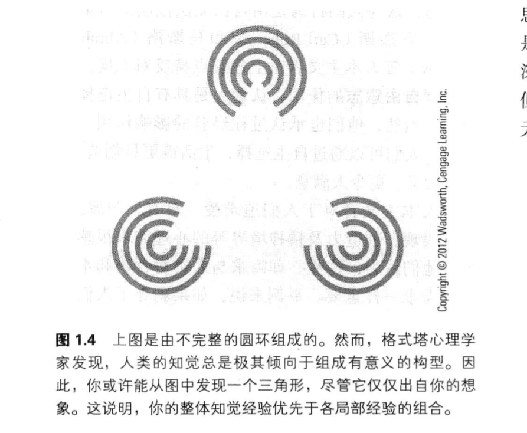

# 心理学导论

> 更好的学习方式是研究教材，而不是通读一遍就完事，如果你是阅读一遍，那么读完之后，你几乎什么都记不住，如果你是研究的读，读完之后，你能记住很多东西，记忆的时间也会更长

## 1.反思式阅读法

### 	1.1：阅读教材的最佳方式

- **体验式认知**：我们再看或者听一些东西的时候，我们只是本能（动物的本能）的浏览了一遍，而没有进行大脑高级功能的自我思考，因此我们对看过的东西不会产生深刻的技艺。典型的例子就是：看电视，看小说

- **思考式认知**：当我们不局限于通过本能去看东西，而是在看的时候，对这个事情产生了思考（人类的高级功能），思考的过程中，我们可能会想这句话的含义，或者和自己以前经历过的事情相关联，或者对阅读的内容加以评价，对比，分析，批判，整合（*这是批判性思维*），思考将有助于你理解和记忆细节

- 反思式SQ4R阅读法：SQ4R分别代表着：概览（survey），提问（question），阅读（read),测一测（recite），想一想（reflect），复习（review）

  1. 概览：在看每一节内容之前，先看看标题，章节提要，图片，章末总结等，能对这一小节进行总结的内容，以便对马上要学习的内容有一个了解
  2. 提问：根据小节的标题或者章节提要，引出来一个或者多个问题，这些问题将有助于你有目的的阅读。
  3. 阅读：阅读时，要需要你提问题的答案，要一点点的啃，如果内容不好懂，可以没读一两段，就停下来。
  4. 测一测：读完这一小节，要试着回答自己一开始提出的问题，以及做笔记（其实我都是一边看一边做笔记），并对这一节的中心思想做总结。知道自己对这一小节彻底理解掌握，否则继续看下去也没有意义。
  5. 学习的过程就是 不断地-> 提问->阅度->测一测
  6. 想一想：**最重要的一步**，阅度的过程中要不断的思考（思考式认知，批判性认知），这样能加深你的记忆和理解，拜托本能性学习。
  7. 复习：读完一小节以后，要反过来看一下自己所学的内容，或学习笔记，进行复述和小测验，检查自己学习的情况，要在学习的过程中，养成积极复习的习惯。

  <!--从头到尾把内容学一遍，会导致我们消化不良，因此在学习的过程中，要经常停下来，去思考，提问，复述，联想和复习，这样才能消化所获的知-->

### 1.2:反思式阅读记笔记->LISAN法

> 要记好笔记，必须积极主动的寻找信息。

**LISAN记笔记法**：前面字母是五个单词的缩写

1. **主动记**：课前阅读老师提供的材料（通过SQ4R阅读法），带着自己的理解去听课。
2. **重点记**：每一节课都是围绕着一个重要的核心展开，老师会通过一些例子进行解释，你可以经常问自己，现在讲的观点是什么，这些观点得到了哪些证据的支持。
3. **抓信号词**：听讲时要抓住那些表示教师思路变化的词。例如:“为什么，最重要的是，与此相反的是，我们举个例子，因此”等等等
4. **积极听**：坐在能与教师交流并提问的地方，与老师积极的互动，保持积极性
5. **选择记**：记笔记要有选择，要吧自己想象成记者，只记重要内容的笔记，如果什么都记，那么会遗漏掉老师讲课的 一些内容

<!--记忆的笔记要随时查看，要不记了有啥用。。。-->

#### 1.2.1：复习方法

- 尽早抽时间完善你的笔记，填补空缺，**完成思考，并需找要点之间的联系**
- 把新的观点与已知的观点联系到一起
- 对笔记进行总结，写出摘要并加以整理。
- 在每一节课后，要写下若干个在未来考试中可能出现的要点，定义和细节，然后根据课堂笔记设想各种问题，并确信你都能回答。

### 1.3：反思式学习策略->良好习惯

- **营造适当的学习环境**：我们没必要时时刻刻都要求自己可以去学习，只要我们养成到一个地方（比如图书馆，我的话 上地铁就能进入学习模式）就能放平心态，进入学习模式即可，这种地方最好的事自习室和图书馆。
- **运用记忆术**：我们学习的目的就是为了理解和记忆，因此记忆至关重要，记忆的方法有许多，比较好的方式有：让自己记忆中的形象夸张，搞怪，生动，并能与之互动
- **采用分散的复习方法**：复习方法分为：**分散式复习**方法和**集中式复习**方法。所谓分散式复习就是：把复习时间分为一些相对较短的时间段（复习一会干一会别的）。集中式复习就是，在一个长时间段玩了命的复习和学习。如果你把所有科目都放到一个时间段内复习，最后反而可能使自己的大脑乱成一锅粥，因此建议采用分散式复试（劳逸结合）。
- **自测**：自测能有效的帮助你查漏补缺，填补知识的空白，了解自身对知识点的掌握情况，因此考试前，要安排多做几次测试，但是学习的过程中，就没必要自测了（学完一小节或者一个知识点在测试）。
- **过度学习**：知识点掌握不好，或者过于自信，都会造成学习成果不理想。当掌握了全部知识点后，也要准备强化学习和复习，从而加深自己的理解，或者纠正错误的理解。

1.4：如何克服拖延

拖延是我们学习最大的阻力，那么我们如何克服拖延的习惯呢。一种好的方式是做一张 **做一张学习娱乐时间表**，规定一下自己在某个时间段，该做什么事，工作日和节假日的时间表可以分开。这样每天按照时间表的内容来进行，久而久之，就会养成习惯，也就不会拖延了（我就是这么干的）。

同时要给自己的学习定一个目标，不仅有近期的目标，也要有远期的目标，远期的目标激励我们不停的努力，近期的目标不会让我们陷入永无止境的学海中，从而对学习产生厌烦，每天完成自己定好的今天的目标，久而久之，就达成了一开始自己设下的远期目标。

~~当一项工作使你不快的时候，你很有可能就会拖延~~

最后，学习就是探险，要想办法让自己对学习产生兴趣，而不要指望课本或者老师吧课程讲的有兴趣，学习是为了自己不是为了别人

### 1.4反思式考试技巧

- 认真阅读试卷上的所有说明和问题，你能从中得到打好考题的建议或者线索
- 答题之前先快速把试卷浏览一遍
- 先答比较容易的题，在花时间做难题
- 合理的分配考试的时间
- 确保你回答了所有的问题，并写好了答题卡
- 有问题一定要及时问。

对于选择题而言，只有一个答案是最好的，有些答案也许部分对，但是为妙之间，还是有缺陷的，当你不知道选哪个好的时候，可以试着吧备选答案按照1-10的等级排序，选，等级评分最高的那个答案。

不要迷信那些选择题不会的时候，该如何选的玄学，抓阄猜对的概率比那都高。

## 2.什么是心理学

> 心理学即是一门学科，也是一个职业，科学观察法是以批判性思维，解答人类行为问题的最有强有力的工具

### 2.1 心理学-研究行为规范

**心理学定义**：因为心灵是看不见，摸不着，无法直接研究的，所以心理学现在的定义是：**对行为和心里过程的科学研究**

**行为**：无论是看得到的 吃饭，行走，打架，撒尿。还是看不见的生气，喜悦，记忆，做梦等心理活动，都算做是行为的一种。

**批判性思考**：很多我们认为的常识性知识都是错误的，*比如大脑只开发了10%，人格测验可以揭露人们的基本动机，甚至包括那些没有意识到的动机*，这些我们认为常识性的东西都是错误的，因此我们才需要批判性思考，我们要多问问这些东西符合逻辑么，有证据支持么等批判性质的思考。

*那些自封为专家的以及人们长久以来所坚持的关于人类行为的常识性信念大多都是错误的*

*绝大多数的常识性信念都是事后诸葛亮。并且很多人的结论都是来自于片面的局限的场景（譬如说北京饭不好吃，只是吃过其中的一家餐馆）*

**科学观察法**：科学观察法讲究系统性，精心设计，并且要具有主体间性，也就是说结果要能够被不止一个观察者所能证实。实验讲究：观察要更为客观

**个人的预测与科学研究**：例如温度高低和犯罪率有关系么，科学研究证明有，如果你猜测的也是有，那你就可以说 ：你看 科研有个鸡巴用，如果你猜测的是没有，科研就能告诉你正确答案，因此个人的猜测（也就是常识）始终是片面的，掺杂自我思想的。科学研究才是客观的，全面的。

**心理学研究的伟大之处在于**：它是以科学观察的方法来系统研究有关人类行为的所有问题。但是伦理和操作，以及有效工具的缺失会妨碍研究

**描述行为**

描述是科学研究中命名和分类的过程。要想回答心理学问题，我们必须要对行为加以客观的**描述**，但描述并非解释，有用的知识来自于客观准确的描述，单描述并不能解答 **为什么** 这个问题，例如他被强奸了却没报警是一种描述，但是他并不能解释为什么他被强奸了却不报警这一问题。

**解释行为**

心理学的第二目的是理解行为：理解行为意味着我们要说明这种行为产生的原因。

**旁观者效应**：当有其他人在场，并可能去施救的时候，人人往往不愿意自己出手相救，因为此时会出现一种“责任心扩散”心里，没有人觉得自己必须出手，就导致能出手的人越多，反而月可能没人出手。

**预测行为**

预测行为 是心理学的第三个目标：能够准确的预言行为。

比如你用“观察者效应”来预测，你汽车抛锚了会不会有人来帮你，结果可能不乐观。

**控制行为**

控制指的是：根据行为预测结果，改变影响行为的条件。汽车设计中就要运用行为控制的远离，以免驾驶员发生致命错误。

*心理学研究的目标就是要找出下列问题的答案*

- 这种行为的本质是什么（描述）
- 这种行为为什么会发生（理解和解释）
- 我们能够预测这种行为将在什么时候发生么（预测）
- 影响这些行为的条件有哪些（控制）

## 批判性思维：带着怀疑的态度学习

> **批判性思维**：要求我们在面对某个观点或者说法的时候，要问问自己，他能否得到科学理论以及科学观察结果的支持。

例如：都说女人比男人话多，那么有没有科学理论可以解释这件事，或者有科学观点证实。

**批判性思维的核心**

在进行评估的时候，批判性思维会深挖推理过程中的缺陷，并对支持性证据加以分析，质疑各种假设，寻找可能的其他结论，在他们心中，真正的知识来源于我们对客观世界认识的不断加深。

**批判性思维的五条基本原则**：

1. 不需要通过逻辑分析和实验验证就可以被接受的“真理”是不存在的。
2. 批判性思维总是在思考，应该如何揭穿那些伪真理
3. 权威或专家的意见不能自动证实或伪证某个观点。
4. 判断证据的质量至关重要
5. 批判性思维者需要心态开放

### 2.2伪心理学：手相学、占星术、人格分析

> 所谓伪心理学就是貌似心理学但是没有任何科学或事实依据的体系

伪心理学只敢拼凑那些貌似科学的证据，不敢直面不相符的事实。而心理学家则对自己的理论持怀疑态度，去需找理论的矛盾点，以期待更进一步的理论完善。

**无批判接受顺言**：当某种说法貌似正确，或者令方方面面皆大欢喜的时候，人们就会倾向于相信他。

占星术的法宝：多说奉承话。都说人类的共性。

**确认偏向**：由于人们只关注与自己的期望相符的信息，而忽略其他的信息所导致的直觉错误。<!--伪心理学就是靠着这个效应发展起来的-->

**巴纳姆效应**：越是使用空泛，笼统的语言描述他人情况，就越能使其觉得这些描述是正确的。

<u>永远让别人觉得自己若有所获，别人就会觉得你说的是对的，有道理，这也就是巴纳姆效应</u>

### 2.3 科学研究：像心理学家那样思考

**科学方法**：一种批判性思考方式，它的基础是仔细收集证据，精确描述与测量，准确定义，在受控条件下观察、研究的结果能够重现

主要包括一下六个元素：

1. 观察
2. 对问题进行定义
3. 提出假设
4. 收集证据，校验假设
5. 构建理论
6. 发表研究结果

**操作定义**：所谓操作定义就是表达概念的严格研究步骤，他使那些无法进行观察的方法得到具体的测量，他把内隐行为转换成外显行为，例如：心情好会降低人的攻击性。开心无法直接测量，那么我们可以开心“外显”为 给某人一万块钱，这是我们才可劲骂他 看他是否反抗（将攻击性转化为外显的是否反抗）。

科研题目：女人比男人话多

1. **观察**：人们都说：“女人比男人话多（观察到的现象）”，那么有什么证据来证明这一点么，查询资料可以找到，或者找不到相关的证据
2. **对问题进行定义**：如果上边找到了证据支持，那么这个支持考虑的全面么，是不是值在特定的场景，环境，条件下测量的，而不能做到通用。因此我们可以对这个问题定义一个更加通用的假设：*在既不干扰谈话者，又不会使调查结果发生偏差的情况下，如果能够在一个比较长的时间跨度里记录自然状态下的谈话，女人是否比男人话多*？
3. **提出假设：**女人比男人话多就是我们的一种假设。
4. **收集证据，检验假设**：为了收集证据、追踪谈话，研究者给参加测试的每个人都戴上一个录音机，这种装置是电子控制的，每隔12.5分钟自动录音30秒。由于每次录音时参与者感觉不到，所以他们很快就适应了状况。
5. **构建理论**：理论是一个思想体系，他将概念与事实联系起来，*可以总结现有的数据，并预测未来的观察*。好的理论能够总结观察结果并加以解释，还能指导未来的研究。
6. **发表研究结果**：以引起更多人的好奇，如果这个结果能够被更多人的复制，或通过其他方式有验证器理论的正确性，那么就证明其是对的，否则 ，也可以砍掉一个错误的认知。

### 2.4 心理学家“全家福”

#### 结构主义心理学

**结构主义**：试图将人的精神生活结构分解成一个个的基本要素（就像建筑构造中的一块块砖一样）来加以分析

**方法-内省法**：通过检查自己的感觉，思想，情感，了解内心活动的方法。例如举起一个苹果，然后观察者可以说，发现了苹果的，色，香，形，以及重量等（将苹果的这些要素一一的分离类举出来），再比如很多食物有多种调料味组成，例如盐，糖，酱油，醋等，将这些一一分析出来，也是结构主义感性的话题。

**缺点**：每个人观察同一个事物，得出来的”基本要素“，往往不一样，而且无法明确指出来谁的是对的谁的是错的。

**用处**：作为一种获取知识的方法，结构主义在催眠，冥想，问题解决，情绪等很多课题都有其可取之处

### 机能主义心理学

**机能主义**：研究的是人的心理机能在人类适应环境的过程中所起的作用，即思想，知觉，习惯，情绪等如何帮助人们适应环境并生存下来

**相对于结构主义**：机能主义认为人们的感觉，知觉，情绪，思想等是一个像水一样融合在一起的统一整体，而不是像结构主义那样，分解成一对对毫无联系的砖头

**意义**：机能主义吧动物研究引入了心理学，同时也崔进了教育，因为学习能使人们更快的适应环境，所以机能主义希望找到完善的教育方法

### 行为心理学

**行为心理学**：研究动物可观察的行为，这种观察取自动物的刺激反应，是客观的，不受主观因素影响（结构主义就极大的收到主观因素的影响）

**方式**：通过进行特定的刺激，而形成一种自然而然的条件反射（例如被蛇咬了，以后看见蛇就害怕）。

**条件反射**：对特定刺激的一种习得性反应。

**缺点**：行为主义认为，所有的反应都是由刺激决定的，但是现在这个结论已经被推翻了

**意义**：行为主义让心理学变成了一门独立的科学，而不是哲学的分支。

### 彻底行为主义心理学

**彻底的行为主义**：它相信人类的行为是受到奖惩控制的。而应该忽略掉思想等心理内部发生的事的作用。它相信积极的强化措施能鼓励人们积极的行为，但是如果单纯只使用惩罚手段，并不会带来好的效果

人类常常因为惩罚和误导性奖励而产生错误的行动。

**意义**：在学习，条件反射，奖惩知识上有大的贡献

### 认知行为主义心理学

**认知主义心理学**它和彻底的行为主义心理学的区别就是，他同样重视思维的作用。

**例子**：例如你喜欢去一家网站，因为哪上边提供免费的视频，彻底的行为主义认为：这是因为看免费录像带来的快乐奖励了你，而认知主义心理学则补充到：除此之外，你还“期待”着这家网站发布新的免费视频，这份“期待”就是你行为的认知部分。

### 格塔式心理学

**格塔式心理学**：将思维，学习和知觉作为整体加以研究，并且“整体大于各部分之和”是它的口号，而不是像结构主义那种将心理事件分解成单个的要素。

**意义**：格塔式心理学在知觉和人格研究中颇具影响力

### 精神分析学

**精神分析学**：主要研究无意识，弗洛伊德认为：人类行为受到无意识思想，冲动和欲望的深刻影响，尤其是在设计性行为和攻击性行为的时候，更是如此。弗洛伊德认为，人类的很多无意识思想都处于被 **压抑**状态，被排斥与意识之外。但有时候也会在梦中，或口误中流露出来。

**与行为主义的不同**：·与行为主义者相同的是，弗洛伊德相信，一切思想、情绪和行为的发生都是可以被确定的,也就是说，它们不是无缘无故发生的，因此，只要我们深入探究，就一定能够发现引发思想和行为的原因。但与行为主义者不同的是，他认为起主要作用的是无意识过程,而非外部刺激。

弗洛伊德早就发现：儿童期对成人人格的形成具有决定性影响，儿童塑造了成年