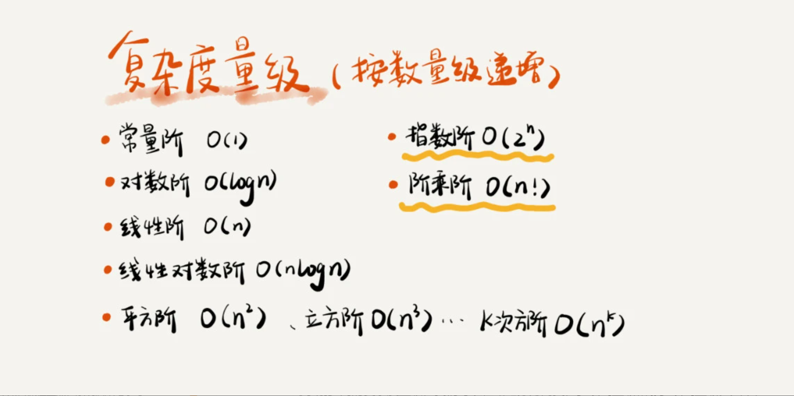
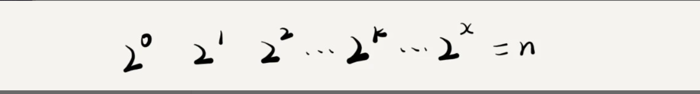
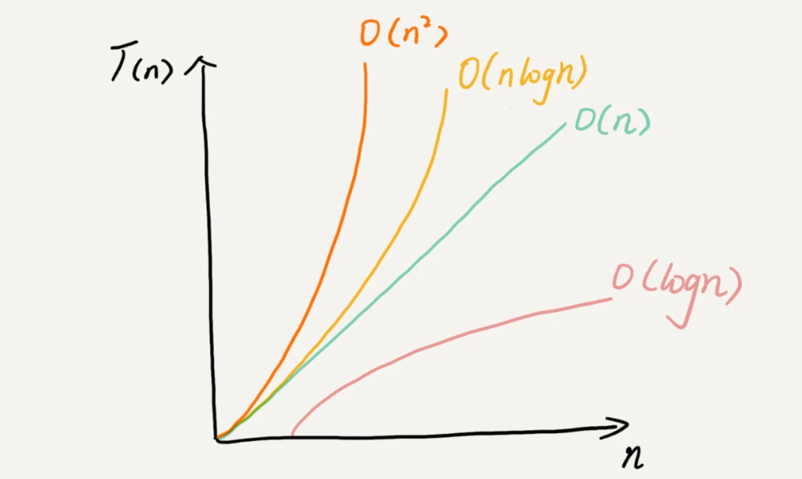

## 1.时间，空间复杂度分析

> 复杂度分析是代码的精髓，掌握它，才能更好的对实现的算法进行性能分析

### 1.为什么需要复杂度分析

如果我们依赖机器跑算法的结果来区分不同算法的复杂度，会有以下的问题：

1. 测试非常依赖测试环境，换一个环境结果就可能完全不同
2. 测试结果受数据规模的影响大，数据太小可能无法真实的反应算法的性能，设置数据的顺序也会对算法的结果产生实质性的影响

### 2.大O表示法

我们对算法进行粗略的估计，会抛弃掉机器相关的影响，不考虑一个乘法其实是一个加法操作的多少倍，每一行语句，就认为程序执行了一次，无论这行语句执行的是什么。

```c

 int cal(int n) {
   int sum = 0;  //执行消耗1
   int i = 1;//执行消耗1
   for (; i <= n; ++i) {//执行消耗n
     sum = sum + i;//执行消耗n
   }
   return sum;//执行消耗1
 }
```

例如，如上的代码，复杂度就是 1+1+1+n+1 = 4+2n

也就是 **代码的执行时间T(n)和每行代码被执行的次数f(n)成正比** 

大O公式如下:

​	
$$
T(n)=O(f(n))
$$
f(n)表示每行代码执行次数的总和 比如上述的  4+2n就是个f(n) 也就是 T(n) = O(4+2n)

大O不是表示一个具体的时间，而是表示 随着数据规模的变大，算法执行时间随数据规模的增长趋势 也叫 **渐进时间复杂度，简称为时间复杂度**

当数据规模越来越大的时候，低阶项，常数项，也就不再是影响算法执行时间的关键，也就可以忽略，例如
$$
T(n) = O(4+2n) ≈ O(n)   又或者    T(n) = O(2n^2+2n+3) ≈ O(2n^2)
$$

### 3.如何分析时间复杂度

可以用如下的方式对算法的时间复杂度进行分析

1. 只关注循环执行次数最多的一段代码，因为它会和其他的代码形成幂级差。根据大O定义 低阶和常数都被忽略

2. 加法法则：总复杂度=量最大的那段代码的复杂度，如下例子所示

   ```c
   
   int cal(int n) {
      int sum_1 = 0;
      int p = 1;
      for (; p < 100; ++p) {
        sum_1 = sum_1 + p;
      }
   
      int sum_2 = 0;
      int q = 1;
      for (; q < n; ++q) {
        sum_2 = sum_2 + q;
      }
    
      int sum_3 = 0;  
      int i = 1;
      int j = 1;
      for (; i <= n; ++i) {//这两个for循环是复杂度最高的一块
        j = 1; 
        for (; j <= n; ++j) {
          sum_3 = sum_3 +  i * j;
        }
      }
    
      return sum_1 + sum_2 + sum_3;
    }
   ```

   注意 循环100000000次，他也是一个常量，只要他用实实在在的数字表示，他就是一个常量，当n无限大的时候，虽然他确实对代码产生实实在在的影响，但是 **时间复杂度说的是 一个算法随着数据规模的变大，他的时间花费的一个变化趋势 是趋势**

   因此上述代码 就是O(n^2) 也就是说 **总的时间复杂度就等于量级最大的那段代码的时间复杂度。**

3. 乘法法则：嵌套代码的复杂度等于嵌套内外代码执行次数的乘积（典型的双重for循环）

上述都是技巧，但是熟练了，就不需要这些技巧了

### 4.几种常见的算法复杂度分析



非多项式量级代码复杂度（NP问题）：上图中有两个
$$
O(2^n)  和   O(n!)
$$
其他的都会多项式量级的

非多项式量级的算法，随着数据的增加，执行时间飞速的上涨，他是一个低效的算法

**O(1):**

他表示一个常量级的算法复杂度，而不是只执行一次，比如代码for(; i <100;i++) 他也是O(1)的

一般情况下，只要代码中不存在循环，递归，计算有成千上万行代码，它的执行次数不会会数据的增大而变化，他就是O(1)的

2.**O(logn)和O(nlogn)**

对数阶是非常常见，而且很难分析例如：

```c

 i=1;
 while (i <= n)  {
   i = i * 2;
 }
```

上述代码就是一个对数阶的算法复杂度，上述循环执行的是一个等比数据，执行过程是如下



所以我们只要知道X的值是多少，就知道他的执行次数了，因为一共会执行x次，x= log2n 很明显

如果吧 i = i *2 换成 i=i * 3 效果一样 x = log3n

不管是以 几 为低，我们吧 对数阶的算法复杂度都计为 logn,因为对数之间 底数不同的对数是可以相互转换的，例如：
$$
O(log3n) = O(C *  log2n)
$$
其中C等于一个产量，在大O中我们是忽略常量系数的，所以 
$$
O(log2n)= O(log3n)
$$
其他常数也是如此，所以我们就统一用 logn代替了  

同理如O(nlogn) 他就是 循环了n遍，每一遍的复杂度都是logn

**3 O(m+n)、O(m*n)**

对于 O(m+n)来说 我们无法评估 m和n谁的量级大，不能简单的省略一个，所以就用了这种方式来表示 

O(m*n)同理

### 5 空间复杂度分析

> 空间复杂度就是表示，算法的存储空间和数据规模之间的增长关系

这里指的是代码需要的额外的存储空间，代码本身的不算，例如我们吧一个数组中的内容复制到另一个数组中，两个数据共存，空间复杂度就是O(n)

