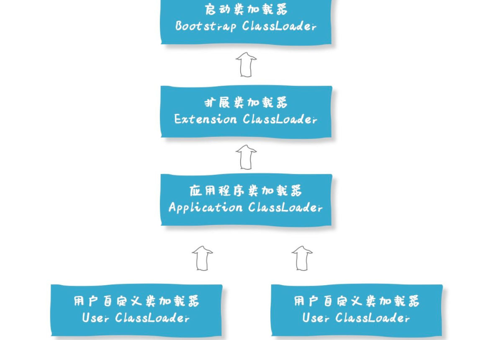

在面试字节跳动的时候从MySQL的主从复制问到了数据的一致性问题-日志先行:

<1>单机
日志先行
<2>主从
-1.从库落地
-2.本地日志写完

WAL（write ahead logging）（先写日志在写磁盘）；数据库提供的原子性和持久化的一系列技术，所有的修改都会被先吸入到日志当中，然后再被应用到系统状态，通常包括redo和undo两部分信息，

redo（mysql中叫重做日志）：成为重做日志：每当有操作的时候，在数据变更之前，将操作写入redo日志，这样在系统发生断电，重启之类的操作的时候，能够根据redo日志继续操作（持久性）

undo（mysql中叫回滚日志）：成为撤销日志，当一些变更执行到一半无法完成的时候，可以根据撤销日志恢复到变更之前的状态（一致性）

binlog（myslq中叫归档日志）

**WAL在消息中间件中的应用**

是所有消息中间件的基础，也是所有存储类系统的基础，在消息中间件中，只需要记录 redo log，消息直接存储在redo log中，只要写redo log完成了，消息也就写入完成了

1. 消息写入log，就表示已经持久化了
2. 不会出现原子性问题，消息写入即成功，没有写入即失败

了解投递的公司与职位与行业背景都做什么，要做的什么

多认识技术大拿，多沟通技术问题，他们招人的时候，成功率会更高

简历可以根据要投递的岗位进行相应的修改，这样可以

技术关键字，很重要 因为her不懂技术，很可能就会记关键词 比如 redis

秒杀：前端就随机抛异常

线程池从本质上来讲，即通过**空间换取时间**，因为线程的创建和销毁都是要消耗资源和时间的，对于大量使用线程的场景，使用池化管理可以延迟线程的销毁，大大提高单个线程的复用能力，进一步提升整体性能

https://www.jb51.net/article/199633.htm    自增id用完了怎么办，1.换趁更大的bigint，二用完之前早就进行分库分表了

**双亲委派机制：**https://www.heapdump.cn/article/2571333

java语言支持四种类型的类加载器，他们各司其职，有不同的加载对象（一个用户自定义的类，如com.hollis.ClassHollis 是无论如何也不会被Bootstrap和Extention加载器加载的。）

1. Bootstrap ClassLoader：启动类加载器：主要负责加载Java核心类库，%JRE_HOME%\lib下的rt.jar、resources.jar、charsets.jar和class等。
2. Extention ClassLoader ：扩展类加载器：主要负责加载目录%JRE_HOME%\lib\ext目录下的jar包和class文件。
3. Application ClassLoader：应用类加载器：主要负责加载当前应用的classpath下的所有类
4. User ClassLoader ：用户自定义类加载器： 用户自定义的类加载器,可加载指定路径的class文件

- 一般认为上一层加载器是下一层加载器的父加载器
- 双亲委派机制：当一个类加载器收到了类加载的请求的时候，他不会直接去加载指定的类，而是把这个请求委托给自己的父加载器去加载。只有父加载器无法加载这个类的时候，才会由当前这个加载器来负责类的加载

出问题重启机器前要先dump 拿到堆栈信息，方便排查是否内存泄漏等问题

采集数据的时候要注意采集的频率，在大促期间 降低采集量，防止日志撑爆磁盘

java中存在循环依赖

字段添加`@Override`注解时会报错，也从另一个方面说明了字段不能重写。

为什么字段能不能被重写的，因为字段仅仅是属性标识，封装一个对象封装的是这个对象的行为，对象的多态体现也是体现的多态的行为，所以才会有行为的多态，而没有字段的多态

cp三次握手发生在connect step.

accept只是把内核中的“已完成连接队列（FIFO with established state)”取出，
另一个队列是“未完成连接队列( FIFO with syn_rcvd state)”，并且这两个队列总和的最大值是backlog.

设计模式大部分都是解决扩展性，主要学习他们主要应用场景，

binary-safe  二进制安全： 将输入作为原始的，无任何含义的数据流，不做任何特殊的规定和格式处理，

例如 C语言中 字符串就规定以  /0 结尾 就不是二进制安全的